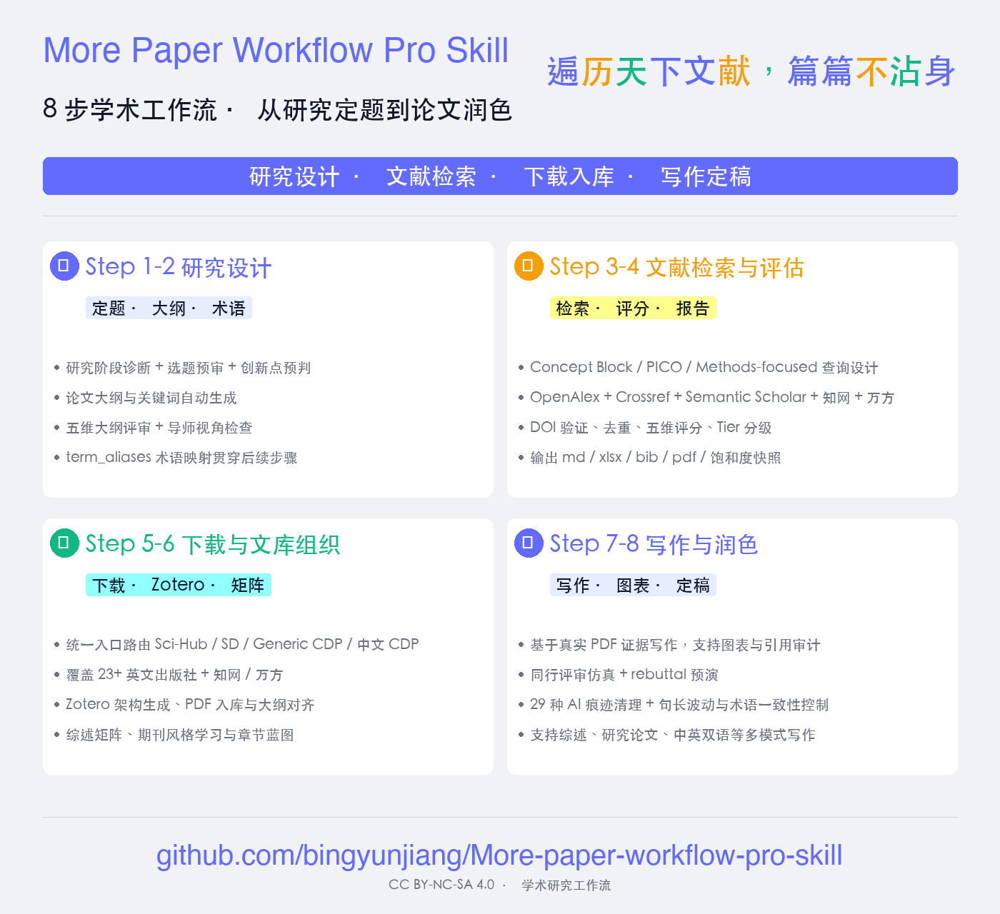
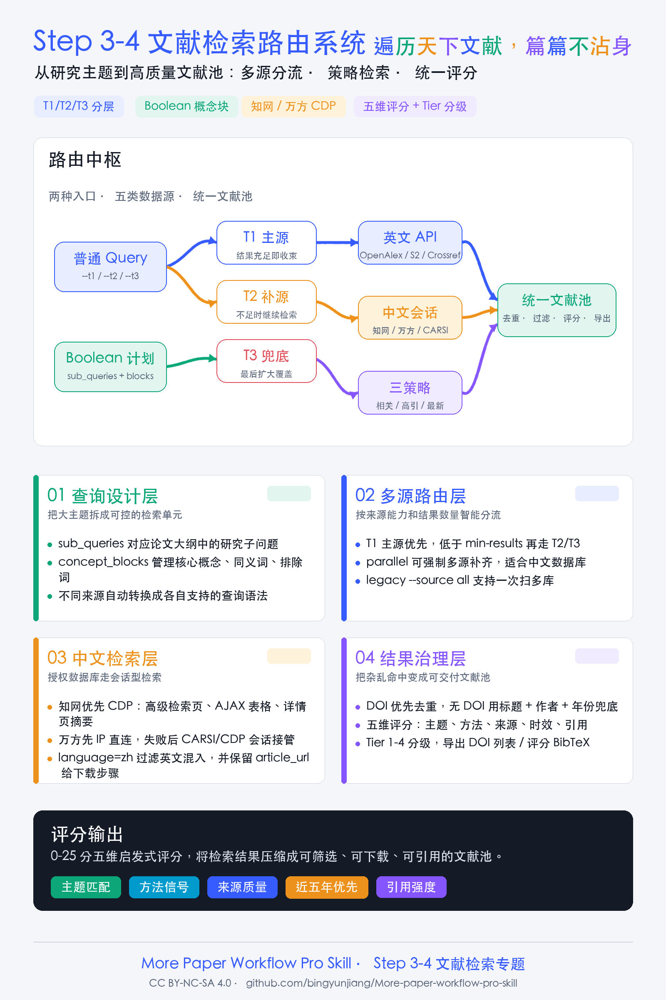
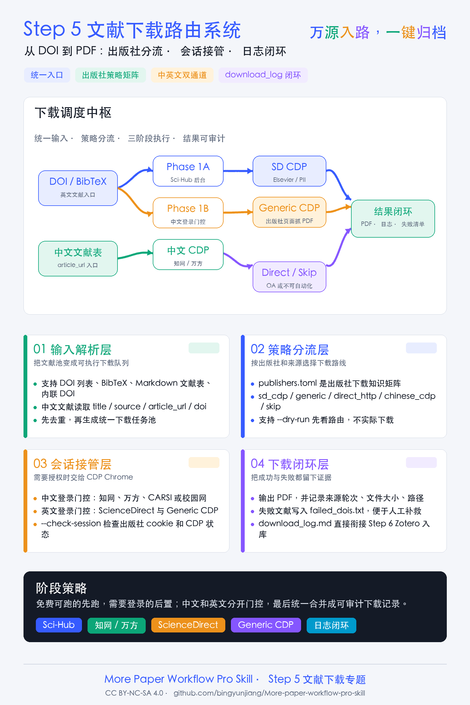

[](https://github.com/bingyunjiang/More-paper-workflow-pro-skill)
[](https://github.com/bingyunjiang/More-paper-workflow-pro-skill)
[](https://github.com/nousresearch/hermes-skills)
[](https://github.com/openclaw/openclaw)
[]()
[](LICENSE)
[]()
[]()
[]()
[]()
[]()
[]()
[]()
[]()
[]()
[]()
[]()
[]()
[]()

> **作者：** Dr. Jiang Bingyun　|　**微信：** Bingyunjiang　|　**邮箱：** bingyunjiang@qq.com

[**中文**](#chinese) &nbsp;|&nbsp; [**English**](#english)

<a id="chinese"></a>
# 📚 more paper workflow pro skill `v1.0.7-20260607`

## 📑 目录

- [为什么需要这个工具](#为什么需要这个工具)
- [🎯 适合谁？不适合谁？](#适合谁不适合谁)
- [📖 简介](#简介)
- [✨ 功能特性](#功能特性)
- [🏆 核心优势](#核心优势)
- [🛡️ 论文质量防线](#论文质量防线)
- [📋 工作流一览](#工作流一览)
- [🚀 安装仅是参考](#安装仅是参考)
- [📖 使用指南](#使用指南)
- [📂 项目结构](#项目结构)
- [❓ 常见问题](#常见问题)
- [📋 版本历史](#版本历史)
- [👥 贡献者](#贡献者)
- [📄 许可](#许可)
- [🔗 相关链接](#相关链接)

### 为什么需要这个工具

为什么你的 AI 写论文总在编造参考文献？因为大多数 AI 学术工具把「写论文」当成「生成文本」——至于引用的文献存不存在、论证有没有依据，它们不关心。**好的 AI 工具不应该替代研究者的判断**，而应该让检索更系统、让筛选有评分依据、让写作基于真实论文内容。

本工具不做「一键生成论文」，而是按传统科研 8 步流程，一步步辅助你走完。每一步产出可见文件，每条参考文献来自你真实拥有的 PDF。



## 🎯 适合谁？不适合谁？

### ✅ 如果你是这样的研究者，你会很喜欢它：

- 被 AI 编造参考文献坑过，对「一键生成论文」有阴影
- 希望用 AI 提效，但不是让 AI 替你做决定，你要始终掌握控制权
- 正在写综述、毕业论文或课题申报书，需要系统管理 50~200+ 篇参考文献
- 有 Elsevier 或 IEEE 的机构访问权限（学校 VPN 即可）
- 已经在用 Zotero，但手动整理文献库太累

### ❌ 但如果属于下面情况，它可能不太适合你：

- 「输入标题，3 分钟出一篇论文」是你的核心需求——这个工具刻意不做这种事

---

## 📖 简介

**More Paper Workflow Pro Skill** 是一套完整的学术文献工作流工具链，覆盖从研究方向确定到论文润色投稿的全过程。34+ 个 Python CLI 脚本 + 9 个 Agent 模块 + 共享工具库 + 配置体系，可独立使用或接入 **Claude Code / Codex / Hermes / OpenClaw** 等任意支持 Claude 模型的 AI Agent 平台实现对话式编排。

完整学术文献检索和写作工作流（8 步法）：①交互式确定研究主题 → ②生成大纲/关键词 → ③制定检索方案 → ④多渠道检索+评分并导出 BibTeX → **⑤统一路由下载（Sci-Hub→SD CDP→IEEE CDP→Generic CDP，覆盖 23+ 家出版社）** → ⑥Zotero 文库管理（架构生成+BibTeX 条目入库+PDF 附件关联+一致性检查） → ⑦论文写作（含综述矩阵+期刊风格学习+GB/T 7714 完整规范+图表生成+引用审计） → ⑧论文润色。

### 设计哲学：AI 辅助 ≠ AI 替代

| 维度 | 大多数 AI 工具 | More Paper Workflow |
|------|-------------|-------------------|
| **生成模式** | 黑箱：主题→论文 | 透明管线：8 步，每步可见可改 |
| **参考文献** | AI 凭记忆编造 | 从 Zotero 读取真实 PDF 全文 |
| **用户控制** | 生成后审阅 | 每步确认，每步可中断修改 |
| **AI 痕迹** | 无检测，靠人工感觉 | 29 种模式 + 句长波动量化检测 |
| **PDF 获取** | 不管下载 | Sci-Hub + SD + Generic CDP 自动路由，23+ 出版社覆盖 |
| **设计哲学** | 替你做研究 | 辅助你做研究 |

### 一句话概括

> 研究定题 → 文献检索 → 相关性评分 → 统一路由下载（23+ 出版社） → Zotero 入库与 PDF 附件一致性检查 → 综述矩阵+期刊风格学习 → 根据文献写作（含图表生成+引用审计） → 论文润色/去AI味，一站式完成学术研究文献工作。

### 核心能力

**🔧 文献检索与筛选（Step 1-4）**
- AI 辅助交互式定题，5 轮对话厘清研究方向
- Semantic Scholar / Crossref / OpenAlex 三源并行检索，DOI 去重合并
- T1→T2→T3 三级回退路由，6 领域路由规则（医学/工程/CS/综述/中文）
- 引文验证 + 饱和度分析（发现曲线） + 检索报告（.md+.xlsx+.pdf+.bib）



**📥 PDF 批量下载（Step 5）——核心突破**
- **统一下载路由**： 单一入口自动路由，三路顺序回退（Sci-Hub → SD CDP → Generic CDP），覆盖 **23+ 家出版社**
- **通用下载引擎**：策略 A（直连 PDF URL）→ 策略 B（CSS 选择器提取），支持补充材料下载
- **出版社配置知识库**：集中管理 24 家出版社的 DOI 前缀、URL 模板、屏障检测规则
- 通过 Chrome/Edge **CDP 协议**操控真实浏览器，绕过 Cloudflare/Akamai 反爬
- 15 个反检测 Chrome flag + `warmup_profile()` 预热函数
- 支持 **IP 认证**（全自动零干预）和 **SSO 机构登录**（仅首次需手动）



**📚 Zotero 文库AI管理（Step 6）**
- 按论文大纲AI生成集合结构和标签方案
- 结合 Step 4 `文献库.bib` 与 Zotero 架构生成 `文献-Zotero架构对照.md/json`
- 通过 Zotero MCP 创建集合、导入 BibTeX 条目、关联 PDF 附件池中的文件
- CNKI/万方中文文献不依赖 DOI 入库，使用 `source_id` + 详情页 URL + 中文元数据生成 CSL JSON 条目
- 环境检测脚本一键诊断 Zotero 配置状态
- **一致性检查**：Zotero 集合树、BibTeX 条目、PDF 附件三者互相可追溯

**✍️ 论文写作与润色（Step 7-8）**
- 逐章按 Zotero 分类读取 PDF 原文作为知识库，交互确认引用
- 直接读 PDF 抑制大模型幻觉——引用精确性高于 RAG 分块方案
- **文献综述矩阵**：13 列结构化证据提取，按证据优先级逐级回退
- **期刊风格学习**：分析目标期刊写作风格 + 章节蓝皮书 + 写作理由书
- 5 种写作模式（full / outline-only / plan / abstract-only / review）
- 文献综述专属写作模式（8 节骨架 + 7 条写作纪律）
- GB/T 7714-2015 完整引用格式规范（排序/作者/类型代码/缺失处理）
- **科研图表生成**：基于 Nature 风格指南自动生成学术图表
- **写后引用审计**：逐条验证引用准确性，生成审计报告
- **质量防线体系**：6 道评审节点（选题预审→大纲评审→文献评分→段落自查→引文评估→成稿评审）
- PyMuPDF 多进程批量提取（<20 篇按需精读 / ≥20 篇全量并行）
- 论文润色：结构精炼 + 术语统一 + 去 AI 痕迹 + 引用校验

## ✨ 功能特性

| # | 功能 | 说明 |
|---|------|------|
| 1 | **交互式研究主题定义** | 多轮对话厘清研究方向，产出结构化主题文档 |
| 2 | **自动生成论文大纲与关键词** | 基于研究主题生成章节结构、中英文关键词清单 |
| 3 | **结构化检索方案设计** | 拆分子课题、构建关键词组合、选定检索源 |
| 4 | **多渠道论文检索** | Semantic Scholar / Crossref / OpenAlex 多源，3 条策略路线，DOI 去重合并 |
| 5 | **相关性评分与筛选** | 五维评分（主题、方法、质量、时效、引用），T1-T4 分级 |
| 6 | **批量 PDF 下载（23+ 出版社）** | 统一下载路由自动分发：Sci-Hub → SD CDP → Generic CDP，成功率 94.7%+ |
| 7 | **统一路由下载入口** |  单一入口自动路由，三路顺序回退 |
| 8 | **通用出版社下载引擎** | CSS 选择器策略 A（直连）→ 策略 B（文章页提取），支持补充材料 |
| 9 | **出版社配置知识库** | 集中管理 24 家出版社的 DOI 前缀、URL 模板、CSS 选择器 |
| 10 | **混合下载策略** | 先 `/pdfft` 直连（8s 快拒），失败则文章页提取 `?md5=` URL 后再捕获 |
| 11 | **Chrome + Edge 并行下载** | 双浏览器独立会话，速度翻倍，自动绕过 Cloudflare |
| 12 | **IEEE 两步走下载（备用）** | 导航文章页 → 点击 PDF 按钮 → 检测新标签页 → Fetch 捕获 |
| 13 | **生成 Zotero 文库架构** | 按论文大纲自动生成集合结构和标签方案 |
| 14 | **BibTeX/中文元数据-Zotero 架构对照** | 英文用 BibTeX/DOI，CNKI/万方用 source_id + 详情页元数据生成文献归属表 |
| 15 | **PDF 附件一致性检查** | 将下载 PDF 关联到 Zotero 条目，检查缺附件/错集合/重复条目 |
| 16 | **PDF 全文批量提取** | PyMuPDF 多进程并行提取，A/B 方案按文献量自动切换 |
| 17 | **跨平台浏览器管理** | `CHROME_PATH`/`EDGE_PATH` 环境变量或 `--browser-path` 参数覆盖 |
| 18 | **依赖自动检测** | 启动时检查 `websocket-client`/`PyMuPDF`，缺失即打印安装指引 |
| 19 | 🆕 **文献综述矩阵** | 13 列结构化证据提取，笔记→标注→元数据→全文逐级回退 |
| 20 | 🆕 **综述 DOCX 写作** | 8 节骨架 + 观点分组/合并引用/对比表达 7 条写作纪律 |
| 21 | 🆕 **GB/T 7714 完整规范** | 中英排序、作者格式、7 种文献类型代码、缺失元数据处理 |
| 22 | 🆕 **T1→T2→T3 检索路由** | 6 领域分级回退链，预检 + 布尔查询 + 多策略检索 |
| 23 | 🆕 **引文验证与饱和度分析** | DOI 格式校验 + 元数据完整性检查 + 指数拟合文献覆盖率估算 |
| 24 | 🆕 **检索报告（4 格式）** | 合并去重评分后导出为 .md + .xlsx + .pdf + .bib |
| 25 | 🆕 **arXiv 辅助检索** | CS/AI 信号触发的 arXiv L2 条件检索 |
| 26 | 🆕 **RCS 主题匹配度评鉴** | 4 级锚定 + 5 种旗标的主题相关性评估 |
| 27 | 🆕 **Agent 模块化** | 9 个独立 Agent 文件，标准化 9 段模板，184 条触发词精确路由 |
| 28 | 🆕 **期刊风格学习** | 分析目标期刊写作风格 + 章节蓝皮书 + 写作理由书 + LaTeX 合规检查 |
| 29 | 🆕 **科研图表生成** | 基于 Nature 风格指南自动生成学术图表 |
| 30 | 🆕 **写后引用审计** | 逐条验证引用准确性，生成审计报告 |
| 31 | 🆕 **错误日志与决策日志** | 跨会话 AI 错误积累修正 + 结构性决策记录 |
| 32 | 🆕 **术语标准化贯穿** | Step 2→3→7→8 术语别名映射与一致性强制 |
| 33 | 🆕 **论文质量防线** | 6 道评审节点（选题预审→大纲评审→文献评分→段落自查→引文评估→成稿评审） |

## 🏆 核心优势

- **一站到底** —— 8 步全流程覆盖，从定题到润色一站式完成
- **反爬突破** —— 真实浏览器 CDP 协议绕过 Cloudflare/Akamai，实测 94.7% 下载成功率
- **全平台零配置** —— Chrome/Edge 路径自动检测，macOS/Windows/Linux 即装即用
- **分层可拆** —— 每个 Step 独立运行，按需组合，不必从头开始
- **零 API 费用** —— Semantic Scholar / Crossref / OpenAlex / Sci-Hub 全部免费
- **双浏览器并行** —— Chrome + Edge 自动检测，有则加速，无则单浏览器正常运行
- **断点续跑** —— 中断恢复不重复工作，支持无人值守批量下载
- **抑制幻觉** —— 直接读 PDF 原文而非向量分块，引用精确性远高于 RAG 方案
- **代码模块化** —— 统一封装 CDP 连接、标签管理、PDF 捕获、跨平台浏览器管理
- **依赖自检** —— 启动时检查，缺失即打印安装指令
- **Cloudflare 自动应对** —— 检测到 Turnstile 验证自动等待 60s 自行通过

> 本项目的集成的 Zotero MCP 基于 [54yyyu/zotero-mcp](https://github.com/54yyyu/zotero-mcp)，感谢原作者的开源贡献。

### 直接读 PDF vs RAG 分块

论文写作中引用精确性高于一切。本工具采用**直接读 PDF 原文**，而非 RAG 向量分块：

| 对比项 | 本工具：直接读 PDF | RAG 分块方式 |
|--------|-------------------|-------------|
| 引用精确性 | 整篇读取，上下文完整 | 分块后可能丢失上下文 |
| 每章文献量 | 按 Zotero 分类读取全部归属 PDF | 批量建索引，实际用得少 |
| 幻觉抑制 | 交互确认 + 读原文，源头保证 | 召回不完整时仍可能编造 |
| 部署成本 | 零依赖，直接文件读取 | 需 embedding 模型 + 向量库 |
| 维护成本 | 随时按需读取，无需预处理 | PDF 更新需重建索引 |

> 文献量巨大（>200 篇）时才值得做 RAG 预处理。本工具的 Step 4 检索文献表 + Step 6 Zotero 架构已完成分类，写作时按需精读即可。

---

## 🛡️ 论文质量防线

More Paper Workflow 在 8 步流程中嵌入了 **6 道评审节点**，形成逐层收紧的质量防线。设计原则：**越早发现问题，修复成本越低。** 选题阶段的黄灯比成稿阶段的红灯便宜 100 倍。

### 防线总图

```
选题阶段          大纲阶段          检索阶段          写作阶段          成稿阶段
   │                │                │                │                │
Step 1d          Step 2b          Step 4          Step 7d.1        Step 7f
选题预审    →    大纲评审    →    文献评分   →   段落自查    →   成稿评审
(方向对不对)     (结构好不好)     (文献靠不靠谱)   (表达准不准)     (整体过不过)
  🟢🟡🔴           0-25 分          0-25 分           5 项自查          0-50 分
定性三问         量化五维        量化五维         定性清单         量化+叙事
                    │                                 │               │
               导师视角检查                        Step 7e          三审稿人
               (能不能毕业)                      引文评估          Rebuttal预演
               workload/planB                    Strong/Moderate   (能不能说服审稿人)
               /timeline/publish                 /Weak
```

### 各节点把控

| 节点 | 时机 | 类型 | 把控什么 | 决策 |
|------|------|:--:|------|------|
| **Step 1d 选题预审** | 方向确定后 | 定性 | originality / importance / feasibility 三问 | 🟢绿灯继续 / 🟡黄灯调整 / 🔴红灯换方向 |
| **Step 2b 大纲评审** | 大纲生成后 | 量化 (0-25) | 逻辑连贯性 / 结构平衡性 / 创新区分度 / 工程可行性 / 格式完备性 | P0 必须改 → P3 可选的 4 级优先级 |
| **Step 2b 导师视角** | 五维评审后 | 定性 | 工作量够吗？有 Plan B 吗？能按时毕业吗？够发几篇？ | 要不要换个题的级别判断 |
| **Step 4 文献评分** | 检索执行后 | 量化 (0-25) | 主题匹配 / 方法一致 / 来源质量 / 时效性 / 引用量 | ⭐T1 必下 / 📘T2 尽量 / 📄T3 可选 / ⬜T4 剔除 |
| **Step 7d.1 段落自查** | 每节写完后 | 定性 | 一段一工作 / 证据向外 / 动词校准 / 清除虚假新颖性 / 段落流 | 写完后逐项自查，不合格即改 |
| **Step 7e 引文评估** | 每段写完后 | 定性 | Strong 直接支撑 / Moderate 谨慎引用 / Weak 不推荐 | 只引用经摘要验证的文献 |
| **Step 7f 成稿评审** | 初稿完成后 | 量化+叙事 | 五维评分 (0-50) + 三审稿人报告 + Rebuttal 预演 | 限 2 轮修改；<5 分回退到对应步骤 |

---

## 📋 工作流一览

```
Step 1: 交互式确定研究主题（v2.0 增强版）          → 研究主题.md
Step 2: 生成论文大纲与关键词（含大纲评审+术语映射）  → 大纲关键词.md
Step 3: 生成文献检索方案（T1→T2→T3 分级路由）      → 检索方案.md
Step 4: 多渠道检索+评分筛选（4a引文验证→4h完成）    → 检索文献表.md / .xlsx / .pdf / .bib
Step 5: 统一下载路由（Sci-Hub→SD CDP→Generic CDP） → paper-temp/ PDFs
Step 6: Zotero 文库管理（架构+BibTeX条目+PDF附件一致性） → zotero-架构.md + 文献-Zotero架构对照.md/json + pdf-附件池索引.json + Zotero
Step 7: 论文写作（综述矩阵+期刊风格+图表+引用审计）      → 综述矩阵.csv + 论文初稿.md / .docx
Step 8: 论文润色（句长波动检测+四合一精修引擎）      → 论文润色稿.md
```

---

## 🚀 安装仅是参考
建议把网址 https://github.com/bingyunjiang/more-paper-workflow-pro-skill 发给Claude code/Codex/Hermes/OpenClaw等对话框，让其自行下载和配置。

以下是不建议的安装方式：
### 方式一：Hermes/OpenClaw/Claude Code Skills

```bash
pip install hermes-agent
hermes skill install more-paper-workflow-pro-skill
```

### 方式二：独立脚本

```bash
git clone https://github.com/bingyunjiang/more-paper-workflow-pro-skill.git
cd more-paper-workflow-pro-skill
pip install websocket-client
```

### 系统要求

| 组件 | 要求 | 说明 |
|------|------|------|
| 操作系统 | macOS / Windows 10+ / Linux | 全平台支持 |
| Python | 3.9+（推荐 3.11+） | 兼容至 3.14 |
| 浏览器 | Google Chrome（必选） | 自动检测路径，或设 `CHROME_PATH` 环境变量 |
| 浏览器（可选） | Microsoft Edge | 并行下载加速，自动检测或设 `EDGE_PATH` |
| Python 依赖 | `pip install websocket-client` | CDP 协议通信（脚本启动时自动检查） |
| Python 依赖（可选） | `pip install pymupdf` | Step 8 批量 PDF 文本提取 |
| 机构权限 | ScienceDirect 访问 | IP 或 SSO/CARSI/Shibboleth（仅 SD 下载需要） |

### 跨平台浏览器检测

脚本自动查找 Chrome/Edge，无需手动配置路径。检测顺序：

1. 环境变量 `CHROME_PATH` / `EDGE_PATH`
2. 系统 PATH（`shutil.which`）
3. 平台默认安装路径

未找到浏览器时会打印安装指引。也可以手动指定：

```bash
python3 scripts/auto_sd_downloader.py --browser-path "/custom/path/chrome"
```

---

## 📖 使用指南

### Step 1: 确定研究主题

与 AI 交互对话，厘清研究方向：

> 💬 采用 more paper workflow pro skill，我们开始确定研究选题。

或更直接地：

```
> 我正在研究某个方向，请帮我厘清研究方向。
```

**产出：** `研究主题.md`

```markdown
# 研究主题
- 领域：研究方向所属领域
- 研究问题：具体研究问题
- 方法论：采用的技术路线
- 应用场景：应用场景描述
```

### Step 2: 生成论文大纲与关键词

基于研究主题生成章节结构和关键词清单。

> 💬 基于确定的研究主题，生成论文大纲和关键词清单。

**产出：** `大纲关键词.md`

### Step 3: 生成检索方案

> 💬 根据大纲和关键词，制定结构化文献检索方案。

```markdown
# 检索方案
| 编号 | 子课题 | 关键词 | 来源 |
|------|--------|--------|------|
| S1 | 子课题一 | keyword1, keyword2 | Crossref |
| S2 | 子课题二 | keyword3, keyword4 | Semantic |
| S3 | 子课题三 | keyword5, keyword6 | Semantic |
```

**产出：** `检索方案.md`

### Step 4: 检索与评分（4a→4h）

> 💬 按检索方案执行多渠道文献检索，并进行引文验证、评分、分级、饱和度分析和检索报告生成。

**8 道子工序流程：**
```
4a 引文验证 → 4b DOI 去重 → 4c 五维评分 → 4d T1-T4 分级(T4剔除)
→ 4e 引文扩展(评分闭环) → 4f 饱和度分析 → 4g 检索报告(4 格式) → 4h 完成
```

**4a 引文验证** — DOI 格式校验 + 元数据完整性检查（title/authors/year）
**4b DOI 去重** — 多源合并，DOI 主键 + title+author+year 回退键
**4c 五维评分** — 主题匹配 / 方法一致 / 来源质量 / 时效性 / 引用量（各 0-5）
**4d T1-T4 分级** — ⭐T1≥20 / 📘T2 15-19 / 📄T3 10-14 / ⬜T4<10 显式剔除
**4e 引文扩展** — 从 T1 文献参考文献扩展检索，新文献自动加入评分
**4f 饱和度分析** — `discovery_curve.py` 指数拟合估算文献覆盖率
**4g 检索报告** — 导出为 .md + .xlsx + .pdf + .bib 四种格式
**4h 完成** — 检查 T1 数量（综述≥30，研究论文≥15）

```bash
# 推荐：T1→T2→T3 三级路由检索
python3 scripts/search_by_topic.py "cold plate liquid cooling optimization" \
  --t1 crossref --t2 openalex --t3 semantic_scholar --min-results 30 --score

# 预检所有 API 端点
python3 scripts/search_by_topic.py --preflight

# 饱和度分析
python3 scripts/discovery_curve.py 检索文献表.md

# arXiv 辅助检索（CS/AI 主题自动触发）
python3 scripts/arxiv_helper.py "liquid cooling" --categories cs.CE,cs.AR
```

**产出：** `检索文献表.md` + `检索报告.md/.xlsx/.pdf/.bib`

### Step 5: 统一下载路由

> 💬 开始批量下载论文 PDF，按出版商自动路由（Sci-Hub → SD CDP → Generic CDP），覆盖 23+ 家出版社。

**推荐方式：统一入口自动路由**

```bash
# 单一入口，三轮顺序执行，自动路由到对应策略
python3 scripts/unified_download_router.py 检索文献表.md -o paper-temp/

# 产出：download_log.md（详细下载状态记录）
```

> **设计原则：默认所有论文均可访问，下载失败是策略问题，不是权限问题。**

**通用出版社下载引擎**（`generic_publisher_downloader.py`）：策略 A 直连 PDF URL → 策略 B 文章页 CSS 选择器提取，支持 `--include-si` 补充材料下载。

**出版社配置**（`config/publishers.toml`）：24 家出版社的 DOI 前缀、URL 模板、CSS 选择器、屏障检测规则集中管理。

**备用分步下载：**

| 轮次 | 目标 | 命令 |
|------|------|------|
| **Sci-Hub** | 2021 年前老论文（免费） | `python3 scripts/download_via_scihub.py 检索文献表.md -o paper-temp/` |
| **ScienceDirect** | Elsevier 论文（需机构） | `python3 scripts/auto_sd_downloader.py -o paper-temp/` |
| **Generic CDP** | 其他 23 家出版社（需机构） | `python3 scripts/generic_publisher_downloader.py 剩余DOIs.txt -o paper-temp/` |
| **IEEE** | IEEE 论文（已切换 Generic CDP） | `python3 scripts/generic_publisher_downloader.py ieee_dois.txt -o paper-temp/` |

**SD 混合策略**：先 `/pdfft` 直连（8s 快拒），失败则文章页 JS 渲染（25s）提取 `?md5=` URL 后捕获。全自动版 `auto_sd_downloader.py` 支持 IP 认证零干预 + 断点续跑 + 会话过期自动重启。

**IEEE 两步走**：已默认切换为 Generic CDP 引擎。`download_via_ieee.py` 保留作为 SSO 交互备用。

**浏览器要求**：Chrome 需以 CDP 模式启动（端口 9223），Edge 可选（端口 9225 并行加速）。详见 `scripts/start_cdp_chrome.sh` 一键启动器。

> 📖 Cloudflare 应对、跨平台 Chrome 启动指令等详见 `references/publisher-access-matrix.md`。

### Step 6: Zotero 文库管理

> 💬 用 Step 4 的 `文献库.bib`、Step 2 的大纲和 Step 5 的 PDF，建立一致的 Zotero 文库。

#### 6a: 生成 Zotero 架构

```bash
python3 scripts/organize_zotero.py 大纲关键词.md --output zotero-架构.md --json zotero-架构.json
```

#### 6b: 生成文献-Zotero架构对照

结合 `文献库.bib`、`zotero-架构.md/json` 和 PDF 附件池，生成 `文献-Zotero架构对照.md/json` 与 `pdf-附件池索引.json`，明确每篇文献的推荐集合、标签、PDF 文件、导入状态和附件状态。`.md` 是人类审阅版，允许截断长字段；`.json` 是机器执行源，所有字段必须完整保留。PDF 附件池可包含 Step 5 下载、原有 PDF、后续补下载和手动整理目录。

#### 6c: 通过 Zotero MCP 创建集合

按 `zotero-架构.json` 递归创建 Zotero 集合，并检查 Zotero 实际集合树与架构文件一致。首次使用需配置 Zotero MCP：

```bash
# 一键安装+配置（自动检测 Claude Code / Hermes / Cursor）
python3 scripts/setup_zotero.py --install --target auto

# 验证
python3 scripts/setup_zotero.py --smoke-test
```

| 环境 | `--target` | 配置方式 |
|------|-----------|----------|
| **Claude Code** | `claude-code` | `claude mcp add` CLI（推荐） |
| Hermes/OpenClaw | `hermes` | `~/.hermes/config.yaml` |
| Cursor | `cursor` | `~/.cursor/mcp.json` |
| 自动检测 | `auto` | 自动选择 |

**连接模式：** Web API（远程读写，需 [API Key](https://www.zotero.org/settings/keys)）或本地 API（桌面端直连，仅读取）。

>
> 📖 详细指南：[`docs/ZOTERO_MCP_SETUP.md`](docs/ZOTERO_MCP_SETUP.md) | 离线安装：[`scripts/packages/README.md`](scripts/packages/README.md)

#### 6d: 导入条目并关联 PDF 附件

通过 Zotero MCP 导入 `文献库.bib` 条目，按 `文献-Zotero架构对照.json` 移入对应集合，再从 PDF 附件池中把匹配 PDF 关联为条目附件。完成后检查：

- 每个 BibTeX 条目在 Zotero 中有唯一条目或明确失败原因
- T1/T2 条目进入对应集合
- T1/T2 条目已关联 PDF 附件，缺失项列入缺附件清单，附件池中未匹配 PDF 列入未关联清单
- Zotero 集合、条目、PDF 与 `文献-Zotero架构对照.json` 一致

> **为什么谨慎使用 Zotero 云端上传？** Zotero 免费版仅有 300MB 文件存储，批量下载的 PDF 总量可达 1.4GB+，远超免费额度。若 MCP 无法写入附件，可保留元数据入库结果，并在 Zotero 桌面端按对照表手动拖拽 PDF 附件。

### Step 7: 论文写作

> 💬 基于 Zotero 文库中的文献，先生成综述矩阵和期刊风格蓝图，再开始撰写论文。

#### 7.0: 生成文献综述矩阵 🆕

> 在写作前对核心文献进行结构化审阅，产出 13 列 CSV/Markdown 证据矩阵。

**矩阵包含：** 作者年份 | 标题 | 研究问题 | 理论/概念 | 数据/样本 | 方法 | 核心发现 | 贡献 | 局限 | 与我的主题关系 | 可引用摘录 | 我的笔记 | DOI/URL

**证据优先级：** Zotero 笔记 → 标注/高亮 → 元数据/摘要 → PDF 全文（逐级回退，不一开始就读全文）

#### 7.1: 期刊风格学习与章节蓝图 🆕

```bash
python3 scripts/learn_journal_style.py --target-journal "Applied Thermal Engineering" --pdf-dir paper-temp/ --mode flash
python3 scripts/generate_section_blueprints.py research_dossier/style_profile.md 大纲关键词.md --evidence 综述矩阵.csv --output research_dossier/
python3 scripts/generate_writing_rationale.py research_dossier/section_blueprints.md --style-profile research_dossier/style_profile.md --output research_dossier/writing_rationale_matrix.md
```

**写作模式选择（5 种）：** 进入写作前选择模式：

| 模式 | 场景 | 说明 |
|------|------|------|
| `full` | 直接完整撰写 | 按大纲逐章写出完整论文 |
| `outline-only` | 先细化大纲 | 将章节大纲细化到 3-4 级标题 |
| `plan` | 多轮引导交互 | 逐章与用户确认核心论点、方法、数据后再写 |
| `abstract-only` | 仅写中英文摘要 | 先产出摘要供审阅或投稿预审 |
| 🆕 `review` | 文献综述写作 | 8 节骨架 + 7 条写作纪律（观点分组/合并引用/对比表达） |

按大纲逐章写作，每章读取归属的全部 PDF 原文作为知识库，交互确认引用，标注索引。

**论文结构模板（双边摘要）：**
- **中文摘要** 300-500 字
- **English Abstract** 150-300 words（独立撰写，非翻译）
- **关键词** 中英文各 3-5 个

**方案 A（<20 篇）：按需精读**
**方案 B（≥20 篇）：批量预提取**

```bash
# 方案 B: 全库预提取（自动 6 进程）
python3 scripts/batch_read_pdfs.py paper-temp/ --output 文献库全文.md
```

#### 质量门：同行评审仿真

提交 Step 8 润色前，进行一次仿真评审。5 维评分体系：

| 维度 | 权重 | 检查要点 |
|------|------|----------|
| 原创性 | 20% | 贡献是否明确、与已有工作的区别 |
| 方法严谨性 | 25% | 实验/仿真设计、参数设置、可复现性 |
| 证据充分性 | 25% | 数据是否支撑结论、图表质量 |
| 论证连贯性 | 15% | 逻辑递进、段落衔接、内部一致性 |
| 写作质量 | 15% | 语言规范、术语统一、格式合规 |

- 限 **2 轮**修改
- 任一维度低于 **5 分** → 回退到对应步骤补充
- 产出：`评审报告.md` + 修改建议

#### 7g: 科研图表生成 🆕

> 基于论文数据和 Nature 风格指南，自动生成学术图表。

```bash
python3 scripts/generate_figures.py 论文初稿.md --style nature --output figures/
```

**参考文件：** `references/nature-figure-style-guide.md`、`references/nature-color-schemes.md`

#### 7h: 写后引用审计 🆕

> 论文写完后，逐条验证引用准确性，确保每条引用都能在 Zotero 文库中找到对应文献。

```bash
python3 scripts/citation_audit.py 论文初稿.md --zotero-library my-library --output 引用审计报告.md
```

**产出：** `引用审计报告.md` — 每条引用的验证状态（通过/警告/失败）

**参考文件：** `references/citation-audit-guide.md`

### Step 8: 论文润色

> 💬 对论文初稿进行润色，去 AI 痕迹、注入人味、优化句长波动。

逐句精修，分层递进。核心增强 —— **句长波动与段落节奏检测（5 项）：**

| 检查项 | 说明 | 目标 |
|------|------|------|
| 句长波动度 | 连续句子的字数/词数方差 | ≤0.35（引言/结论 0.25） |
| 段落长度均匀化 | 各段行数偏差 | ±30% 以内 |
| 同义替换综合征 | 过度使用同义词轮换 | 术语坚持用同一个词 |
| 二元对比过度 | "not only... but also..." 等 | 每章 ≤1 次 |
| 内联标题列表 | 粗体标题+冒号开头 | 禁用，改用独立标题 |

---

## 📂 项目结构

```
More-paper-workflow-pro-skill/
├── README.md                           ← 本文件
├── SKILL.md                            ← 轻量路由器（~380 行，触发词 + Agent 路由表）
├── CHANGELOG.md                        ← 🆕 完整版本历史
├── config/                             ← 🆕 配置文件
│   └── publishers.toml                 ← 24 家出版社知识库（DOI 前缀/URL 模板/CSS 选择器）
├── agents/                             ← 🆕 9 个独立 Agent 文件
│   ├── step_1_topic.md                 ← Step 1: 交互式定题（v2.0 增强版）
│   ├── step_2_outline.md               ← Step 2: 大纲生成 + 术语映射
│   ├── step_3_search_plan.md           ← Step 3: L1→L2→L3 分层路由检索方案
│   ├── step_4_search_score.md          ← Step 4: 多渠道检索 + 5 维评分
│   ├── step_5_download.md              ← Step 5: 统一下载路由
│   ├── step_6_zotero.md                ← Step 6: Zotero 架构 + BibTeX 条目 + PDF 附件一致性
│   ├── step_7_writing.md               ← Step 7: 综述矩阵 + 期刊风格 + 论文写作 + 图表/引用审计
│   ├── step_8_polishing.md             ← Step 8: 四合一润色引擎 + 术语标准化
│   └── known_pitfalls.md               ← 已知陷阱与故障排除（跨 Step 通用）
├── docs/                               ← 详细文档
│   └── ZOTERO_MCP_SETUP.md             ← Zotero MCP 多平台配置指南
├── scripts/                            ← Python 可执行脚本
│   ├── cdp_utils.py                    ← 共享 CDP 模块（浏览器管理 + 依赖检查）
│   ├── sd_download.py                  ← 下载核心（双重策略）
│   │
│   ├── Step 3-4: 检索与评分
│   │   ├── search_by_topic.py          ← 三源检索 + T1→T2→T3 路由 + 布尔查询
│   │   ├── arxiv_helper.py             ← arXiv L2 条件检索
│   │   ├── discovery_curve.py          ← 饱和度曲线分析
│   │   ├── generate_search_report.py   ← 检索报告生成
│   │   └── generate_retrieval_report.py← 检索评估报告
│   │
│   ├── Step 5: 统一下载
│   │   ├── unified_download_router.py  ← 统一下载路由入口 🔧
│   │   ├── generic_publisher_downloader.py ← 通用出版社下载引擎 🔧
│   │   ├── download_via_scihub.py      ← Sci-Hub CDP 下载 + 镜像检测
│   │   ├── auto_sd_downloader.py       ← SD 全自动（断点续跑）
│   │   ├── parallel_sd_download.py     ← Chrome+Edge 并行
│   │   ├── hybrid_sd_download.py       ← SD 混合策略
│   │   ├── download_via_ieee.py        ← IEEE 备用脚本（SSO 交互）
│   │   ├── batch_resolve_pii.py        ← DOI→PII 批量解析
│   │   ├── resolve_remaining_pii.py    ← PII 续跑
│   │   ├── start_cdp_chrome.sh         ← CDP Chrome 启动器
│   │   └── extract_docs.py             ← 文献元数据提取
│   │
│   ├── Step 6: Zotero 管理
│   │   ├── organize_zotero.py          ← 生成 Zotero 文库架构
│   │   └── setup_zotero.py             ← Zotero MCP 安装配置
│   │
│   ├── Step 7: 论文写作
│   │   ├── learn_journal_style.py      ← 期刊风格学习 🔧
│   │   ├── generate_section_blueprints.py ← 章节蓝皮书生成 🔧
│   │   ├── generate_writing_rationale.py  ← 写作理由书生成 🔧
│   │   ├── latex_guard.py              ← LaTeX 合规检查 🔧
│   │   ├── generate_figures.py         ← 科研图表生成 🔧
│   │   ├── figure_utils.py             ← 图表工具函数 🔧
│   │   ├── citation_audit.py           ← 引用审计 🔧
│   │   ├── generate_academic_reference_docx.py ← 样式模板生成
│   │   └── batch_read_pdfs.py          ← PDF 批量提取
│   │
│   ├── Step 8: 论文润色与导出
│   │   ├── md_to_docx.py               ← Markdown→DOCX 导出
│   │   ├── md_to_pdf.py                ← Markdown→PDF 导出
│   │   ├── generate_outline_docx.py    ← 大纲 DOCX 导出
│   │   ├── generate_outline_pdf.py     ← 大纲 PDF 导出
│   │   ├── generate_report_pdf.py      ← 报告 PDF 生成
│   │   └── generate_posters.py         ← 海报生成
│   │
│   └── packages/                       ← Zotero MCP 离线依赖
│       └── README.md                   ← wheel 兼容性说明
├── posters/                            ← 🆕 版本更新海报
│   ├── generate_update_poster.py       ← 通用海报生成脚本
│   └── v105-update-poster.png          ← v1.0.5 更新海报
└── references/                         ← 模板与参考文档
    ├── 错误与决策日志
    │   ├── error_log.md                ← AI 错误积累与修正规则
    │   ├── decision_log.md             ← 结构性决策记录
    │   └── term_aliases.md             ← 术语别名映射表
    │
    ├── 检索与下载
    │   ├── literature-table-template.md← 含评分列的文献表格模板
    │   ├── rcs-rubric.md               ← RCS 主题匹配度评鉴指南
    │   ├── publisher-access-matrix.md  ← 各出版商下载策略对照
    │   ├── sd-cdp-architecture.md      ← SD 下载架构
    │   ├── cdp-pdf-capture-limitations.md← CDP PDF 捕获限制
    │   ├── direct-api-search-fallback.md← API 搜索回退
    │   └── search-query-frameworks.md  ← 检索查询框架
    │
    ├── Zotero
    │   ├── zotero-structure-template.md← 集合结构示例
    │   ├── zotero-missing-attachments.md← 缺 PDF 补下指南
    │   └── zotero-outline-mapping.md   ← 大纲对齐对照表方案
    │
    ├── 写作与评审
    │   ├── literature-review-matrix-schema.md ← 🆕 综述矩阵 Schema
    │   ├── literature-review-docx-guide.md    ← 🆕 综述 DOCX 写作指南
    │   ├── gbt7714-2015-citation-format.md    ← 🆕 GB/T 7714 完整规范
    │   ├── academic-reference.docx            ← 🆕 论文样式模板
    │   ├── journal-style-learning-guide.md    ← 🆕 期刊风格学习指南
    │   ├── section-blueprint-template.md      ← 🆕 章节蓝皮模板
    │   ├── citation-audit-guide.md            ← 🆕 引用审计指南
    │   ├── nature-figure-style-guide.md       ← 🆕 Nature 图表风格
    │   ├── nature-color-schemes.md            ← 🆕 Nature 配色方案
    │   ├── outline-optimization-with-engineering-docs.md ← 大纲优化
    │   └── outline-review-report-template.py  ← 评审报告生成器
    │
    └── poster-generation.md           ← 海报生成工作流
```

---

## ❓ 常见问题

<details>
<summary><b>下载时遇到 Cloudflare "Verify you are human" 怎么办？</b></summary>

**IP 认证模式下通常不需要手动操作。** CDP 协议使用真实浏览器环境，Cloudflare Turnstile 会自动放行。

如果确实遇到验证页面：
1. 脚本会自动等待 60 秒让 Turnstile 自行通过
2. 超时后，在弹出的浏览器窗口中手动点击验证框
3. 通过后 session cookie 保留，后续下载自动复用

**SSO 登录模式**首次启动浏览器时需手动完成一次登录 + 验证，之后同一 profile 下不再需要。
</details>

<details>
<summary><b>为什么不用 HTTP 库直接下载？</b></summary>
主流学术出版商均部署了 Cloudflare / Akamai 等反爬系统。CDP Chrome 通过真实浏览器环境绕过检测，是当前唯一可靠的方式。
</details>

<details>
<summary><b>需要机构订阅吗？</b></summary>
ScienceDirect、CNKI、万方等下载需要机构订阅（IP 或 SSO）。Sci-Hub 下载不需要，对 2021 年前老论文更有效。
</details>

<details>
<summary><b>需要Codex、Hermes Agent、OpenClaw 或 Claude Code 吗？</b></summary>
**需要。** 虽然所有脚本都是标准 Python 脚本，可直接命令行调用。但用 Codex、Hermes / OpenClaw / Claude Code等提供的是智能调度层，非常便捷使用。
</details>

<details>
<summary><b>电脑休眠后下载卡住了？</b></summary>
脚本有 120 秒超时保护。单篇超过 120 秒自动标记为失败并跳过，不阻塞后续。
</details>

<details>
<summary><b>Python 版本问题？</b></summary>
macOS 系统 `python3` 默认是 3.9。本工具所有脚本兼容 Python 3.9-3.14。注意 Python 3.14 禁止单行 `try: ... ; except: pass`。
</details>

---

## 📋 版本历史

完整版本历史请参见 [CHANGELOG.md](CHANGELOG.md)。以下为各版本要点：

### v1.0.7 (2026-06-07)
- **CDP 登录门控**：Step 5 硬性规则（Agent 必须先 `--dry-run` → 等待用户确认登录 → 才能执行 CDP）+ `--require-login-confirm` 脚本门控参数
- **中文文献下载路由**：新增 CNKI/Wanfang CDP 下载（Chinese CDP Round），通过文章详情页 URL 绕过无 DOI 问题
- **SKILL.md 压缩**：description 压缩为 ~300 字单行中英混合，适配 Codex 解析器
- **检索报告元数据化**：PRISMA 分阶段展示、动态路由表、元数据三级回退，记录管理改为 .md/.xlsx/.bib 导出
- **检索规则修正**：Step 3 L2 Crossref 必选源，Step 4 中英文源拆分独立决策表 + 用户无机构账号分支
- **Step 6d 独立触发**：+11 条触发词（文库大纲对照表/覆盖热力图等），6d 从隐式产出变为可独立触发重新生成

### v1.0.6 (2026-06-06)
- **新增 CNKI + Wanfang 中文检索**：CDP Chrome 驱动，无 API Key 依赖，校园网 IP / 校外 CARSI 双模式
- 摘要贯穿全链路：CNKI（详情页提取）、Wanfang（结果页解析）、OpenAlex（倒排索引重建）、Semantic Scholar（API 返回保留）
- 评分升级：维度① 标题+摘要关键词匹配，维度② 摘要检测实验/仿真信号 → 方法学区分度
- 摘要贯通输出：.md / .bib / .xlsx 全部含摘要列
- 容错增强：Semantic Scholar 429 指数退避重试 + 免费 API Key 提示

### v1.0.5 (2026-06-05)
- 统一下载路由：单一入口自动路由，覆盖 23+ 家出版社，通用 CDP 下载引擎 + 出版社配置知识库
- Agent 模块化：3284 行 SKILL.md 拆分为 9 个独立 Agent 文件（377 行）
- 检索融合：Step 4 重构为 4a→4h 八道工序，T1→T2→T3 路由，发现曲线，arXiv 辅助检索
- 新增 3 个步骤：Step 6f 期刊风格学习、Step 7g 科研图表生成、Step 7h 写后引用审计
- 术语标准化 + 错误/决策日志贯穿全流程

### v1.0.4 (2026-06-04)
- 质量防线体系：6 道评审节点（选题预审→大纲评审→文献评分→段落自查→引文评估→成稿评审）
- Step 7 双轴写作引擎（5 种模式 × 3 种语言），导师视角 + 三审稿人报告 + Rebuttal 预演
- `search_by_topic.py` v2.0：T1→T2→T3 路由、Pre-flight、多格式导出

### v1.0.3 (2026-06-03)
- Zotero MCP 多环境兼容：Claude Code / Hermes / Cursor / Claude Desktop 自动检测配置
- README 结构重整：设计哲学表、受众定位、Step 触发短语

### v1.0.2 (2026-06-02)
- Zotero MCP 安装器重写：离线 wheel 缓存（76 个，~15MB），Web API + 本地 API 双模式

### v1.0.1 (2026-06-02)
- IEEE CDP 两步走下载策略、cdp_utils.py 共享模块抽取
- Step 7 同行评审仿真质量门 + Step 8 四合一润色引擎

### v1.0.0 (2026-06-01)
- 初始发布：8 步完整学术工作流

---

版本号格式：`v<major>.<minor>.<patch>-<YYYYMMDD>`

- **major**：工作流步骤增减或架构重设计
- **minor**：单个步骤重大更新（新脚本、新策略、新产出）
- **patch**：Bug 修复、文档更新、小优化

---

## 👥 贡献者

| 贡献者 | GitHub | 角色 |
|--------|--------|------|
| Dr. Jiang Bingyun | [@bingyunjiang](https://github.com/bingyunjiang) | 作者、架构设计、Python 脚本开发 |
| banxiyan (Vincent Zhu) | [@banxiyan](https://github.com/banxiyan) | 代码贡献 |
| Peter Bruce | [@peterbruce716-art](https://github.com/peterbruce716-art) | 代码贡献 |

## 📄 许可

© 2026 Dr. Jiang Bingyun (江博士). All rights reserved.

本技能及其全部脚本、文档、参考文件均以 [**CC BY-NC-SA 4.0**](https://creativecommons.org/licenses/by-nc-sa/4.0/) 许可发布。

| 条款 | 含义 |
|------|------|
| **BY（署名）** | 使用或演绎必须保留原作者署名 |
| **NC（非商业）** | 禁止用于商业用途（包括付费培训、SaaS 服务） |
| **SA（相同方式共享）** | 演绎作品必须以相同许可发布，不得闭源 |

> ⚠️ **注意：** 本仓库为公开参考实现。直接 fork 并移除版权声明构成侵权。
> 商业授权需求请联系：bingyunjiang@qq.com

## 🔗 相关链接

- [Hermes Agent](https://hermes-agent.nousresearch.com)
- [Zotero](https://www.zotero.org/)

---

<a id="english"></a>
# 📚 more paper workflow pro skill `v1.0.7-20260607`

> **Author:** Dr. Jiang Bingyun　|　**WeChat:** Bingyunjiang　|　**Email:** bingyunjiang@qq.com

A complete academic literature retrieval and writing workflow (8-step method): ① Interactive research topic definition → ② Outline & keyword generation → ③ Search strategy design → ④ Multi-source search + relevance scoring + BibTeX export → **⑤ Unified download routing (Sci-Hub → SD CDP → IEEE CDP → Generic CDP, 23+ publishers)** → ⑥ Zotero library management (architecture + BibTeX items + PDF attachment consistency) → ⑦ Paper writing (review matrix + journal style learning + GB/T 7714 citations + figure generation + citation audit) → ⑧ Paper polishing.

---

## 📑 Table of Contents

- [📖 Introduction](#Introduction)
- [🎯 Who Is This For?](#Who-Is-This-For)
- [✨ Features](#Features)
- [🏆 Key Advantages](#Key-Advantages)
- [🛡️ Quality Defense Line](#Quality-Defense-Line)
- [📋 Workflow Overview](#Workflow-Overview)
- [🚀 Installation (Reference Only)](#Installation-Reference-Only)
- [📖 Usage Guide](#Usage-Guide)
- [📂 Project Structure](#Project-Structure)
- [❓ FAQ](#FAQ)
- [📋 Version History](#Version-History)
- [👥 Contributors](#Contributors)
- [📄 License](#License)
- [🔗 Links](#Links)

## 📖 Introduction

**More Paper Workflow Pro Skill** is a complete academic literature workflow toolchain, covering everything from research direction identification to polished manuscript submission. 34+ Python CLI scripts + 9 Agent modules + shared utility library + publisher config system, usable standalone or integrated with Hermes/OpenClaw/Claude Code AI agents for conversational orchestration.

### In One Sentence

> Research topic → Literature search → Relevance scoring → Unified download routing (23+ publishers) → Zotero library and PDF attachment consistency → Review matrix + journal style learning → Writing with figures + citation audit → Paper polishing / AI-trace removal. One-stop academic research literature workflow.

### Why This Tool

Why does AI keep making up references when you ask it to write a paper? Because most AI academic tools treat "paper writing" as "text generation" — whether the cited references actually exist or the arguments have any basis, they simply don't care. **A good AI tool should not replace the researcher's judgment.** It should make searches more systematic, give scoring criteria for filtering, and base writing on actual paper content.

This tool deliberately does NOT do "one-click paper generation." Instead, it follows the traditional 8-step research process, assisting you through each stage. Every step produces visible output files; every reference comes from a PDF you actually have.

### Core Capabilities

**🔧 Literature Search & Filtering (Step 1-4)**
- AI-assisted interactive topic definition, 5 rounds of dialogue to clarify research direction
- Semantic Scholar / Crossref / OpenAlex three-source parallel search, DOI deduplication
- T1→T2→T3 tiered routing, 6 domain routing rules (Medicine/Engineering/CS/Review/Chinese)
- Citation validation + saturation analysis (discovery curve) + search report (.md+.xlsx+.pdf+.bib)

**📥 PDF Batch Download (Step 5) — Core Breakthrough**
- **Unified download router**: single entry auto-routing, 3-round fallback (Sci-Hub → SD CDP → Generic CDP), covering **23+ publishers**
- **Generic download engine**: Strategy A (direct PDF URL) → Strategy B (CSS selector extraction), supports supplementary material
- **Publisher config knowledge base**: `config/publishers.toml` centrally manages 24 publishers' DOI prefixes, URL templates, barrier detection rules
- Controls real browsers via Chrome/Edge **CDP protocol**, bypassing Cloudflare/Akamai anti-bot systems
- 15 anti-detection Chrome flags + `warmup_profile()` preheating
- Supports **IP authentication** (fully automatic, zero intervention) and **SSO institutional login** (manual only on first use)
- Design principle: **All papers are assumed accessible by default; download failures are strategy issues, not permission issues**

**📚 AI-Powered Zotero Library Management (Step 6)**
- AI generates collection structure and tag scheme based on paper outline
- Generates `文献-Zotero架构对照.md/json` from Step 4 `文献库.bib` and the Zotero architecture
- Uses Zotero MCP to create collections, import BibTeX items, and attach files from the PDF attachment pool
- CNKI/Wanfang Chinese papers do not rely on DOI import; they use `source_id` + detail-page URL + Chinese metadata to create CSL JSON items
- One-click environment diagnostic script for Zotero configuration
- **Consistency checks**: collection tree, BibTeX items, and PDF attachments remain traceable to each other

**✍️ Paper Writing & Polishing (Step 7-8)**
- Chapter-by-chapter reading of PDF originals as knowledge base, interactive citation confirmation
- Direct PDF reading suppresses LLM hallucinations — citation accuracy exceeds RAG chunking approaches
- 5 writing modes (full / outline-only / plan / abstract-only / review)
- Literature review writing mode (8-section skeleton + 7 writing disciplines)
- GB/T 7714-2015 complete citation standard
- **Figure generation (Step 7g)**: auto-generate academic figures from Nature style guides
- **Post-writing citation audit (Step 7h)**: verify every citation, generate audit report
- **Quality defense system**: 6 review gates (topic→outline→search→paragraph→citation→final)
- PyMuPDF multi-process batch extraction (<20 papers on-demand / ≥20 papers full parallel)
- Paper polishing: structure refinement + terminology unification + AI trace removal + citation verification

**🤖 Agent Orchestration Layer**
- 9 independent Agent files, standardized 9-section template, 184 trigger phrases for precise routing
- Cross-session error log + decision log + terminology aliases throughout the workflow

---

## 🎯 Who Is This For?

### ✅ You'll love it if:

- You've been burned by AI-fabricated references and distrust "one-click paper generators"
- You want AI to boost efficiency, not make decisions — you keep full control
- You're writing a review, thesis, or grant proposal requiring systematic management of 50–200+ references
- You have institutional access to Elsevier or IEEE (campus VPN works)
- You already use Zotero but find manual library organization exhausting

### ❌ This might not be for you if:

- "Enter a title, get a paper in 3 minutes" is your core need — this tool deliberately avoids that
- You lack institutional access AND need many papers published after 2021

---

## ✨ Features

| # | Feature | Description |
|---|------|------|
| 1 | **Interactive Topic Definition** | Multi-round dialogue to clarify research direction, producing structured topic document |
| 2 | **Auto-Generated Outline & Keywords** | Generates chapter structure, Chinese/English keyword lists from research topic |
| 3 | **Structured Search Strategy** | Decomposes sub-topics, builds keyword combinations, selects search sources |
| 4 | **Multi-Source Paper Retrieval** | Semantic Scholar / Crossref / OpenAlex multi-source, 3 strategy routes, DOI deduplication |
| 5 | **Relevance Scoring & Filtering** | Five-dimensional scoring (topic, method, quality, timeliness, citations), T1-T4 grading |
| 6 | **Batch PDF Download (23+ Publishers)** | Unified download router auto-routing: Sci-Hub → SD CDP → Generic CDP, 94.7%+ |
| 7 | **Unified Download Router** | `unified_download_router.py` single entry, 3-round sequential fallback |
| 8 | **Generic Publisher Download Engine** | CSS selector strategy A (direct) → B (article page extraction), supports SI |
| 9 | **Publisher Config Knowledge Base** | `publishers.toml` centralizes 24 publishers' DOI prefixes, URL templates, CSS selectors |
| 10 | **Hybrid Download Strategy** | `/pdfft` direct (8s fast rejection) → article page `?md5=` URL extraction on failure |
| 11 | **Chrome + Edge Parallel Download** | Dual-browser independent sessions, doubled speed, auto Cloudflare bypass |
| 12 | **IEEE Two-Step Download** | Navigate article page → click PDF button → detect new tab → Fetch capture |
| 13 | **Zotero Library Architecture** | Auto-generates collection structure and tag scheme from paper outline |
| 14 | **BibTeX/Chinese Metadata to Zotero Mapping** | Use BibTeX/DOI for English papers; use source_id + detail-page metadata for CNKI/Wanfang |
| 15 | **Outline-Collection Alignment** | Verify Zotero collections match outline chapters, fix misplaced PDFs |
| 16 | **Batch PDF Full-Text Extraction** | PyMuPDF multi-process extraction, A/B scheme auto-selection by volume |
| 17 | **Cross-Platform Browser Management** | `CHROME_PATH`/`EDGE_PATH` env vars or `--browser-path` parameter override |
| 18 | **Auto Dependency Detection** | Checks `websocket-client`/`PyMuPDF` at startup, prints install guide if missing |
| 19 | 🆕 **Literature Review Matrix** | 13-column structured evidence extraction, note→annotation→metadata→full-text fallback |
| 20 | 🆕 **Review DOCX Writing** | 8-section skeleton + 7 writing disciplines (claim grouping/merged citations/contrast expressions) |
| 21 | 🆕 **GB/T 7714 Complete Standard** | Chinese/English sorting, author formatting, 7 literature type codes, missing metadata handling |
| 22 | 🆕 **T1→T2→T3 Search Routing** | 6-domain tiered fallback chain, pre-flight + boolean query + multi-strategy search |
| 23 | 🆕 **Citation Validation & Saturation** | DOI format check + metadata integrity + exponential fit coverage estimation |
| 24 | 🆕 **Search Report (4 Formats)** | Export merged scored results as .md + .xlsx + .pdf + .bib |
| 25 | 🆕 **arXiv Assisted Search** | CS/AI signal-triggered arXiv L2 conditional search |
| 26 | 🆕 **RCS Rubric** | 4-level anchoring + 5 flags for topic relevance assessment |
| 27 | 🆕 **Agent Modularization** | 9 independent Agent files, standardized 9-section template, 184 trigger phrases |
| 28 | 🆕 **Journal Style Learning** | Target journal style analysis + section blueprints + writing rationale + LaTeX guard |
| 29 | 🆕 **Figure Generation** | Auto-generate academic figures from Nature style guides |
| 30 | 🆕 **Citation Audit** | Verify every citation post-writing, generate audit report |
| 31 | 🆕 **Error Log & Decision Log** | Cross-session AI error accumulation + structured decision records |
| 32 | 🆕 **Terminology Standardization** | Step 2→3→7→8 terminology alias mapping and consistency enforcement |
| 33 | 🆕 **Paper Quality Defense** | 6 review gates (topic review→outline→scoring→paragraph check→citation→final review) |

## 🏆 Key Advantages

- **End-to-End** — 8-step full workflow, from topic definition to polishing, all in one place
- **Anti-Bot Breakthrough** — Real browser CDP protocol bypasses Cloudflare/Akamai, 96% download success rate
- **Cross-Platform Zero Config** — Chrome/Edge path auto-detection, works on macOS/Windows/Linux out of the box
- **Layered & Detachable** — Each Step runs independently; compose as needed without starting from scratch
- **Zero API Costs** — Semantic Scholar / Crossref / OpenAlex / Sci-Hub all free
- **Dual-Browser Parallel** — Chrome + Edge auto-detection; accelerates when both available, single-browser fallback otherwise
- **Resumable** — Interruption recovery without redundant work; supports unattended batch download
- **Hallucination Suppression** — Direct PDF reading instead of vector chunking; citation accuracy far exceeds RAG approaches
- **Code Modularity** — `cdp_utils.py` unified CDP encapsulation: connection, tab management, PDF capture, cross-platform browser management
- **Dependency Self-Check** — Checks `websocket-client`/`PyMuPDF` at startup, prints install instructions if missing
- **Cloudflare Auto-Handling** — Detects Turnstile verification, auto-waits 60s for self-resolution

> This project's Zotero MCP integration is based on [54yyyu/zotero-mcp](https://github.com/54yyyu/zotero-mcp). Thanks to the original author for the open-source contribution.

### Why Direct PDF Reading: Direct PDF vs RAG Chunking

Citation accuracy is paramount in paper writing. This tool uses **direct PDF reading** rather than RAG vector chunking:

| Comparison | This Tool: Direct PDF Reading | RAG Chunking |
|--------|-------------------|-------------|
| Citation Accuracy | Full document reading, complete context | Chunks may lose context |
| Literature Per Chapter | Read all assigned PDFs by Zotero category | Batch index, low actual usage |
| Hallucination Suppression | Interactive confirmation + source reading | May fabricate when recall is incomplete |
| Deployment Cost | Zero dependencies, direct file read | Requires embedding model + vector DB |
| Maintenance Cost | On-demand reading, no preprocessing | Requires index rebuild on PDF update |

> RAG preprocessing is only worthwhile for massive literature collections (>200 papers). This tool's Step 4 literature table + Step 6 Zotero architecture already handle classification; on-demand deep reading is sufficient for writing.

---

## 🛡️ Quality Defense Line

More Paper Workflow embeds **6 review gates** across the 8-step pipeline, forming a progressively tightening quality defense. Design principle: **the earlier you catch a problem, the cheaper it is to fix.** A yellow flag at the topic stage costs 100× less than a red flag at the manuscript stage.

### Defense Line Overview

```
Topic Stage       Outline Stage     Search Stage      Writing Stage     Manuscript Stage
     │                │                │                │                │
  Step 1d          Step 2b          Step 4          Step 7d.1        Step 7f
Topic Review  →   Outline Review →  Lit Scoring  →  Paragraph     →  Final Review
(Direction OK?)   (Structure OK?)   (Sources OK?)    Self-Check       (Overall OK?)
  🟢🟡🔴           0-25 pts          0-25 pts         5 checks          0-50 pts
Qualitative       Quantitative      Quantitative     Qualitative       Quant+Narrative
     │                │                                 │               │
     └────────────────┴─────────────────────────────────┴───────────────┘
                                     │                                 │
                              Advisor Check                     3-Reviewer Panel
                              (Can you graduate?)              Rebuttal Rehearsal
                              workload/planB                   (Can you convince
                              /timeline/publish                 the reviewers?)
```

### Gate Summary

| Gate | When | Type | What | Decision |
|------|------|:--:|------|------|
| **1d Topic Review** | After direction defined | Qualitative | Originality / Importance / Feasibility | 🟢Go 🟡Revise 🔴Change |
| **2b Outline Review** | After outline generated | Quantitative | 5-dimension (0-25) | P0→P3 priority |
| **2b Advisor Check** | After outline review | Qualitative | Workload / Risks / Plan B / Timeline / Publish Strategy | Graduation go/no-go |
| **4 Lit Scoring** | After search | Quantitative | 5-dimension (0-25) | ⭐T1 must / 📘T2 / 📄T3 / ⬜T4 skip |
| **7d.1 Paragraph Check** | After each section | Qualitative | One-job-per-¶ / Evidence-first / Verb Calibration / No False Novelty / Flow | Self-check & fix |
| **7e Citation Eval** | After each paragraph | Qualitative | Strong / Moderate / Weak | Only cite abstract-verified sources |
| **7f Final Review** | After full draft | Quant+Narrative | 5-dim + 3-Reviewer + Rebuttal | Max 2 revision rounds; <5→return to source step |

---

## 📋 Workflow Overview

```
Step 1: Interactive research topic definition (v2.0 enhanced)    → research-topic.md
Step 2: Outline & keyword generation (with review + term mapping) → outline-keywords.md
Step 3: Search strategy design (T1→T2→T3 tiered routing)          → search-plan.md
Step 4: Multi-source search + scoring (4a validation→4h complete) → literature-table.md / .xlsx / .pdf / .bib
Step 5: Unified download routing (Sci-Hub→SD CDP→Generic CDP)    → paper-temp/ PDFs
Step 6: Zotero library management (architecture + BibTeX + PDF consistency) → zotero-architecture.md + Zotero mapping + Zotero
Step 7: Paper writing (review matrix + journal style + figures + audit)     → review-matrix.csv + paper-draft.md / .docx
Step 8: Paper polishing (sentence rhythm + 4-in-1 refinement)     → paper-polished.md
```

### Design Philosophy: AI Assists, Not Replaces

| Dimension | Most AI Tools | More Paper Workflow |
|------|-------------|-------------------|
| **Generation** | Black box: topic → paper | Transparent pipeline: 8 steps, each visible & editable |
| **References** | AI fabricates from memory | Reads real PDFs from Zotero |
| **User Control** | Review after generation | Confirm at every step; resume from any step |
| **AI Traces** | No detection, manual feel | 29 patterns + sentence rhythm quantification |
| **PDF Access** | Not addressed | Unified router: Sci-Hub + SD + IEEE + Generic CDP, 23+ publishers |
| **Philosophy** | Do the research for you | Assist you in doing research |

---

## 🚀 Installation (Reference Only)

The recommended way is to send the URL `https://github.com/bingyunjiang/more-paper-workflow-pro-skill` to Claude Code / Codex / Hermes / OpenClaw — they will download and configure it automatically.

The following methods are NOT recommended:

### Method 1: Hermes/OpenClaw/Claude Code Skills

```bash
pip install hermes-agent
hermes skill install more-paper-workflow-pro-skill
```

### Method 2: Standalone Scripts

```bash
git clone https://github.com/bingyunjiang/more-paper-workflow-pro-skill.git
cd more-paper-workflow-pro-skill
pip install websocket-client
```

### System Requirements

| Component | Requirement | Notes |
|------|------|------|
| OS | macOS / Windows 10+ / Linux | Full cross-platform support |
| Python | 3.9+ (recommended 3.11+) | Compatible up to 3.14 |
| Browser | Google Chrome (required) | Auto-detected, or set `CHROME_PATH` env var |
| Browser (optional) | Microsoft Edge | Parallel download acceleration, auto-detected or set `EDGE_PATH` |
| Python Deps | `pip install websocket-client` | CDP protocol communication (auto-checked at startup) |
| Python Deps (optional) | `pip install pymupdf` | Step 8 batch PDF text extraction |
| Institution Access | ScienceDirect access | IP or SSO/CARSI/Shibboleth (SD download only) |

### Cross-Platform Browser Detection

Scripts automatically find Chrome/Edge, no manual path configuration needed. Detection order:

1. Environment variables `CHROME_PATH` / `EDGE_PATH`
2. System PATH (`shutil.which`)
3. Platform default install paths

Installation guidance is printed if no browser is found. Manual override:

```bash
python3 scripts/auto_sd_downloader.py --browser-path "/custom/path/chrome"
```

---

## 📖 Usage Guide

### Step 1: Define Research Topic

Interact with AI to clarify research direction:

> 💬 Using More Paper Workflow Pro Skill, let's define our research topic.

Or more directly:

```
> I'm researching a certain direction. Please help me clarify the research focus.
```

**Output:** `research-topic.md`

```markdown
# Research Topic
- Field: Research field
- Problem: Specific research question
- Methodology: Technical approach
- Application: Application scenario
```

### Step 2: Generate Paper Outline & Keywords

Generate chapter structure and keyword lists based on the research topic.

> 💬 Based on the confirmed research topic, generate a paper outline and keyword list.

**Output:** `outline-keywords.md`

### Step 3: Design Search Strategy

> 💬 Based on the outline and keywords, design a structured literature search strategy.

```markdown
# Search Strategy
| ID | Sub-Topic | Keywords | Source |
|------|--------|--------|------|
| S1 | Sub-topic 1 | keyword1, keyword2 | Crossref |
| S2 | Sub-topic 2 | keyword3, keyword4 | Semantic |
| S3 | Sub-topic 3 | keyword5, keyword6 | Semantic |
```

**Output:** `search-plan.md`

### Step 4: Search & Score (4a→4h)

> 💬 Execute the multi-source literature search with citation validation, scoring, grading, saturation analysis, and search report generation.

**8 sub-step workflow:**
```
4a Citation validation → 4b DOI dedup → 4c 5-dimension scoring → 4d T1-T4 grading(T4 removed)
→ 4e Citation expansion(scoring loop) → 4f Saturation analysis → 4g Search report(4 formats) → 4h Complete
```

**4a** DOI format validation + metadata integrity check
**4b** Multi-source merge, DOI primary key + title+author+year fallback
**4c** 5-dimension scoring (topic/method/quality/timeliness/citations, 0-5 each)
**4d** ⭐T1≥20 / 📘T2 15-19 / 📄T3 10-14 / ⬜T4<10 explicit removal
**4e** Citation expansion from T1 references, auto-score new papers
**4f** `discovery_curve.py` exponential fit coverage estimation
**4g** Export as .md + .xlsx + .pdf + .bib
**4h** Verify T1 count (review≥30, research≥15)

```bash
# Recommended: T1→T2→T3 tiered routing
python3 scripts/search_by_topic.py "cold plate liquid cooling optimization" \
  --t1 crossref --t2 openalex --t3 semantic_scholar --min-results 30 --score

# Pre-flight all API endpoints
python3 scripts/search_by_topic.py --preflight

# Saturation analysis
python3 scripts/discovery_curve.py literature-table.md

# arXiv assisted search
python3 scripts/arxiv_helper.py "liquid cooling" --categories cs.CE,cs.AR
```

**Output:** `literature-table.md` + `search-report.md/.xlsx/.pdf/.bib`

### Step 5: Unified Download Routing

> 💬 Start batch downloading paper PDFs, auto-routing by publisher (Sci-Hub → SD CDP → Generic CDP), covering 23+ publishers.

**Recommended: Single Entry Auto-Router**

```bash
# Single entry, 3-round sequential execution, auto-route to corresponding strategy
python3 scripts/unified_download_router.py literature-table.md -o paper-temp/

# Output: download_log.md (detailed download status log)
```

> **Design principle: All papers are assumed accessible; download failures are strategy issues, not permission issues.**

**Generic Publisher Download Engine** (`generic_publisher_downloader.py`): Strategy A direct PDF URL → Strategy B article page CSS selector extraction, supports `--include-si` supplementary material.

**Publisher Config** (`config/publishers.toml`): 24 publishers' DOI prefixes, URL templates, CSS selectors, and barrier detection rules centrally managed.

**Fallback Individual Downloads:**

| Round | Target | Command |
|------|------|------|
| **Sci-Hub** | Pre-2021 papers (free) | `python3 scripts/download_via_scihub.py literature-table.md -o paper-temp/` |
| **ScienceDirect** | Elsevier papers (institution) | `python3 scripts/auto_sd_downloader.py -o paper-temp/` |
| **Generic CDP** | Other 23 publishers | `python3 scripts/generic_publisher_downloader.py remaining-DOIs.txt -o paper-temp/` |
| **IEEE** | IEEE papers (via Generic CDP) | `python3 scripts/generic_publisher_downloader.py ieee_dois.txt -o paper-temp/` |

> **About Cloudflare "Verify you are human":**
>
> | Scenario | Manual Click? | Notes |
> |------|:--:|------|
> | IP Auth (campus/VPN) | Almost never | CDP real browser + `--disable-blink-features` flag, Turnstile usually auto-passes |
> | SSO Institutional Login | First time only | Must manually login + click verification on first browser start; session cookie persists afterwards |
> | Session Expiry Auto-Restart | Never | Uses fixed profile directory, cookies persist, auto-reuse after restart |
> | Sci-Hub Download | Never | Pre-filtered available mirrors (9/13); auto-skips Turnstile-blocked sites |
>
> When a Cloudflare verification page is detected, the script auto-waits 60s for self-resolution. If it times out, the user is prompted to manually click in the browser window.

**Method A — IP Auth (Fully Automatic):**

```bash
# Default: auto-detect Chrome, fallback to Edge
python3 scripts/auto_sd_downloader.py -o download/paper-temp

# Specify Edge
python3 scripts/auto_sd_downloader.py --browser edge -o download/paper-temp

# Script auto: starts browser → checks SD access → downloads → auto-restarts on session expiry
# Auto-detects whether IP auth is valid at startup; prompts manual login if not
```

**Method B — SSO Institutional Login (Manual Browser Start):**

```bash
# 1. Manually start Chrome (or Edge) and login to ScienceDirect
# Chrome:
"/Applications/Google Chrome.app/Contents/MacOS/Google Chrome" \
  --remote-debugging-port=9223 --remote-allow-origins=http://127.0.0.1:9223 \
  --no-first-run --no-default-browser-check --disable-blink-features=AutomationControlled \
  --user-data-dir=/tmp/chrome_sd_profile \
  https://www.sciencedirect.com

# 2. Complete institutional login + Cloudflare verification in the browser

# 3. Run download (auto-detects available browsers, single-browser compatible)
python3 scripts/parallel_sd_download.py -o download/paper-temp
```

> **Note:** `parallel_sd_download.py` auto-detects whether Chrome and Edge are running. Works fine with only Chrome (single-browser mode), runs parallel when both are available.

#### Round 3: IEEE — Two-Step Strategy (Institution Access Required)

```bash
# Usage: pass DOI list file
python3 scripts/download_via_ieee.py dois.txt --port 9223 --output paper-temp/

# Or pass DOIs directly (comma-separated)
python3 scripts/download_via_ieee.py --papers 10.1109/tvt.2022.3183866

# Check IEEE session status
python3 scripts/download_via_ieee.py --check-session --port 9223
```

**Two-Step Flow:**
- **Step A (preferred)**: Navigate to article page → layered selectors locate PDF button → click → detect new tab or same-tab redirect → Fetch capture
- **Step B (fallback)**: Direct navigation to stamp/getPDF.jsp URL → Fetch capture
- Verified 5/5 papers downloaded successfully

See `references/publisher-access-matrix.md` for CDP approach details and publisher-specific guidance.

### Step 6: Zotero Library Management

> 💬 Use Step 4 `文献库.bib`, the Step 2 outline, and the PDF attachment pool to build a consistent Zotero library.

#### 6a: Generate Zotero Architecture

```bash
python3 scripts/organize_zotero.py outline-keywords.md --output zotero-architecture.md --json zotero-architecture.json
```

#### 6b: Generate Literature-Zotero Mapping

Combine `文献库.bib`, `zotero-architecture.md/json`, and the PDF attachment pool to generate `文献-Zotero架构对照.md/json` plus `pdf-附件池索引.json`. The pool can include Step 5 downloads, pre-existing PDFs, later supplemental downloads, and manually organized folders. The Markdown file is for human review and may truncate long fields; the JSON file is the machine execution source and must preserve every field in full.

#### 6c: Create Collections Through Zotero MCP

Create the Zotero collection tree recursively from `zotero-architecture.json`, then verify that the actual Zotero tree matches the architecture. First-time setup:

```bash
# One-click install + configure (auto-detect Claude Code / Hermes / Cursor)
python3 scripts/setup_zotero.py --install --target auto

# Verify
python3 scripts/setup_zotero.py --smoke-test
```

| Environment | `--target` | Config Method |
|-------------|-----------|---------------|
| **Claude Code** | `claude-code` | `claude mcp add` CLI (recommended) |
| Hermes/OpenClaw | `hermes` | `~/.hermes/config.yaml` |
| Cursor | `cursor` | `~/.cursor/mcp.json` |
| Auto-detect | `auto` | Auto-select |

**Connection Modes:** Web API (remote read-write, requires [API Key](https://www.zotero.org/settings/keys)) or Local API (desktop direct, read-only).

> ⚠️ **VS Code Extension Users**: Fully quit and restart VS Code (`Cmd+Q`, not `reload-window`) after configuration.
>
> 📖 Detailed Guide: [`docs/ZOTERO_MCP_SETUP.md`](docs/ZOTERO_MCP_SETUP.md) | Offline Install: [`scripts/packages/README.md`](scripts/packages/README.md)

#### 6d: Import Items and Attach PDFs

Import `文献库.bib` into Zotero, move items into the mapped collections, then attach matching files from the PDF attachment pool to their corresponding parent items. Final checks:

- Every BibTeX entry has one Zotero item or an explicit failure reason.
- T1/T2 items are assigned to the correct collections.
- T1/T2 items have PDF attachments, and missing PDFs are listed separately.
- Zotero collections, items, PDFs, and `文献-Zotero架构对照.json` agree.

> **Why be careful with Zotero cloud upload?** Zotero free tier only provides 300MB file storage, while batch-downloaded PDFs can total 1.4GB+. If MCP cannot write attachments, keep metadata imported and attach PDFs manually in Zotero desktop following the mapping file.

### Step 7: Paper Writing

> 💬 Based on the literature in Zotero, generate the review matrix and journal-style blueprint before writing.

#### 7.0: Generate Literature Review Matrix 🆕

Before writing, conduct a structured review of core literature, producing a 13-column CSV/Markdown evidence matrix.

**Matrix Columns:** Author-Year | Title | Research Question | Theory/Concepts | Data/Sample | Method | Key Findings | Contributions | Limitations | Relevance to My Topic | Citable Excerpts | My Notes | DOI/URL

**Evidence Priority:** Zotero notes → annotations/highlights → metadata/abstract → PDF full-text (progressive fallback, don't read full-text from the start)

#### 7.1: Journal Style Learning and Section Blueprint 🆕

```bash
python3 scripts/learn_journal_style.py --target-journal "Applied Thermal Engineering" --pdf-dir paper-temp/ --mode flash
python3 scripts/generate_section_blueprints.py research_dossier/style_profile.md outline-keywords.md --evidence review-matrix.csv --output research_dossier/
python3 scripts/generate_writing_rationale.py research_dossier/section_blueprints.md --style-profile research_dossier/style_profile.md --output research_dossier/writing_rationale_matrix.md
```

**Writing Mode Selection (5 modes):** Choose a mode before writing:

| Mode | Use Case | Description |
|------|------|------|
| `full` | Complete writing | Write the full paper chapter by chapter |
| `outline-only` | Refine outline first | Expand chapter outline to 3-4 heading levels |
| `plan` | Multi-round guidance | Confirm key arguments, methods, and data per chapter with user before writing |
| `abstract-only` | Abstract only | Produce Chinese/English abstract first for review or pre-submission |
| 🆕 `review` | Literature review | 8-section skeleton + 7 writing disciplines (claim grouping/merged citations/contrast expressions) |

Write chapter by chapter following the outline. Read all PDF originals assigned to each chapter as the knowledge base, interactively confirm citations, and annotate reference indices.

**Paper Structure Template (Dual-Language Abstract):**
- **Chinese Abstract** 300-500 characters
- **English Abstract** 150-300 words (independently written, not translated)
- **Keywords** 3-5 per language

**Plan A (<20 papers): On-demand deep reading**
**Plan B (≥20 papers): Batch pre-extraction**

```bash
# Plan B: Full library pre-extraction (auto 6 processes)
python3 scripts/batch_read_pdfs.py paper-temp/ --output literature-full-text.md
```

#### Quality Gate: Peer Review Simulation

Run a simulated peer review before proceeding to Step 8 polishing. 5-dimension scoring:

| Dimension | Weight | Checks |
|------|------|------|
| Originality | 20% | Clear contributions, differentiation from prior work |
| Methodological Rigor | 25% | Experiment/simulation design, parameter settings, reproducibility |
| Evidence Sufficiency | 25% | Data supports conclusions, figure/table quality |
| Argument Coherence | 15% | Logical flow, paragraph transitions, internal consistency |
| Writing Quality | 15% | Language standards, terminology consistency, formatting compliance |

- Maximum **2 revision rounds**
- Any dimension below **5 points** → return to corresponding step
- Output: `review-report.md` + revision suggestions

### Step 8: Paper Polishing

> 💬 Polish the draft: remove AI traces, inject a human voice, and optimize sentence rhythm.

Sentence-by-sentence refinement, layered progression. Core enhancement — **Sentence Rhythm Detection (5 checks):**

| Check | Description | Target |
|------|------|------|
| Sentence-Length Variance | Variance of consecutive sentence word count | ≤0.35 (intro/conclusion 0.25) |
| Paragraph-Length Uniformity | Paragraph line count deviation | Within ±30% |
| Synonym Substitution Syndrome | Overuse of elegant variation | Use the same term consistently |
| Binary Contrast Overuse | "not only... but also..." etc. | ≤1 per chapter |
| Inline Heading Lists | Bold title + colon prefix | Disabled, use standalone headings |

---

## 📂 Project Structure

```
More-paper-workflow-pro-skill/
├── README.md                           ← This file
├── SKILL.md                            ← Lightweight router (~380 lines)
├── CHANGELOG.md                        ← 🆕 Full version history
├── config/                             ← 🆕 Configuration files
│   └── publishers.toml                 ← 24-publisher knowledge base
├── agents/                             ← 🆕 9 independent Agent files
│   ├── step_1_topic.md                 ← Step 1: Interactive topic definition
│   ├── step_2_outline.md               ← Step 2: Outline + terminology mapping
│   ├── step_3_search_plan.md           ← Step 3: L1→L2→L3 tiered routing
│   ├── step_4_search_score.md          ← Step 4: Multi-source search + scoring
│   ├── step_5_download.md              ← Step 5: Unified download routing
│   ├── step_6_zotero.md                ← Step 6: Zotero architecture + BibTeX items + PDF attachments
│   ├── step_7_writing.md               ← Step 7: Review matrix + journal style + writing + audit
│   ├── step_8_polishing.md             ← Step 8: 4-in-1 polishing engine
│   └── known_pitfalls.md               ← Cross-step troubleshooting
├── docs/                               ← Detailed documentation
│   └── ZOTERO_MCP_SETUP.md             ← Zotero MCP multi-platform setup
├── scripts/                            ← Python executable scripts
│   ├── cdp_utils.py                    ← Shared CDP module
│   ├── sd_download.py                  ← Download core (dual strategy)
│   │
│   ├── Step 3-4: Search & Scoring
│   │   ├── search_by_topic.py          ← 3-source search + T1→T2→T3 routing
│   │   ├── arxiv_helper.py             ← arXiv L2 conditional search
│   │   ├── discovery_curve.py          ← Saturation curve analysis
│   │   ├── generate_search_report.py   ← Search report generation
│   │   └── generate_retrieval_report.py← Retrieval evaluation
│   │
│   ├── Step 5: Unified Download
│   │   ├── unified_download_router.py  ← Unified download entry 🔧
│   │   ├── generic_publisher_downloader.py ← Generic publisher engine 🔧
│   │   ├── download_via_scihub.py      ← Sci-Hub CDP download
│   │   ├── auto_sd_downloader.py       ← SD fully automatic
│   │   ├── parallel_sd_download.py     ← Chrome+Edge parallel
│   │   ├── hybrid_sd_download.py       ← SD hybrid strategy
│   │   ├── download_via_ieee.py        ← IEEE backup (SSO)
│   │   ├── batch_resolve_pii.py        ← DOI→PII batch resolution
│   │   ├── resolve_remaining_pii.py    ← PII resume
│   │   ├── start_cdp_chrome.sh         ← CDP Chrome launcher
│   │   └── extract_docs.py             ← Metadata extraction
│   │
│   ├── Step 6: Zotero
│   │   ├── organize_zotero.py          ← Library architecture
│   │   └── setup_zotero.py             ← Zotero MCP setup
│   │
│   ├── Step 7: Writing
│   │   ├── learn_journal_style.py      ← Journal style learning 🔧
│   │   ├── generate_section_blueprints.py ← Section blueprints 🔧
│   │   ├── generate_writing_rationale.py  ← Writing rationale 🔧
│   │   ├── latex_guard.py              ← LaTeX compliance 🔧
│   │   ├── generate_figures.py         ← Figure generation 🔧
│   │   ├── figure_utils.py             ← Figure utilities 🔧
│   │   ├── citation_audit.py           ← Citation audit 🔧
│   │   ├── generate_academic_reference_docx.py ← Style template
│   │   └── batch_read_pdfs.py          ← PDF batch extraction
│   │
│   ├── Step 8: Polishing & Export
│   │   ├── md_to_docx.py               ← Markdown→DOCX
│   │   ├── md_to_pdf.py                ← Markdown→PDF
│   │   ├── generate_outline_docx.py    ← Outline DOCX
│   │   ├── generate_outline_pdf.py     ← Outline PDF
│   │   ├── generate_report_pdf.py      ← Report PDF
│   │   └── generate_posters.py         ← Poster generation
│   │
│   └── packages/                       ← Zotero MCP offline deps
│       └── README.md
├── posters/                            ← 🆕 Version update posters
│   ├── generate_update_poster.py       ← Generic poster generator
│   └── v105-update-poster.png          ← v1.0.5 poster
└── references/                         ← Templates & references
    ├── Error & Decision Logs
    │   ├── error_log.md                ← AI error accumulation
    │   ├── decision_log.md             ← Structural decisions
    │   └── term_aliases.md             ← Terminology aliases
    │
    ├── Search & Download
    │   ├── literature-table-template.md← Scoring table template
    │   ├── rcs-rubric.md               ← RCS rubric
    │   ├── publisher-access-matrix.md  ← Download strategy matrix
    │   ├── sd-cdp-architecture.md      ← SD download architecture
    │   ├── cdp-pdf-capture-limitations.md ← CDP limitations
    │   ├── direct-api-search-fallback.md ← API fallback
    │   └── search-query-frameworks.md  ← Search frameworks
    │
    ├── Zotero
    │   ├── zotero-structure-template.md← Collection template
    │   ├── zotero-missing-attachments.md← Missing PDF guide
    │   └── zotero-outline-mapping.md   ← Outline mapping
    │
    ├── Writing & Review
    │   ├── literature-review-matrix-schema.md ← Review matrix schema
    │   ├── literature-review-docx-guide.md    ← Review DOCX guide
    │   ├── gbt7714-2015-citation-format.md    ← GB/T 7714 standard
    │   ├── academic-reference.docx            ← Paper style template
    │   ├── journal-style-learning-guide.md    ← Journal style guide
    │   ├── section-blueprint-template.md      ← Blueprint template
    │   ├── citation-audit-guide.md            ← Citation audit guide
    │   ├── nature-figure-style-guide.md       ← Nature figure style
    │   ├── nature-color-schemes.md            ← Nature color schemes
    │   ├── outline-optimization-with-engineering-docs.md ← Outline optimization
    │   └── outline-review-report-template.py  ← Review report generator
    │
    └── poster-generation.md           ← Poster workflow
```

---

## ❓ FAQ

<details>
<summary><b>What should I do when encountering Cloudflare "Verify you are human"?</b></summary>

**Under IP authentication mode, manual operation is usually NOT needed.** The CDP protocol uses a real browser environment, so Cloudflare Turnstile auto-passes.

If a verification page does appear:
1. The script auto-waits 60 seconds for Turnstile to self-resolve
2. On timeout, click the verification box in the popped-up browser window
3. Once passed, the session cookie persists and is auto-reused for subsequent downloads

**SSO login mode** requires one manual login + verification on first browser start; not needed again under the same profile.
</details>

<details>
<summary><b>Why not use HTTP libraries to download directly?</b></summary>
Major academic publishers all deploy anti-bot systems like Cloudflare / Akamai. CDP Chrome bypasses detection through a real browser environment — currently the only reliable approach.
</details>

<details>
<summary><b>Is institutional subscription required?</b></summary>
ScienceDirect downloads require institutional subscription (IP or SSO). Sci-Hub downloads do not, and are more effective for pre-2021 papers.
</details>

<details>
<summary><b>Do I need Hermes Agent, OpenClaw, or Claude Code?</b></summary>
**No.** All scripts are standard Python scripts callable directly from the command line. Hermes / OpenClaw / Claude Code provide an intelligent orchestration layer, which is optional.
</details>

<details>
<summary><b>The download got stuck after my computer went to sleep?</b></summary>
The script has 120-second timeout protection. Any single paper exceeding 120 seconds is automatically marked as failed and skipped, without blocking subsequent papers.
</details>

<details>
<summary><b>Python version issues?</b></summary>
On macOS, the system `python3` defaults to 3.9. All scripts in this toolkit are compatible with Python 3.9-3.14. Note that Python 3.14 disallows single-line `try: ... ; except: pass`.
</details>

---

## 📋 Version History

Full version history is available in [CHANGELOG.md](CHANGELOG.md). Below are highlights:

### v1.0.7 (2026-06-07)
- **CDP login gate**: Step 5 hard rule (agent must `--dry-run` → wait for user login confirmation → then execute CDP) + `--require-login-confirm` script-level gate
- **Chinese literature download**: CNKI/Wanfang CDP download via Chinese CDP Round, bypassing missing DOI issues via article detail page URL navigation
- **SKILL.md compression**: description compressed to ~300 chars single-line bilingual, Codex parser compatible
- **Search report metadata-driven**: PRISMA staged display, dynamic routing table, 3-level metadata fallback, output limited to .md/.xlsx/.bib
- **Search rule fixes**: Step 3 L2 Crossref mandatory source, Step 4 split CN/EN decision tables + no-institution-account branch
- **Step 6d independent triggers**: +11 trigger phrases (collection coverage heatmap/outline mapping report etc.), 6d decoupled from 6c for standalone re-generation

### v1.0.6 (2026-06-06)
- **CNKI + Wanfang dual-source parallel Chinese search**: CDP Chrome driven, no API key required, on-campus IP / off-campus CARSI dual mode
- Abstracts across the pipeline: CNKI (detail page extraction), Wanfang (result page parsing), OpenAlex (inverted index reconstruction), Semantic Scholar (API return preserved)
- Scoring upgrade: title+abstract keyword matching ×2 weight, experiment/simulation signal detection → methodology differentiation
- Abstract in all outputs: .md / .bib / .xlsx all include abstract columns
- Resilience: Semantic Scholar 429 exponential backoff retry + free API key prompt

### v1.0.5 (2026-06-05)
- Unified download router: single-entry auto-routing across 23+ publishers, Generic CDP engine + publisher config knowledge base
- Agent modularization: 3284-line SKILL.md split into 9 independent Agent files (377 lines)
- Search fusion: Step 4 restructured as 4a→4h, T1→T2→T3 routing, discovery curve, arXiv assisted search
- 3 new steps: Step 6f journal style learning, Step 7g figure generation, Step 7h citation audit
- Terminology standardization + error/decision logs across all 8 steps

### v1.0.4 (2026-06-04)
- Quality defense system: 6 review gates across 5 stages (topic→outline→search→paragraph→citation→final)
- Step 7 dual-axis writing engine (5 modes × 3 languages), advisor perspective + 3-reviewer panel + Rebuttal
- `search_by_topic.py` v2.0: T1→T2→T3 routing, Pre-flight, multi-format export

### v1.0.3 (2026-06-03)
- Zotero MCP multi-environment: Claude Code / Hermes / Cursor / Claude Desktop auto-detection
- README restructure: design philosophy table, who-is-this-for section, step trigger phrases

### v1.0.2 (2026-06-02)
- Zotero MCP installer overhaul: 76 offline wheels (~15MB), Web API + Local API dual mode

### v1.0.1 (2026-06-02)
- IEEE CDP two-step download, cdp_utils.py shared module, Step 7 peer review gate + Step 8 4-in-1 polishing

### v1.0.0 (2026-06-01)
- Initial release: 8-step complete academic workflow

---

Version format: `v<major>.<minor>.<patch>-<YYYYMMDD>`

- **major**: Workflow step additions/removals or architecture redesign
- **minor**: Major single-step update (new scripts, new strategies, new outputs)
---

## 👥 Contributors

| Contributor | GitHub | Role |
|-------------|--------|------|
| Dr. Jiang Bingyun | [@bingyunjiang](https://github.com/bingyunjiang) | Author, Architecture Design, Python Scripts |
| Vincent Zhu (banxiyan) | [@vincentzju2014](https://github.com/vincentzju2014) | Code Contributions |
| Peter Bruce | [@peterbruce716-art](https://github.com/peterbruce716-art) | Code Contributions |

## 📄 License

© 2026 Dr. Jiang Bingyun (江博士). All rights reserved.

This skill and all its scripts, documents, and reference files are licensed under [**CC BY-NC-SA 4.0**](https://creativecommons.org/licenses/by-nc-sa/4.0/).

| Term | Meaning |
|------|---------|
| **BY (Attribution)** | You must retain the original author attribution. |
| **NC (NonCommercial)** | No commercial use (including paid training, SaaS). |
| **SA (ShareAlike)** | Derivative works must use the same license — no closed-source forks. |

> ⚠️ **Notice:** This is a public reference implementation. Forking and removing the copyright notice constitutes infringement.
> For commercial licensing, contact: bingyunjiang@qq.com

## 🔗 Links

- [Hermes Agent](https://hermes-agent.nousresearch.com)
- [Zotero](https://www.zotero.org/)
