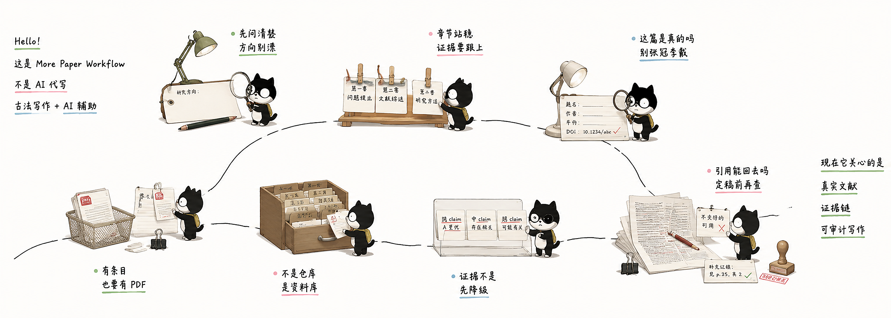

[](https://github.com/bingyunjiang/More-paper-workflow-pro-skill)
[](https://github.com/bingyunjiang/More-paper-workflow-pro-skill)
[](https://github.com/nousresearch/hermes-skills)
[](https://github.com/openclaw/openclaw)
[]()
[](LICENSE)
[]()

> **作者：** Dr. Jiang Bingyun　|　**微信：** Bingyunjiang　|　**邮箱：** bingyunjiang@qq.com

[**中文**](#chinese) &nbsp;|&nbsp; [**English**](#english)

<a id="chinese"></a>
# 📚 more paper workflow pro skill `v1.0.20-20260711`

> 面向中文/双语论文写作的证据闭环工作流。覆盖定题、检索、下载、Zotero、写作与引用审计，所有关键步骤都围绕真实文献落地，而不是模型记忆。

## 📑 目录

- [为什么需要这个工具](#为什么需要这个工具)
- [🎯 适合谁？不适合谁？](#适合谁不适合谁)
- [⚡ Quick Start / 装完第一句话](#-quick-start--装完第一句话)
- [📦 你会得到什么产物](#-你会得到什么产物)
- [🛑 不会做什么 / 何时停手问你](#-不会做什么--何时停手问你)
- [📋 工作流一览](#-工作流一览)
- [🚀 安装参考](#-安装参考)
- [🧱 核心能力速览](#-核心能力速览)
- [📖 使用指南](#-使用指南)
- [🛡️ 论文质量防线](#-论文质量防线)
- [📂 项目结构](#-项目结构)
- [❓ 常见问题](#-常见问题)
- [📋 版本历史](#-版本历史)
- [📄 许可](#-许可)
- [🙏 致谢](#-致谢)
- [🔗 相关链接](#-相关链接)

### 为什么需要这个工具

很多 AI 写论文工具把问题简化成“生成一段文本”，但论文真正麻烦的地方是证据、引用和边界是否站得住。  
这个 skill 不负责替你一键写完，而是把学术写作拆成 8 个可见、可中断、可回溯的步骤，让检索、下载、Zotero、写作和引用审计形成闭环。默认口径是先发散、后收敛、候选池先保留。每一步都要有输入边界、候选池、输出工件和失败回退。  

它的核心区别可以直接概括为几件事：

- 不是“主题 -> 直接出正文”，而是从定题、检索、下载、Zotero 到写作与引用审计的 8 步透明流程
- 不是靠模型记忆拼参考文献，而是围绕真实 PDF、BibTeX、Zotero 和附件一致性来组织证据
- 不是只会生成文本，而是会产出 `研究主题.md`、`文献库.bib`、`download_manifest.json`、`文献-Zotero架构对照.md/json`、章节蓝图、引用审计报告等中间工件
- 不是默认线性重跑，而是支持从 Step 5 下载、Step 7 写作等位置 direct-entry，只要你已经有等价输入
- 不是把高风险动作静默做完，而是在登录态、外部写入、证据不足或引用高风险时明确停手
- 不是为了“看起来聪明”，而是优先压制幻觉：直接读 PDF 原文，RAG 最多只做候选定位加速
- 不是堆平台依赖，而是尽量走跨平台、低额外成本路径：Chrome/Edge 自动检测，多数检索源免费可用，脚本自带依赖检查和失败回退

[](https://www.bilibili.com/video/BV1hzjE6jEmo/?vd_source=45e56689c0324bcaf7fe9c9cd13fca01)

> 点击上方海报可跳转到 B 站视频

## 🎯 适合谁？不适合谁？

### ✅ 适合你，如果你：

- 被 AI 编造参考文献坑过，想把“真实性”放在第一位
- 想用 AI 提效，但不想把研究判断权交给 AI
- 正在写综述、毕业论文、课程论文或课题申报书
- 已有或准备建立 Zotero 文库，希望把 PDF、条目和章节结构对齐
- 愿意按步骤推进，而不是追求“3 分钟自动出整篇论文”

### ❌ 不太适合你，如果你：

- 只想要“一键生成完整可信论文”
- 不接受任何人工确认节点
- 完全不关心引用是否真实、证据是否能追溯

## ⚡ Quick Start / 装完第一句话

README 首屏只保留 3 个最短入口。运行规则、失败回退和 step 级边界仍以 [`SKILL.md`](SKILL.md) 与 [`agents/`](agents/) 为准。

### 1. 定题入口

```text
我想研究“航空发动机滑油系统中 HFO 工质替代”的方向。请按 more paper workflow 先帮我做 Step 1，给我一份研究主题澄清结果，并说明下一步该怎么进入 Step 2。
```

- 适合：还没有最终题目，但已有研究方向
- 触发：Step 1
- 立刻会产出：`研究主题.md` 风格结果
- 样例：[`examples/first-run/step1-topic-sample.md`](examples/first-run/step1-topic-sample.md)

### 2. 直达下载入口

```text
请直接进入 Step 5。根据这 3 个 DOI 生成下载清单并说明下载路由，不要回跑前面的检索步骤：10.1016/j.est.2024.113105; 10.1109/ACCESS.2024.3399912; 10.1016/j.energy.2022.125097
```

⚠️ 订阅制出版社论文通常需要机构登录后才能下载。首次进入 Step 5 时，建议先启动 CDP 浏览器并在同一个 Chrome/Edge 窗口中完成机构 SSO 登录；登录后再执行直达下载，或让脚本进入现有登录门控。详见 [`agents/step_5_download.md`](agents/step_5_download.md)。

- 适合：已经有 DOI、BibTeX、标题清单或参考文献列表
- 触发：Step 5
- 立刻会产出：`download_manifest.json` / 路由预览 / 未解析条目清单
- 样例：[`examples/first-run/step5-download-summary.md`](examples/first-run/step5-download-summary.md)

### 3. 写作入口

```text
我已经有 Zotero 文库、PDF 附件和一份章节草稿。请直接进入 Step 7，先为“2.3 HFO 工质替代的研究现状”生成章节写作蓝图，并告诉我需要补哪些证据。
```

- 适合：已经有 Zotero / PDF / 草稿，不想从 Step 1 重跑
- 触发：Step 7
- 立刻会产出：章节蓝图、证据缺口或指定章节草稿
- 样例：[`examples/first-run/step7-writing-sample.md`](examples/first-run/step7-writing-sample.md)

更多最小样例见 [`examples/first-run/README.md`](examples/first-run/README.md)。可复现文本演示见 [`examples/demo/demo-script.md`](examples/demo/demo-script.md)。

如果你想直接运行一个现成的 Step 8 样本，而不是自己先准备 `论文初稿.md`，可直接使用：

- [`examples/demo/step8-ai-trace-demo/`](examples/demo/step8-ai-trace-demo/)

在仓库根目录执行：

```bash
python3 scripts/run_step8_ai_trace.py --project-root examples/demo/step8-ai-trace-demo
```

它会直接生成 `.skill-state/ai_trace_diagnostics.json`、`diagnostic_summary.md`、`revision_ledger.json/md`、`润色质量报告.md`，适合快速体验 Step 8 的 AI 味诊断、分诊单和统一状态契约。

## 📦 你会得到什么产物

这个 skill 不只给“回答”，而是给文件化中间产物，方便你继续检索、下载、审阅和写作。

- Step 1: `研究主题.md`
- Step 4: `检索文献表.md/.xlsx/.pdf` + `文献库.bib` + `step4-dashboard/`
- Step 5: `download_manifest.json` / `unresolved_download_items.md` / PDF 附件池
- Step 6: `文献-Zotero架构对照.md/json`、`capability_index.json/md`
- Step 7: `section_blueprints.md/json`、`writing_rationale_matrix.md/json`、章节草稿或全文草稿
- Step 7.16: `citation_audit_sample.md` 风格的引用审计结果
- Step 8: `论文润色稿.md` 与质量报告

推荐先看这 3 个对外最短样例：

- [`examples/first-run/step1-topic-sample.md`](examples/first-run/step1-topic-sample.md)
- [`examples/first-run/step5-download-summary.md`](examples/first-run/step5-download-summary.md)
- [`examples/first-run/step7-writing-sample.md`](examples/first-run/step7-writing-sample.md)

完整展示层见 [`examples/showcase/README.md`](examples/showcase/README.md)。

## 🛑 不会做什么 / 何时停手问你

这个 skill 的严谨性来自“会停手”，而不是“什么都自动做”。

- 不承诺一键生成可信论文
- 不会把未核验引用直接写进成稿关键结论
- 不会在 Step 6 静默默认 `cloud` 模式
- 不会因为缺少前序步骤就强迫你线性回跑；如果你已有等价输入，会按 direct-entry 合同进入当前步骤
- 可用 `.skill-state/artifact_passport.json` 记录 Step 4-8 direct-entry artifact graph：能确认的材料关系才标 confirmed，无法确认的 PDF、证据或引用关系只标 gaps/risks；Step 1-3 仍走对话式 direct-entry 合同，不由 Passport 做 readiness 路由
- 不会在需要登录态、外部写入或高风险动作时假装已经完成
- 不会把 README 当运行时真相；真正执行边界以 [`SKILL.md`](SKILL.md) 和 [`agents/step_*.md`](agents/) 为准
- 入口收敛只影响对外发现层，不影响对话式工作流从 Step 1-8 直接进入；Artifact Passport 的材料识别与 readiness 路由只覆盖 Step 4-8
- 6 种稳定写作模式仍然保留：`full-document / review-only / abstract-only / chapter-only / continue-existing / revision-only`
- 自然技能原则不新增公开入口，仍服务现有 8 步：先做任务定义，再做实现选择；双向校准、最小对比和反模式命名用于澄清任务边界；快速通道不跳质量门

## 📋 工作流一览

```
Step 1: 交互式确定研究主题（先发散后收敛）          → 研究主题.md
Step 2: 生成论文大纲与关键词（主任务 + 候选任务区）  → 大纲关键词.md
Step 3: 生成文献检索方案（协议化筛选 + 回退）        → 检索方案.md
Step 4: 多渠道检索+评分筛选（结果落文件 + 状态回写）  → 检索文献表.md / .xlsx / .pdf / .bib / step4-dashboard/
Step 5: 统一下载路由（显式失败状态 + 恢复点）         → paper-temp/ PDFs
Step 6: Zotero 文库管理（架构+证据层分离 + 缺口记录）  → zotero-架构.md + 文献-Zotero架构对照.md/json + pdf-附件池索引.json + Zotero
Step 7: 论文写作（结构化证据 + 可回查锚点）           → 文献证据矩阵.csv + 论文初稿或指定章节.md/.docx
Step 8: 润色与保守修订（诊断、局部修订、回退）        → 论文润色稿.md
```
[](https://www.bilibili.com/video/BV1hzjE6jEmo/?vd_source=45e56689c0324bcaf7fe9c9cd13fca01)

## 🚀 安装参考

### 推荐公共安装方式

当前最稳妥的公共使用方式，是把仓库地址交给支持 Skill 的对话式运行时，由它读取 `README.md`、`SKILL.md` 和 `agents/*.md` 后按需执行：

- `https://github.com/bingyunjiang/more-paper-workflow-pro-skill`

### 本仓库参考安装

本仓库保留参考安装说明，原因是不同运行时（Claude Code / Codex / Hermes / OpenClaw）的安装入口并不完全统一。短期内这里不强行承诺单一 `npx skills add ...` 命令，以免给出会失效的公共入口。

装好后，判断自己是否成功的最简单方式不是“看有没有报错”，而是直接复制上面的 3 条入口 prompt 之一，看它能否识别到对应 Step 和预期产物。

### Windows UTF-8 说明

本仓库的 Markdown / YAML 文件应以 UTF-8 保存。

如果你在 Windows 终端里看到中文乱码，这通常是终端显示编码问题，不一定表示文件内容已损坏。请优先用支持 UTF-8 的编辑器，或在 PowerShell 中显式按 UTF-8 读取文件后再判断。

PowerShell 示例：

```powershell
Get-Content -Encoding UTF8 .\SKILL.md
Get-Content -Encoding UTF8 .\README.md
```

判断原则：

- 若显式按 UTF-8 读取后中文正常，说明文件本身正常，只是终端默认编码不匹配
- 若显式按 UTF-8 读取后仍乱码，再检查文件是否被错误转码

### 许可与分发说明

- 仓库内许可证见 [LICENSE](LICENSE)
- Marketplace 元数据已放在 [`.claude-plugin/marketplace.json`](.claude-plugin/marketplace.json)
- GitHub 仓库描述、topics、release 说明等平台元数据属于发布动作，需要在仓库托管平台上同步维护

## 🧱 核心能力速览

- **Step 1-4 检索与筛选**：定题、大纲、检索式、多源检索、相关性评分、引文验证和饱和度分析，输出检索表、报告和 BibTeX
- **Step 5 下载路由**：已有 DOI、标题、URL、BibTeX 或参考文献列表时，可直达下载；统一记录成功、失败原因和恢复建议
- **Step 6 Zotero 对齐**：把大纲、BibTeX、中文元数据、PDF 附件池和 Zotero 集合映射到同一套可追溯结构
- **Step 7 写作与审计**：按章节读取证据，生成章节蓝图、写作理由矩阵、草稿、图表草案和引用审计结果
- **Step 8 润色与修订**：先诊断，再做保守修订；遇到证据缺口、结构漂移或引用错配时回退，而不是硬润色
- **跨平台运行**：Chrome/Edge 自动检测，脚本自带依赖检查；详细执行规则以 [`SKILL.md`](SKILL.md) 和 [`agents/step_*.md`](agents/) 为准

> 本项目集成的 Zotero MCP 基于 [54yyyu/zotero-mcp](https://github.com/54yyyu/zotero-mcp)，感谢原作者的开源贡献。

### 直接读 PDF vs RAG 分块

论文写作中引用精确性高于一切。本工具当前以**直接读 PDF 原文**为主链；若后续引入 RAG，也只作为候选定位加速层，而不是替代原文确认：

| 对比项 | 本工具：直接读 PDF | RAG 分块方式 |
|--------|-------------------|-------------|
| 引用精确性 | 整篇读取，上下文完整 | 分块后可能丢失上下文 |
| 每章文献量 | 按 Zotero 分类读取全部归属 PDF | 批量建索引，实际用得少 |
| 幻觉抑制 | 交互确认 + 读原文，源头保证 | 召回不完整时仍可能编造 |
| 部署成本 | 零依赖，直接文件读取 | 需 embedding 模型 + 向量库 |
| 维护成本 | 随时按需读取，无需预处理 | PDF 更新需重建索引 |

> 本工具的 Step 4 检索文献表 + Step 6 Zotero 架构已完成分类，写作时优先按需精读；RAG 只在需要加速定位候选证据时作为辅助层介入。

> RAG 的定位严格限定为**候选定位加速层**：RAG 负责“找哪里可能有证据”，Zotero note / annotation / PDF 原文直读负责“确认这里是不是真证据”。RAG 结果不会直接进入正文引用或引用审计结论。`retrieval_index_manifest.json` 只记录检索索引和缓存复用状态，不触发全文 RAG。第一版按章节确认，只覆盖文字证据，不并入图表证据子链。

---

## 🛡️ 论文质量防线

More Paper Workflow 在 8 步流程中嵌入了 **前中后段联动的质量防线**，形成逐层收紧、逐层分流的质量控制体系。设计原则：**越早发现问题，修复成本越低；越靠近成稿，越要区分“还能在当前层修”还是“必须回退补证据/补结构”。**

### 防线总图

```
选题阶段          大纲阶段          检索阶段          写作阶段          成稿阶段
   │                │                │                │                │
Step 1.4          Step 2.2          Step 4        Step 7.7/7.8/7.10       Step 7.12/7.14/7.16/8
选题预审    →    大纲评审    →    文献评分   →   论证计划/段落自查/引文评估  →  修稿/复评/审计/润色诊断
(方向对不对)     (结构好不好)     (文献靠不靠谱)   (这章能不能写/这段能不能引)    (问题到底关没关/还能不能定稿)
  0-25 分          0-25 分          0-25 分       结构化工件 + 定性清单 + 证据强度     量化+叙事+动作分流
                    │                                 │                          │
               导师视角检查                    Step 7.7 章节论证计划          Step 7.12/7.14 修稿/复评
               (能不能毕业/投稿)               Step 7.8.1 可读性检查        Step 7.16 引用审计
               workload/planB                  Step 7.9 引文支撑            Step 8 诊断优先润色
               /timeline/publish               Strong/Moderate/Weak         ready / rollback
```

### 各节点把控

| 节点 | 时机 | 类型 | 把控什么 | 决策 |
|------|------|:--:|------|------|
| **Step 1.4 选题预审** | 方向确定后 | 量化 (0-25) | originality / importance / feasibility / literature support / method readiness | 🟢绿灯继续 / 🟡黄灯调整 / 🔴红灯换方向 |
| **Step 2.2 大纲评审** | 大纲生成后 | 量化 (0-25) | 逻辑连贯性 / 结构平衡性 / 创新区分度 / 工程可行性 / 格式完备性 | P0 必须改 → P3 可选的 4 级优先级 |
| **Step 2.2 导师视角** | 五维评审后 | 定性 | 工作量够吗？有 Plan B 吗？能按时毕业吗？够发几篇？ | 要不要换个题的级别判断 |
| **Step 4 文献评分** | 检索执行后 | 量化 (0-25) | 主题匹配 / 方法一致 / 来源质量 / 时效性 / 引用量 | ⭐T1 必下 / 📘T2 尽量 / 📄T3 可选 / ⬜T4 剔除 |
| **Step 7.7 章节论证计划** | 写正文前 | 结构化约束 | 当前章节的 `core_claim` / `required_evidence` / `must_have_figure` / `rollback_if_missing` 是否清楚 | 没有证据就先不写，先回退补证据或补蓝图 |
| **Step 7.8.1 可读性检查** | 正文生成过程中 | 定性 | 段落职责、证据边界、动词强度、衔接是否足够清楚 | 只做轻量整理，不把表达偏好写成硬性质量门 |
| **Step 7.9 引文支撑** | 段落或章节形成后 | 定性 | Strong / Moderate / Weak；摘要级证据是否被误用；图表 claim 是否需要额外确认 | 只引用经 Zotero 条目、笔记、标注或 PDF 证据验证的文献；高风险 claim 触发回退或 checkpoint |
| **Step 7.12/7.14 修稿与复评** | 评审后 / 修稿后 | 量化+叙事+闭环 | 问题拆解、claim 变化、修稿动作、上轮问题是否关闭、是否引入新问题 | 未关闭问题或新问题需要继续 revision-only 或回退上游 Step |
| **Step 7.16 写后引用审计** | 初稿或修稿后 | 三层审计 | `format_status / mapping_status / evidence_status` + `recommended_action`；必要时图表证据子路径 | 高风险引用不能带入定稿；必须按动作建议修复 |
| **Step 8 诊断优先润色** | 引用审计后 | 诊断+分流 | `evidence_gap / structure_drift / language_mechanical / contribution_overclaim / citation_misalignment` 哪些还能在本层修 | `ready_to_polish / ready_with_warnings / not_ready_requires_rollback`；保真终验后才可 `ready_for_finalize` |

## 📖 使用指南

> README 只展示推荐主路径。备用脚本、失败回退、平台差异和执行边界，请以 [`SKILL.md`](SKILL.md) 与 [`agents/step_*.md`](agents/) 为准。

### Step 1: 确定研究主题

不知道怎么开始时，复制下面任一模板给 AI 即可。Step 1 会先判断你的研究阶段，再通过“发散层 / 收敛层”的两阶段方式做广度探索、预检索和选题预审：先把主题、假设、路线和反例放进候选池，再把当前轮收敛成一个执行包。

**推荐启动语：**

```text
采用 more paper workflow pro skill，从 Step 1 开始帮我确定研究主题。
请先诊断我的研究阶段，再引导我完成选题聚焦、预检索和选题预审。
```

**如果你还没有明确方向：**

```text
我现在只有一个大概兴趣方向：[填写领域/课程/行业/技术]。
我的身份是：[本科/硕士/博士/教师/工程师]，目标是：[毕业论文/期刊论文/综述/课题申报]。
请帮我发散 3-5 个可研究子方向，并评估哪个更适合继续做。
```

**如果你已有大方向：**

```text
我想研究：[你的大方向]。
已有基础/资源是：[数据、实验条件、软件、工程场景、导师要求]。
请帮我判断这个方向是否过宽，提出可落地的研究问题、方法路线、关键词和初步创新点。
```

**如果导师已经给了题目或约束：**

```text
导师给我的题目/要求是：[粘贴题目或要求]。
请不要直接改题目，先分析它的研究对象、核心问题、可行性风险和可检索关键词，
再给出 2-3 个更聚焦的题目版本供我选择。
```

**产出：** `研究主题.md`

```markdown
# 研究主题
- 用户画像：身份、阶段、时间压力、目标
- 子方向预检索对比：文献量、趋势、代表论文、初判 gap
- 聚焦主题：研究对象、研究问题、方法论、应用场景、评价指标
- 创新点初判：方法/应用/数据/组合创新
- 选题预审：originality / importance / feasibility / literature support / method readiness
- 检索深度：quick / standard / deep
- Step 2/3 交接块：标题候选、核心问题、关键词、排除词、推荐数据库
```

### Step 2: 生成论文大纲与关键词

基于研究主题生成章节结构、关键词清单和章节证据需求表。

> 💬 基于确定的研究主题，生成论文大纲和关键词清单。

**产出：** `大纲关键词.md` + `大纲关键词.pdf` + 更新 `.skill-state/term_aliases.md`

```markdown
# 论文大纲与关键词

## 论文标题

## 检索语言
中文 | 英文 | 中英文混合

## 章节大纲
| 章节ID | 章节标题 | 章节目标 | 核心论点 | 证据需求 | 预期图表 | 风险点 |

## 关键词清单
| 章节 | 核心词 | 同义词/缩写 | 上位词 | 下位词 | 方法词 | 场景词 | 指标词 | 排除词 |

## 章节证据需求表
| 章节ID | 证据类型 | 需要回答的问题 | 推荐数据库 | 推荐检索词 | 优先级 |
```

### Step 3: 生成检索方案

> 💬 根据章节大纲、关键词清单和章节证据需求表，制定结构化文献检索方案。

```yaml
search_language: 中文|英文|中英文混合
tier: quick|standard|deep
search_tasks:
  - id: S1
    chapter_id: ch1
    evidence_type: review|method|experiment|data|standard|case
    query_blocks:
      - name: 研究对象
        terms: []
    route:
      l1: []
      l2: []
      l3: []
```

**产出：** `检索方案.md` + `检索方案.pdf`

### Step 4: 检索与评分（4.1→4.9）

> 💬 按检索方案执行多渠道文献检索，并进行引文验证、评分、分级、饱和度分析和检索报告生成。

**核心流程：**
```
4.2 引文验证 → 4.3 DOI 去重 → 4.4 筛选依据确认 → 4.5 五维评分 → 4.6 T1-T4 分级(T4剔除)
→ 4.7 引文扩展(评分闭环) → 4.8 饱和度分析 → 4.9 报告生成与完成检查
```

```bash
# 推荐：T1→T2→T3 三级路由检索
python3 scripts/search_by_topic.py "cold plate liquid cooling optimization" \
  --t1 crossref --t2 openalex --t3 semantic_scholar --min-results 30 --score
```

完整的预检、用户可见筛选依据确认、饱和度分析、分级阈值和扩展检索规则见 [`agents/step_4_search_score.md`](agents/step_4_search_score.md)。

**产出：** `workflow_search_results.json` + `检索文献表.md/.xlsx` + `检索报告.md/.pdf` + `文献库.bib` + `retrieval_index_manifest.json` + `step4-dashboard/`，条件性产出 `saturation_snapshot.json` / `中文论文元数据.json`

### Step 5: 统一下载路由

> 💬 开始批量下载论文 PDF，按出版商和来源自动进入 Sci-Hub / OA fast / IEEE CDP / Generic CDP / Chinese CDP 路由；已有 DOI、论文标题、URL 或 BibTeX 时也可直接从 Step 5 开始。

**推荐方式：统一入口自动路由**

```bash
# 单一入口，两轮顺序执行，自动路由到对应策略
python3 scripts/unified_download_router.py 检索文献表.md -o paper-temp/

# 已有 DOI 时可直达下载
python3 scripts/unified_download_router.py --papers "10.1021/x,10.1002/y" -o paper-temp/
```

**产出：** `download_log.md`、`download_manifest.json`、`download_attempts.jsonl`、`pdf-附件池索引.json` 和 PDF 附件池。Step 5 会在重跑时识别本地已有 PDF，避免重复下载；失败项会写入明确的 `failure_reason`、恢复分桶和 `recommended_next_step`。手动补下载 PDF 后，可运行 `python3 scripts/step5_reconcile_pdf_pool.py --output paper-temp/` 归并回 manifest/PDF pool；下载前诊断可运行 `python3 scripts/step5_download_doctor.py --output paper-temp/`。英文机构登录门控会按本轮待登录 DOI 自动打开所需出版社 tab，中文 CNKI/万方门控会按本轮 source 自动打开对应文库入口。出版商路由、CDP 登录门控、失败回退和 Cloudflare 应对详见 [`agents/step_5_download.md`](agents/step_5_download.md) 与 [`references/publisher-access-matrix.md`](references/publisher-access-matrix.md)。

### Step 6: Zotero 文库管理

> 💬 用 Step 4 的 `文献库.bib`、Step 2 的大纲和 Step 5 的 PDF，建立一致的 Zotero 文库。

#### 6.1: 生成 Zotero 架构

根据 Step 2 大纲生成 `zotero-架构.md/json`，作为后续集合创建和一致性检查的源文件。标准链路下，根集合是论文题目，一级集合只作为一级章节容器，文献默认直接归入对应的大纲二级章节集合。

#### 6.2: 生成文献-Zotero架构对照

结合 `workflow_search_results.json` / `文献-大纲对照.json`、`文献库.bib`、`zotero-架构.md/json` 和 PDF 附件池，生成 `文献-Zotero架构对照.md/json` 与 `pdf-附件池索引.json`，明确每篇文献的推荐集合、标签、PDF 文件、导入状态和附件状态。`.md` 是人类审阅版，允许截断长字段；`.json` 是机器执行源，所有字段必须完整保留。PDF 附件池可包含 Step 5 下载、原有 PDF、后续补下载和手动整理目录。

#### 6.3: 通过 Zotero MCP 创建集合

按 `zotero-架构.json` 递归创建 Zotero 集合和子集合，并检查 Zotero 实际集合树与架构文件一致；集合路径应优先复用前序文献-大纲映射，便于 Step 7 按小节集合取证。首次使用 Zotero MCP 时，配置和诊断见 [`docs/ZOTERO_MCP_SETUP.md`](docs/ZOTERO_MCP_SETUP.md)。

#### 6.5: 导入条目并关联PDF附件

通过 Zotero MCP 导入 `文献库.bib` 条目，按 `文献-Zotero架构对照.json` 移入对应集合，再从 PDF 附件池中把匹配 PDF 关联为条目附件。完成后检查：

- 每个 BibTeX 条目在 Zotero 中有唯一条目或明确失败原因
- T1/T2/T3 条目进入对应集合
- T1/T2/T3 条目已关联 PDF 附件，缺失项列入缺附件清单，附件池中未匹配 PDF 列入未关联清单
- Zotero 集合、条目、PDF 与 `文献-Zotero架构对照.json` 一致

> **为什么谨慎使用 Zotero 云端上传？** Zotero 免费版仅有 300MB 文件存储，批量下载的 PDF 总量可达 1.4GB+，远超免费额度。若 MCP 无法写入附件，可保留元数据入库结果，并在 Zotero 桌面端按对照表手动拖拽 PDF 附件。

#### 6.6: 生成能力索引

生成 `capability_index.json/md`，说明当前 Zotero、BibTeX、workflow JSON、PDF、MinerU ZIP 和附件池能支持哪些后续 Step，以及哪些缺口会影响写作、引用审计、下载或 Zotero 写入。

### Step 7: 论文写作

> 💬 基于 Zotero 文库中的文献，先生成文献证据矩阵和目标体裁/文档风格蓝图，再开始完整写作、指定章节写作或续写已有草稿。

Step 7 的核心能力：

- **文献证据矩阵（7.1）**：把 T1/T2/T3 文献整理为可写作、可引用、可审计的证据表。
- **章节级候选证据层（7.7.4）**：弱 RAG 只做 claim→候选证据定位，再按章节回到 note / annotation / PDF 原文确认，并把确认结果回写 `argument_plan`。
- **候选证据增强字段**：记录 `evidence_question_id`、`query_variant`、`source_page_hint` 和反证/冲突候选，只帮助定位证据，不决定正文写法。
- **目标体裁/文档风格（7.2）**：支持期刊论文、学位论文、会议论文、课程论文和已有草稿续写。
- **多种写作范围**：可完整写作、只写综述章节、只写指定章节、续写已有草稿、只写摘要或只做 revision-only 修稿。
- **修稿入口（7.12）**：收到审稿意见后，直接在 Step 7 生成修稿路线图、回应骨架和证据缺口清单，并用统一 `issue_state` 跟踪问题生命周期。
- **章节级论证计划（Step 7.7）**：正文生成前先锁定章节 claim、所需证据、图表要求和缺证据回退策略。
- **图表意图与证据约束**：先记录 `figure_intent → evidence_basis → candidate_specs → human_selected_candidate → figure_risk_note`，再决定图表是否进入正文。
- **复评（7.13）**：验证修稿是否真正关闭上轮问题、是否引入新问题、引用风险是否下降。
- **引用闭环**：逐段匹配 Zotero 条目和 PDF/笔记/标注证据，写后执行引用审计。
- **质量门**：包含段落自查、同行评审仿真、图表生成和写后引用审计。

详细执行规则以 [`agents/step_7_writing.md`](agents/step_7_writing.md) 为准。

常见场景入口：

- 导师给了目录，但还没检索：从 Step 2/3 开始
- 已有 DOI / BibTeX / 标题清单：直接进入 Step 5
- 已有 Zotero 文库和 PDF：直接进入 Step 7
- 已有草稿，只想续写或补写章节：Step 7 `continue-existing` / `chapter-only`
- 收到审稿意见，需要先拆任务：Step 7 `revision-only` + `revision_roadmap.md`

Step 7 对 existing-draft 统一分成三类入口：

- `continue-existing`：继续写主体内容
- `chapter-only`：只处理指定章节
- `revision-only`：按审稿意见或修订目标做定向修订

它们都允许 direct-entry，但都不能跳过证据确认。

### Step 8: 润色与保守修订

> 💬 对论文初稿进行润色、受约束补写与修订后验证，重点维护证据边界、表达清晰度和终稿风险收口。

Step 8 现在优先做诊断，再做保守修订。它会先把问题分成固定几类，并进一步归入中文三分法：

- `evidence_gap`
- `structure_drift`
- `language_mechanical`
- `contribution_overclaim`
- `citation_misalignment`

以及：

- `可直接修订`
- `需作者决定`
- `当前依据不足`

并通过 `diagnostic_summary.md`、`revision_ledger.json/md`、`润色质量报告.md` 明确告诉用户：

- 哪些问题可在 Step 8 内解决
- 哪些是直接修改，哪些属于局部补写
- 哪些问题必须回退 Step 7 或 Step 4/6
- 哪些改动触发了 `meaning_audit_required`
- 下一步应是继续定稿，还是回退修稿/审计/证据修复
- 诊断阶段 `Overall Status` 应为：`ready_to_polish / ready_with_warnings / not_ready_requires_rollback`；只有润色稿存在且保真终验通过后才可为 `ready_for_finalize`

Step 8 还会自动运行一个内部的 **AI 味确定性检查** 子层，用于识别机械化表达、空泛套话、悬垂洞见、句长节奏过匀和载体层脏污。这个检查只服务于润色诊断，不判断学术观点真假，不替代 Step 7 引用审计，也不会因为“像 AI”就直接判定稿件失败。

从当前版本开始，Step 8 运行态会在项目 `.skill-state/ai_trace_diagnostics.json` 写出结构化结果。它不只是中间调试文件，还承载 Step 8 runtime 状态源：包含 AI 味诊断统计、局部分诊结论，以及对齐全仓统一输出契约的 `status_contract`。后续的 `artifact_passport.json` / 路由层可以读取它，决定 Step 8 是继续局部润色、回到 Step 7 引用审计，还是回退 Step 4/6 补资料底座。

Step 8 的边界是：

- 可以做术语统一、语言清理、论断降强度、已有引用落点调整
- 可以补桥接句、限定句、解释句、引证配套句、局部支撑句
- 不新增外部证据或引用来源
- 不重写章节主体，不接管 Step 7 的主写作
- 必要时可读取 `retrieval_candidates.json` 做缺口提醒，但不得把候选层内容当作证据

Step 8 可以检查明显的机械化表达、重复性问题和读者理解障碍，也会做 AI 味确定性检查与载体清洁度检查（Markdown/LaTeX/Word hygiene），但不会把某种固定风格、句长节奏或“人味”写法设成硬标准。  
在不越过证据边界和论证边界的前提下，用户仍保留自己的写作策略和表达风格。

---

## 📂 项目结构

```
More-paper-workflow-pro-skill/
├── README.md                       ← GitHub 展示与快速开始
├── SKILL.md                        ← Skill 入口、触发词、Agent 路由
├── agents/                         ← Step 1-8 权威执行规则
├── scripts/                        ← 可直接运行的 Python/浏览器自动化脚本
├── references/                     ← 模板、规范、rubric 与写作参考
├── docs/                           ← 详细安装与集成文档
├── config/                         ← 出版商、下载策略等配置
├── posters/                        ← 版本海报与展示素材
└── scripts/packages/               ← Zotero MCP 离线依赖缓存（需与推荐版本同步）
```

| 目录/文件 | 什么时候看 |
|-----------|-------------|
| `SKILL.md` | 想了解触发词、Agent 路由和运行时总览 |
| `agents/step_*.md` | 想看某一步的权威执行规则、输入输出和质量门 |
| `scripts/unified_download_router.py` | 需要统一下载 PDF 时 |
| `scripts/setup_zotero.py` | 第一次配置或诊断 Zotero MCP 时 |
| `references/` | 需要模板、引用格式、rubric、图表与写作参考时 |
| `docs/ZOTERO_MCP_SETUP.md` | Zotero MCP 安装、离线包升级或跨平台配置遇到问题时 |

> README 只展示仓库导航；完整脚本索引和 Step 细则以 `SKILL.md`、`agents/step_*.md` 和实际目录为准。

---

## ❓ 常见问题

<details>
<summary><b>下载时遇到 Cloudflare "Verify you are human" 怎么办？</b></summary>

**IP 认证模式下通常不需要手动操作。** CDP 协议使用真实浏览器环境，Cloudflare Turnstile 会自动放行。

如果确实遇到验证页面：
1. 脚本会自动等待 60 秒让 Turnstile 自行通过
2. 超时后，在弹出的浏览器窗口中手动点击验证框
3. 通过后 session cookie 保留，后续下载自动复用

**SSO 登录模式**首次启动浏览器时需手动完成一次登录 + 验证，之后同一 profile 下不再需要。
</details>

<details>
<summary><b>为什么不用 HTTP 库直接下载？</b></summary>
主流学术出版商均部署了 Cloudflare / Akamai 等反爬系统。CDP Chrome 通过真实浏览器环境绕过检测，是当前唯一可靠的方式。
</details>

<details>
<summary><b>需要机构订阅吗？</b></summary>
ScienceDirect、CNKI、万方等下载需要机构订阅（IP 或 SSO）。Sci-Hub 下载不需要，对 2021 年前老论文更有效。
</details>

<details>
<summary><b>需要Codex、Hermes Agent、OpenClaw 或 Claude Code 吗？</b></summary>
**需要** 虽然所有脚本都是标准 Python 脚本，可直接命令行调用。但用 ReasonIX、Codex、Hermes、OpenClaw、Claude Code等提供的是智能调度层，非常便捷使用。
</details>

<details>
<summary><b>电脑休眠后下载卡住了？</b></summary>
脚本有 120 秒超时保护。单篇超过 120 秒自动标记为失败并跳过，不阻塞后续。
</details>


---

## 📋 版本历史

完整版本历史请参见 [CHANGELOG.md](CHANGELOG.md)。以下为各版本要点：

### v1.0.20-20260711 (2026-07-10 至 2026-07-11)

- Step 1-4 增加真实小样本证据校准、低负担交互记录、关键词语料审计、检索后局部协调和按来源能力编译查询，补强 PRISMA-S、发现轮次与元数据溯源。
- Step 5-6 增加原子 JSON、去重 journal、可关闭 checkpoint 以及 Zotero plan/execution 新鲜度审计，降低中断、重跑和旧操作记录导致的状态失真。
- Step 7-8 新增博士论文整篇论证地图、逐章 `prepare -> write -> close -> incremental audit`、作者声音与修订责任合同；保持 direct-entry，并明确不承诺 AIGC 检测结果。

### v1.0.18-20260627 (2026-06-26 至 2026-06-27)
- **Step 7 写作前硬门控与结构化子模式**：`full-document / chapter-only / continue-existing` 写作必须先生成 `step7_execution_card.md`；新增四个结构化子模式（`section-blueprint-first` / `pre-review` / `citation-audit` / `revision-roadmap`），统一消费同类证据工件。
- **图文联合约束加固**：Markdown-first 不等于 text-only；正文需包含图片或可解析图位标记；`post_write` 只表示图片插入可后置。
- **写作质量审计脚本体系**：新增 6 个脚本（`audit_scientific_writing_quality.py` / `audit_engineering_claims.py` / `validate_step7_output.py` / `md_to_pdf_with_images.py` / `build_mechanism_argument_plan.py` / `build_deep_read_cards.py`）。
- **领域知识包（Domain Packs）**：新增 4 个领域包（材料/机械 Journal Style、材料/机械 Writing、电力电子/充电桩/储能/EMS/V2G、电力电子 Journal Style）与 6 个质量/审计参考文件，均采用条件加载策略。
- **Step 8 审稿式润色子模式**：新增 `review-style-polish` 子模式与 `CRITICAL / MAJOR / MINOR` 严重性分级；默认输出顺序固定为 7 段制。
- **SKILL.md/README 入口收敛重构**：SKILL.md 新增全局执行纪律；README 首屏只保留 3 个最短入口；新增 `agents/step_1_entry.md`、`step_7_entry.md`、`references/reference-index.md`。入口收敛不影响 direct-entry。
- **测试大幅扩展**：`test_step7_step8_contracts.py` +532 行；新增 `test_validate_step7_output.py` / `test_writing_quality_audits.py` / `test_public_docs.py` / `test_direct_entry_contracts.py`。


### v1.0.16-20260621 (2026-06-21)
- **Step 8 与运行态状态源继续收口**：AI 味诊断、`.skill-state/ai_trace_diagnostics.json`、Step 8 demo、`artifact_passport` 对接与更新提醒协议一起落位，润色层更接近可验证、可追踪的发布状态。
- **跨平台主入口继续统一**：`start_cdp_browser.py`、`batch_chinese_search.py`、Zotero Windows 支持、平台兼容扫描与测试门继续收口，下载、检索和文库入口进一步转向 Python CLI 优先。
- **跨 Agent 入口与激活继续收口**：`SKILL.md` frontmatter 收窄为发现友好的最小集合，触发词迁移到独立 `trigger-catalog`，并补齐 Codex / Claude 的薄适配层，减少不同宿主对超长 skill 头部的误读风险。
- **版本检查改为以 `SKILL.md` 为主锚点**：升级检查统一把 `SKILL.md` 当作主版本源，README / CHANGELOG 作为展示副本，减少版本号各看各的情况。
- **Windows UTF-8 使用说明补齐**：README 与 SKILL 同步加入 Windows 下显式按 UTF-8 读取的说明，帮助区分终端显示乱码与文件真实损坏。
- **首屏封面视频化**：README 顶部海报图改为点击跳转 B 站介绍视频，作为对外展示入口。
- **同类海报统一入口**：`posters/story/more-paper-long-scroll.png` 与 `posters/story/preview-contact-sheet.png` 统一为同一个视频跳转链接。
- **对外展示继续保持压缩**：README 只保留展示和入口信息，运行规则仍以 `SKILL.md` 与 `agents/*.md` 为准。

### v1.0.15-20260619 (2026-06-19)
- **Step 8 AI 味诊断与运行态状态源**：新增确定性写作诊断、`.skill-state/ai_trace_diagnostics.json`、Step 8 demo 和样例报告，用于把机械化表达、空泛套话、载体层脏污与局部分诊结果写成可追踪状态
- **Windows + macOS 双平台运行入口**：核心入口统一改为 Python CLI 优先，`.sh` 继续作为 macOS/Linux wrapper 保留，Windows 原生 PowerShell/CMD 不再依赖 bash
- **跨平台 CDP 与中文批处理入口**：新增 `scripts/start_cdp_browser.py` 和 `scripts/batch_chinese_search.py`，支持 Chrome/Edge、登录等待、CNKI/万方串行检索和原有 protocol markers
- **下载与 Zotero 兼容性修复**：下载脚本统一提示 Python CDP 启动方式；Zotero MCP 安装支持识别 Windows `Scripts/zotero-mcp.exe`，并明确离线 wheel cache 的平台边界
- **平台兼容扫描与测试加入质量门**：新增 `scripts/check_platform_compat.py` 和平台兼容测试，用于发现未标注的 macOS-only 命令、`bash/curl` 假设、硬编码临时目录和 Zotero 路径风险
- **自动更新与后续开发规则固化**：版本检查、升级提示和用户确认边界形成可测试协议；新增脚本默认先提供 Python CLI，平台相关命令必须标注平台或提供跨平台替代

### v1.0.14-20260618 (2026-06-17 至 2026-06-18)
- **Step 4 / Step 6 的中文元数据与映射产物补齐**：新增和增强 `manage_step4_intermediate.py`、`merge_workflow_results.py`、`export_chinese_metadata.py`、`export_outline_mapping.py`、`build_zotero_plan.py` 等链路，稳定生成中间工件、章节映射和 Zotero 规划输入，降低多章节场景下的手工整理成本
- **Step 5 下载路由与出版社矩阵继续收口**：统一下载路由、通用出版社下载器、访问矩阵和 Step 5 文档同步更新，并补强下载测试，进一步固定直达下载和回退行为
- **新增英文摘要增强与 Step 4 表格导出**：加入 `enrich_english_abstracts.py` 与 `export_step4_table.py`，改善跨语种检索后的摘要质量和人工审阅展示层
- **工作流契约继续向 Step 7 写作输入延伸**：新增 `paper-card-contract.md`，同步增强 Step 4 / 6 / 7 的字段约束，使检索结果、Zotero 规划和写作输入更容易稳定衔接
- **对外宣传素材更新**：新增 `docs/promo-copy.md` 与一组 `posters/story/` 原创长卷海报，README 保持对外概览，详细变更保留在 `CHANGELOG.md`

### v1.0.13-20260616 (2026-06-15 至 2026-06-16)
- **Step 7 证据链改为多入口设计**：默认推荐 `Zotero + PDF + MinerU ZIP`，但 Zotero/MinerU 不再是硬依赖；无 Zotero、无 MinerU 或无解析缓存时，可通过本地 PDF、BibTeX/CSL JSON、实验报告、数据、草稿、审稿意见、标准文件和图片目录组成 `evidence_pack` 继续写作
- **证据等级决定 claim 强度**：新增 `evidence-pack.v1` 最小映射，固定 `source_path / source_type / evidence_level / claim_scope / risk_flags / verification_action`；只有草稿或摘要级材料时，只能写低风险结构稿并标注证据缺口
- **MinerU ZIP 接入 Zotero 附件形态**：支持识别 `LLM-for-Zotero-MinerU-cache-*.zip`，读取 `_llm_source.json`、`manifest.json`、`full.md` 和 `images/`，生成 `figure_index.json` 并可复制图片到 `figures/`
- **写作输出收口为 Markdown-first**：Step 7 默认写 `论文初稿.md` 或 `指定章节草稿.md`，图像用相对路径插入；完成当前写作范围后再提示导出 DOCX，只有用户明确要求阶段 Word 审阅时才边写边导出
- **PyMuPDF fallback 风险标记补齐**：直接读 PDF 的低质量 fallback 会标记 `parser_confidence=low`、`must_check_pdf=true` 和布局风险，不直接支撑图表、公式、表格、精确数值或强 claim
- **防截断原则固化**：JSON/BibTeX/证据映射等机器主工件禁止截断；Markdown/XLSX/PDF 展示层可截断但必须保留稳定回查 ID，且不得反向污染机器工件
- **编号体系清理**：Step-local 子步骤统一从 `N.1` 开始，去掉 `N.0`；外层模板标题和入口路由文件去除普通文档序号，避免和 `7.x` 这类业务子步骤混淆
- **契约测试扩展**：新增 MinerU ZIP、证据包、防截断和标题编号防回归测试；完整测试扩展到 75 项并通过

### v1.0.12-20260614 (2026-06-14)
- **PDF 全文工作层闭环**：新增 `references/pdf-processing-policy.md`，正式收口 `metadata-first / selective-fulltext / batch-fulltext` 三档模式；默认不全量 `PDF -> Markdown`，而是先 `JSON + Zotero`，只在关键 claim、方法细节、图表/公式/页码核对和引用审计时升级到全文层
- **新增 `scripts/prepare_pdf_for_llm.py`**：单篇或定点 PDF 可直接生成 `raw.md`、`clean.md`、`chunks.json`、`extraction_report.json` 与 `prepared_pdf_artifacts.json`，用于 Step 7/7.16/8 的全文工作层
- **MinerU 首次使用提示与回退语义补齐**：`prepare_pdf_for_llm.py` 现支持 `--parser auto/pymupdf/mineru-local/mineru-api`；`auto` 检测到复杂 PDF 时会主动建议 MinerU，但不阻塞主流程；若 `mineru-local` / `mineru-api` 不可用，会自动回退 PyMuPDF，并给出本地 CLI、API 和官方在线试用的提示说明
- **Step 6 主 JSON 接入 prepared artifacts**：`scripts/build_zotero_plan.py` 新增 `--prepared-pdf-artifacts`，`文献-Zotero架构对照.json` 的每条 record 现在可回挂全文提取结果、证据层级、`must_check_pdf` 和 `risk_flags`
- **引用审计升级为“摘要支撑 + PDF 风险提醒”双层结构**：`scripts/citation_audit.py` 新增 `--mapping`、`--pdf-index`、`--prepared-chunks`，即使摘要层看似支撑，也会对高风险内容提示“必须回原 PDF 核验”；同时修复了“全部无法判断却误报通过”的结论 bug
- **标准命令链与样例演练补齐**：`SKILL.md` 和 `agents/step_6_zotero.md` 现已提供 `prepare_pdf_for_llm.py -> build_zotero_plan.py -> citation_audit.py` 的最小 example workflow，并在 `tests/tmp-pdf-drill/` 中完成真实链路演练
- **Step 1 / Step 2 深化重构**：Step 1 现在明确采用“发散层 / 收敛层”两阶段结构，先保留候选池再收敛当前轮问题；Step 2 明确为完整大纲唯一生成层，且 `2.3` 继续以已有大纲为主体，Step 1 仅作约束源
- **RAG 候选层落位**：新增 `retrieval_index_manifest.json`、`retrieval_candidates.json` 契约，明确 RAG 只负责候选定位，不能直接升级为 `VERIFIED` 或直接决定审计动作
- **图表证据子链加入 Step 7**：新增 `figure_index.json`、`figure_evidence_report.md/json` 契约，并把图注/正文绑定、图表 claim、图表误引风险接入 `argument_plan`、`revision-only` 和 `7.16`
- **质量防线更新**：README 的“论文质量防线 / Quality Defense Line”已改为前中后段联动版本，覆盖 `7.6`、`7.12/7.14`、`7.16`、`8`
- **全仓编号与公共口径整理**：运行文档、README、SKILL、references、examples 和 CHANGELOG 统一到当前小数编号体系，并补充 Step 8 最小验证与 `revision_ledger` 的编号洁净度契约测试
- **契约测试扩展**：新增 Step 1/2、RAG 候选层、图表证据链的测试，保证 direct-entry 与现有证据链不被破坏

### v1.0.11-20260613-1 (2026-06-12 至 2026-06-13)
- **Step 7/8 写作与润色工作台收紧**：写作模式收敛为 6 个稳定模式（`full-document / review-only / abstract-only / chapter-only / continue-existing / revision-only`），并把写作/润色入口、运行时契约和测试统一
- **新增章节级论证计划**：Step 7 在风格蓝图和正文生成之间补入 `argument_plan.md/json`，先锁定章节 claim、证据、图表和回退策略，避免直接硬写正文
- **修稿闭环成形**：新增修稿教练、`revision-only` 执行记录和复评层；`revision_roadmap.md`、`response_letter_skeleton.md`、`evidence_gap_list.md`、`rereview_report.md` 成为标准工件
- **三层引用审计动作化**：在 `format_status / mapping_status / evidence_status` 之外新增 `recommended_action`，可直接服务 `revision-only`
- **Step 8 绑定 Step 7 三工件**：`style_profile.json`、`section_blueprints.json`、`writing_rationale_matrix.json` 从“优先读取”升级为“默认约束源”；缺失时只能降级运行并显式记录
- **文档与示例层增强**：新增 `commands/` 短文档层、`examples/showcase/` 样例层，以及 Step 7/8 契约测试与 fixtures

### v1.0.9-20260609 (2026-06-08 至 2026-06-09)
- **Step 2-5 流程接口收口**：Step 2 新增已有大纲评估优化模式和 2.1/2.3 路由判定；Step 3/4 用 `search_tasks`、章节字段和 `中文论文元数据.json` 打通大纲、检索、下载、Zotero 和写作
- **Step 5 直达下载模式**：用户可直接提供 DOI、标题、URL、BibTeX 或参考文献列表；系统先生成 `direct_download_manifest`，只下载可唯一解析的条目
- **Step 6 Zotero 文库管理升级**：新增 `scripts/build_zotero_plan.py`，先生成 `文献-Zotero架构对照.md/json` 与 `pdf-附件池索引.json`，再决定是否写入 Zotero
- **中文文献入库补齐**：CNKI/万方条目使用 `source_id` + `article_url` + 中文元数据生成 CSL JSON，不再把合成 ID 当 DOI
- **PDF 附件池策略**：Step 5 下载、原有 PDF、补下载和手动整理目录统一纳入附件池；默认先判断 `missing/found/already_attached/duplicate_candidate/conflict`，再给出安全动作建议
- **中文检索批处理**：跨平台主入口 `scripts/batch_chinese_search.py` 现在默认先直跑 CNKI/万方批量检索，只在失败项需要登录/验证时才进入 CARSI 登录等待并重试失败项；仍支持 `--login-only`，`scripts/batch_chinese_search.sh` 仅作为 macOS/Linux wrapper 保留
- **运行态模板隔离**：`decision_log.md` / `error_log.md` / `term_aliases.md` 移入 `references/templates/`，首次使用复制到项目 `.skill-state/`，避免直接改模板
- **文档与仓库清理**：README 升级到 v1.0.9，补充 Codex 展示，明确 README 是概览、`agents/step_*.md` 是运行时规则；`.claude/` 改为本地配置忽略项
- **解析修复**：`organize_zotero.py` 支持 Step 2 标准 `章节大纲` 编号列表和 `关键词清单` 表格，避免元信息标题误生成集合

### v1.0.7 (2026-06-07)
- **CDP 登录门控**：Step 5 硬性规则（Agent 必须先 `--dry-run` → 等待用户确认登录 → 才能执行 CDP）+ `--require-login-confirm` 脚本门控参数
- **中文文献下载路由**：新增 CNKI/Wanfang CDP 下载（Chinese CDP Round），通过文章详情页 URL 绕过无 DOI 问题
- **SKILL.md 压缩**：description 压缩为 ~300 字单行中英混合，适配 Codex 解析器
- **检索报告元数据化**：PRISMA 分阶段展示、动态路由表、元数据三级回退，记录管理改为 .md/.xlsx/.bib 导出
- **检索规则修正**：Step 3 L2 Crossref 必选源，Step 4 中英文源拆分独立决策表 + 用户无机构账号分支
- **文库大纲对照表独立触发**：+11 条触发词（文库大纲对照表/覆盖热力图等），该对照表从隐式产出变为可独立触发重新生成

### v1.0.6 (2026-06-06)
- **新增 CNKI + Wanfang 中文检索**：CDP Chrome 驱动，无 API Key 依赖，校园网 IP / 校外 CARSI 双模式
- 摘要贯穿全链路：CNKI（详情页提取）、Wanfang（结果页解析）、OpenAlex（倒排索引重建）、Semantic Scholar（API 返回保留）
- 评分升级：维度① 标题+摘要关键词匹配，维度② 摘要检测实验/仿真信号 → 方法学区分度
- 摘要贯通输出：.md / .bib / .xlsx 全部含摘要列
- 容错增强：Semantic Scholar 429 指数退避重试 + 免费 API Key 提示

### v1.0.5 (2026-06-05)
- 统一下载路由：单一入口自动路由，覆盖 23+ 家出版社，通用 CDP 下载引擎 + 出版社配置知识库
- Agent 模块化：3284 行 SKILL.md 拆分为 9 个独立 Agent 文件（377 行）
- 检索融合：Step 4 重构为 4.1→4.9 八道工序，T1→T2→T3 路由，发现曲线，arXiv 辅助检索
- 新增 3 个能力：Step 7.3 目标体裁/文档风格学习、Step 7.15 科研图表生成、Step 7.16 写后引用审计
- 术语标准化 + 错误/决策日志贯穿全流程

### v1.0.4 (2026-06-04)
- 质量防线体系：6 道评审节点（选题预审→大纲评审→文献评分→段落自查→引文评估→成稿评审）
- Step 7 写作引擎（paper_type × language × target_genre，支持多种写作范围），先产出 `style_profile` / `section_blueprints` / `writing_rationale_matrix`，再进入正文生成；保留导师视角 + 三审稿人报告 + Rebuttal 预演
- `search_by_topic.py` v2.0：T1→T2→T3 路由、Pre-flight、多格式导出

### v1.0.3 (2026-06-03)
- Zotero MCP 多环境兼容：Claude Code / Hermes / Cursor / Claude Desktop 自动检测配置
- README 结构重整：设计哲学表、受众定位、Step 触发短语

### v1.0.2 (2026-06-02)
- Zotero MCP 安装器重写：离线 wheel 缓存（76 个，~15MB），Web API + 本地 API 双模式

### v1.0.1 (2026-06-02)
- IEEE CDP 两步走下载策略、cdp_utils.py 共享模块抽取
- Step 7 同行评审仿真质量门 + Step 8 润色与保守修订闭环

### v1.0.0 (2026-06-01)
- 初始发布：8 步完整学术工作流

---

版本号格式：`v<major>.<minor>.<patch>-<YYYYMMDD>`

- **major**：工作流步骤增减或架构重设计
- **minor**：单个步骤重大更新（新脚本、新策略、新产出）
- **patch**：Bug 修复、文档更新、小优化

---

## 👥 贡献者

| 贡献者 | GitHub | 角色 |
|--------|--------|------|
| Dr. Jiang Bingyun | [@bingyunjiang](https://github.com/bingyunjiang) | 作者、架构设计、Python 脚本开发 |
| banxiyan (Vincent Zhu) | [@banxiyan](https://github.com/banxiyan) | 代码贡献 |
| Peter Bruce | [@peterbruce716-art](https://github.com/peterbruce716-art) | 代码贡献 |

## 📄 许可

© 2026 Dr. Jiang Bingyun (江博士). All rights reserved.

本技能及其全部脚本、文档、参考文件均以 [**CC BY-NC-SA 4.0**](https://creativecommons.org/licenses/by-nc-sa/4.0/) 许可发布。

| 条款 | 含义 |
|------|------|
| **BY（署名）** | 使用或演绎必须保留原作者署名 |
| **NC（非商业）** | 禁止用于商业用途（包括付费培训、SaaS 服务） |
| **SA（相同方式共享）** | 演绎作品必须以相同许可发布，不得闭源 |

> ⚠️ **注意：** 本仓库为公开参考实现。直接 fork 并移除版权声明构成侵权。
> 商业授权需求请联系：bingyunjiang@qq.com

## 🙏 致谢

- [54yyyu/zotero-mcp](https://github.com/54yyyu/zotero-mcp) — 本项目集成的 Zotero MCP 基础实现
- [Zotero](https://www.zotero.org/) — 文献管理与本地知识组织基础设施
- Claude Code / Codex / Hermes / OpenClaw — 作为对话式 orchestration runtime 的主要承载环境

## 🔗 相关链接

- [Hermes Agent](https://hermes-agent.nousresearch.com)
- [Zotero](https://www.zotero.org/)

---

<a id="english"></a>
# 📚 more paper workflow pro skill `v1.0.20-20260711`

> **Author:** Dr. Jiang Bingyun　|　**WeChat:** Bingyunjiang　|　**Email:** bingyunjiang@qq.com

> An evidence-centered academic workflow for bilingual and Chinese paper writing. It connects topic definition, literature search, download routing, Zotero, drafting, citation audit, and polishing around real documents rather than model memory.

## 📑 Table of Contents

- [Why This Tool](#why-this-tool)
- [🎯 Who Is This For?](#who-is-this-for)
- [⚡ Quick Start](#quick-start)
- [📦 What You Get](#what-you-get)
- [🛑 What It Will Not Do](#what-it-will-not-do)
- [📋 Workflow Overview](#workflow-overview)
- [🚀 Installation (Reference Only)](#installation-reference-only)
- [🧱 Capability Snapshot](#capability-snapshot)
- [🛡️ Quality Defense Line](#quality-defense-line)
- [📖 Usage Guide](#usage-guide)
- [📂 Project Structure](#project-structure)
- [❓ FAQ](#faq)
- [📋 Version History](#version-history)
- [👥 Contributors](#contributors)
- [📄 License](#license)
- [🔗 Links](#links)

### Why This Tool

Many AI writing tools reduce academic work to "generate some text." The hard part of a paper is not just prose: it is whether the evidence exists, whether citations can be traced, and whether every claim stays inside its evidence boundary.

This skill does not try to write a trustworthy paper in one click. It breaks academic work into 8 visible, interruptible, and recoverable steps so search, download routing, Zotero, writing, and citation audit form a closed loop.

The core differences are simple:

- It uses an 8-step transparent workflow rather than jumping from topic to final draft
- It organizes claims around real PDFs, BibTeX, Zotero items, and attachment consistency
- It produces intermediate artifacts such as `research-topic.md`, `library.bib`, `download_manifest.json`, Zotero mapping files, section blueprints, and citation audit reports
- It supports direct entry into later steps such as Step 5 download or Step 7 writing when you already have equivalent inputs
- It stops before high-risk actions involving login state, external writes, missing evidence, or unsafe citations
- It treats direct PDF reading as the primary evidence layer; RAG, if introduced later, is only a candidate-location accelerator
- It stays practical: Chrome/Edge auto-detection, free search sources where possible, dependency checks, and explicit fallback paths

## 🎯 Who Is This For?

### ✅ You'll love it if:

- You've been burned by AI-fabricated references and distrust "one-click paper generators"
- You want AI to boost efficiency, not make decisions — you keep full control
- You are writing a review, thesis, coursework paper, journal article, or grant proposal
- You already use or plan to build a Zotero library
- You are willing to move step by step instead of asking for a "paper in 3 minutes"

### ❌ This might not be for you if:

- You want a one-click trustworthy paper generator
- You do not want any human confirmation points
- You do not care whether citations are real or evidence is traceable

## ⚡ Quick Start

README keeps only the shortest public entry points. Runtime rules, fallback behavior, and Step boundaries live in [`SKILL.md`](SKILL.md) and [`agents/`](agents/).

### 1. Topic Entry

```text
I want to study HFO refrigerant substitution in aero-engine lubrication systems. Please run more paper workflow from Step 1, produce a research-topic clarification result, and tell me how to move into Step 2.
```

- Best for: you have a direction but not a final topic
- Triggers: Step 1
- Immediate output: `research-topic.md`-style result

### 2. Direct Download Entry

```text
Please go directly to Step 5. Use these DOI values to build a download manifest and explain the routing. Do not rerun earlier search steps: 10.1016/j.est.2024.113105; 10.1109/ACCESS.2024.3399912; 10.1016/j.energy.2022.125097
```

Subscription publisher PDFs usually require institutional login. For first Step 5 use, start a CDP browser and complete SSO in the same Chrome/Edge window before download routing.

- Best for: you already have DOI, BibTeX, titles, URLs, or a reference list
- Triggers: Step 5
- Immediate output: `download_manifest.json`, routing preview, unresolved item list

### 3. Writing Entry

```text
I already have a Zotero library, PDF attachments, and a section draft. Please go directly to Step 7, first generate a section blueprint for "2.3 Research status of HFO refrigerant substitution", and tell me what evidence is still missing.
```

- Best for: you already have Zotero / PDFs / draft material
- Triggers: Step 7
- Immediate output: section blueprint, evidence gaps, or selected-section draft

## 📦 What You Get

This skill produces files, not just chat replies:

- Step 1: `research-topic.md`
- Step 4: literature table `.md/.xlsx/.pdf`, `library.bib`, `step4-dashboard/`
- Step 5: `download_manifest.json`, unresolved item list, PDF attachment pool
- Step 6: literature-Zotero mapping `.md/.json`, `capability_index.json/md`
- Step 7: section blueprints, writing rationale matrix, section draft or full draft
- Step 7.16: citation audit result
- Step 8: polished manuscript and quality report

## 🛑 What It Will Not Do

The rigor comes from knowing when to stop:

- It does not promise one-click trustworthy papers
- It does not insert unverified citations into key conclusions
- It does not silently choose Step 6 `cloud` mode
- It does not force a full linear rerun when equivalent direct-entry inputs exist
- It does not pretend login-gated access, external writes, or high-risk actions have completed
- README is not the runtime source of truth; [`SKILL.md`](SKILL.md) and [`agents/step_*.md`](agents/) define execution boundaries

## 📋 Workflow Overview

```text
Step 1: Interactive topic definition                    -> research-topic.md
Step 2: Outline and keyword generation                   -> outline-keywords.md
Step 3: Search strategy design                           -> search-plan.md
Step 4: Multi-source search and scoring                  -> literature table / library.bib / dashboard
Step 5: Unified download routing                         -> PDF pool / download manifest
Step 6: Zotero library management                        -> Zotero architecture / mapping / capability index
Step 7: Paper writing with evidence and citation audit    -> draft / section draft / audit report
Step 8: Polishing and conservative revision              -> polished manuscript / quality report
```

## 🚀 Installation (Reference Only)

The recommended way is to send this URL to Claude Code / Codex / Hermes / OpenClaw and let the runtime download and configure the skill:

- `https://github.com/bingyunjiang/more-paper-workflow-pro-skill`

The repository keeps reference commands because different runtimes expose different install paths. The simplest success check is to paste one Quick Start prompt and see whether the expected Step and output artifacts are recognized.

## 🧱 Capability Snapshot

- **Step 1-4 Search and filtering**: topic clarification, outline, search strategy, multi-source search, scoring, citation validation, saturation analysis, reports, and BibTeX
- **Step 5 Download routing**: DOI/title/URL/BibTeX/reference-list input can go straight into download routing with explicit success/failure/recovery records
- **Step 6 Zotero alignment**: outline, BibTeX, Chinese metadata, PDF attachment pool, and Zotero collections become one traceable structure
- **Step 7 Writing and audit**: section-level evidence reading, section blueprints, writing rationale matrix, draft generation, figure drafts, and citation audit
- **Step 8 Polishing and revision**: diagnose first, revise conservatively, and roll back when evidence gaps, structure drift, or citation mismatches cannot be fixed locally
- **Cross-platform runtime**: Chrome/Edge auto-detection and dependency checks; detailed behavior lives in [`SKILL.md`](SKILL.md) and [`agents/step_*.md`](agents/)

> This project's Zotero MCP integration is based on [54yyyu/zotero-mcp](https://github.com/54yyyu/zotero-mcp). Thanks to the original author for the open-source contribution.

### Why Direct PDF Reading: Direct PDF vs RAG Chunking

Citation accuracy is paramount in paper writing. This tool uses **direct PDF reading** rather than RAG vector chunking:

| Comparison | This Tool: Direct PDF Reading | RAG Chunking |
|--------|-------------------|-------------|
| Citation Accuracy | Full document reading, complete context | Chunks may lose context |
| Literature Per Chapter | Read all assigned PDFs by Zotero category | Batch index, low actual usage |
| Hallucination Suppression | Interactive confirmation + source reading | May fabricate when recall is incomplete |
| Deployment Cost | Zero dependencies, direct file read | Requires embedding model + vector DB |
| Maintenance Cost | On-demand reading, no preprocessing | Requires index rebuild on PDF update |

> RAG preprocessing is only worthwhile for massive literature collections (>200 papers). This tool's Step 4 literature table + Step 6 Zotero architecture already handle classification; on-demand deep reading is sufficient for writing.

> If RAG is added later, it will be strictly limited to a **candidate retrieval accelerator**: RAG finds where evidence might exist, while Zotero notes / annotations / direct PDF reading confirm whether it is real evidence. RAG outputs will never directly become manuscript citations or audit conclusions.

## 🛡️ Quality Defense Line

More Paper Workflow now embeds a **linked quality defense system across planning, drafting, revision, audit, and polishing**. Design principle: **the earlier you catch a problem, the cheaper it is to fix; the later the stage, the more important it is to decide whether the issue can still be fixed locally or must be rolled back for evidence or structure repair.**

### Defense Line Overview

```
Topic Stage       Outline Stage     Search Stage      Drafting Stage             Finalization Stage
     │                │                │                │                          │
  Step 1.4          Step 2.2          Step 4       Step 7.7 / 7.8 / 7.10      Step 7.12 / 7.14 / 7.16 / 8
Topic Review  →   Outline Review →  Lit Scoring → Argument / paragraph /   Revision / audit /
(Direction OK?)   (Structure OK?)   (Sources OK?) citation checks          polish diagnostics
  🟢🟡🔴           0-25 pts          0-25 pts      Structured + qualitative Quant + narrative + routing
Qualitative       Quantitative      Quantitative  controls                  decisions
     │                │                │                │                          │
     └────────────────┴────────────────┴────────────────┴──────────────────────────┘
                                                       │
                                               Advisor Check / Rereview /
                                               Citation Audit / Polish Diagnostics
```

### Gate Summary

| Gate | When | Type | What | Decision |
|------|------|:--:|------|------|
| **Step 1.4 Topic Review** | After direction defined | Qualitative | Originality / Importance / Feasibility | 🟢Go 🟡Revise 🔴Change |
| **Step 2.2 Outline Review** | After outline generated | Quantitative | 5-dimension (0-25) | P0→P3 priority |
| **Step 2.2 Advisor Check** | After outline review | Qualitative | Workload / Risks / Plan B / Timeline / Publish Strategy | Graduation go/no-go |
| **4 Lit Scoring** | After search | Quantitative | 5-dimension (0-25) | ⭐T1 must / 📘T2 / 📄T3 / ⬜T4 skip |
| **Step 7.7 Argument Plan** | Before drafting a section | Structured contract | `core_claim` / `required_evidence` / `must_have_figure` / `rollback_if_missing` | No evidence, no drafting |
| **Step 7.7.1 Readability Check** | During drafting | Qualitative | Paragraph role / evidence boundary / verb strength / local flow | Light cleanup only; no hardcoded writing style |
| **Step 7.9 Citation Support** | After paragraph or section drafting | Qualitative | Strong / Moderate / Weak + abstract-only misuse + figure-claim risk | Cite Zotero-note/annotation/PDF-verified sources; trigger rollback/checkpoint when needed |
| **Step 7.12/7.14 Revision & Rereview** | After review / after revision | Quant+Narrative+closure | roadmap / claim delta / issue closure / new issue detection | Unresolved issues loop back |
| **Step 7.16 Citation Audit** | After draft or revision | 3-layer audit | `format_status / mapping_status / evidence_status` + `recommended_action` | High-risk citations must be fixed before finalization |
| **Step 8 Polish Diagnostics** | After audit | Diagnostic + routing | `evidence_gap / structure_drift / language_mechanical（含 AI 味确定性检查） / contribution_overclaim / citation_misalignment` | finalize / warn / rollback |

## 📖 Usage Guide

> README shows only the recommended path. Fallback scripts, failure recovery, platform differences, and execution boundaries are defined in [`SKILL.md`](SKILL.md) and [`agents/step_*.md`](agents/).

### Step 1: Define Research Topic

If you are not sure how to start, copy one of the prompts below. Step 1 first diagnoses your research stage, then uses broad exploration, pre-search, and topic review to turn a vague direction into a searchable and writable research topic.

**Recommended starter:**

```text
Use More Paper Workflow Pro Skill and start from Step 1 to help me define my research topic.
First diagnose my research stage, then guide me through topic focusing, pre-search, and topic review.
```

**If you only have a broad interest:**

```text
I only have a broad interest area: [field/course/industry/technology].
My role is: [undergraduate/master's/PhD/faculty/engineer], and my goal is: [thesis/journal paper/review/grant proposal].
Please propose 3-5 researchable sub-directions and evaluate which one is most suitable.
```

**If you already have a direction:**

```text
I want to study: [your broad direction].
My available resources are: [data, lab conditions, software, engineering scenario, supervisor requirements].
Please tell me whether this direction is too broad, then propose feasible research questions, methods, keywords, and possible contributions.
```

**If your supervisor already gave you a title or constraints:**

```text
My supervisor gave me this title/requirement: [paste title or requirements].
Do not rewrite it immediately. First analyze the research object, core problem, feasibility risks, and searchable keywords,
then provide 2-3 more focused title versions for me to choose from.
```

**Output:** `research-topic.md`

```markdown
# Research Topic
- Field: Research field
- Problem: Specific research question
- Methodology: Technical approach
- Application: Application scenario
```

### Step 2: Generate Paper Outline & Keywords

Generate chapter structure, keyword list, and chapter evidence requirements table based on the research topic.

> 💬 Based on the confirmed research topic, generate a paper outline and keyword list.

**Output:** `outline-keywords.md` + `outline-keywords.pdf` + updated `.skill-state/term_aliases.md`

```markdown
# Paper Outline & Keywords

## Paper Title

## Search Language
Chinese | English | Chinese-English mixed

## Chapter Outline
| Chapter ID | Chapter Title | Goal | Core Claim | Evidence Need | Expected Figures | Risks |

## Keyword List
| Chapter | Core Terms | Aliases | Broader Terms | Narrower Terms | Method Terms | Scenario Terms | Metric Terms | Exclusion Terms |

## Chapter Evidence Table
| Chapter ID | Evidence Type | Question to Answer | Recommended Databases | Search Terms | Priority |
```

### Step 3: Design Search Strategy

> 💬 Based on the chapter outline, keyword list, and chapter evidence table, design a structured literature search strategy.

```yaml
search_language: Chinese|English|mixed
tier: quick|standard|deep
search_tasks:
  - id: S1
    chapter_id: ch1
    evidence_type: review|method|experiment|data|standard|case
    query_blocks:
      - name: object
        terms: []
    route:
      l1: []
      l2: []
      l3: []
```

**Output:** `search-plan.md` + `search-plan.pdf`

### Step 4: Search & Score (4.1→4.9)

> 💬 Execute the multi-source literature search with citation validation, scoring, grading, saturation analysis, and search report generation.

**Core workflow:**
```
4.2 Citation validation → 4.3 DOI dedup → 4.4 screening-basis confirmation → 4.5 5-dimension scoring → 4.6 T1-T4 grading(T4 removed)
→ 4.7 Citation expansion(scoring loop) → 4.8 Saturation analysis → 4.9 report generation and completion check
```

```bash
# Recommended: T1→T2→T3 tiered routing
python3 scripts/search_by_topic.py "cold plate liquid cooling optimization" \
  --t1 crossref --t2 openalex --t3 semantic_scholar --min-results 30 --score
```

Complete preflight, saturation analysis, grading thresholds, and expansion-search rules live in [`agents/step_4_search_score.md`](agents/step_4_search_score.md).

**Output:** `literature-table.md` + `literature-table.xlsx` + `search-report.md` + `search-report.pdf` + `library.bib` + `step4-dashboard/` + `saturation_snapshot.json` + `chinese-paper-metadata.json`

### Step 5: Unified Download Routing

> 💬 Start batch downloading paper PDFs, auto-routing by publisher and source across Sci-Hub / OA fast / IEEE CDP / Generic CDP / Chinese CDP. If DOI, paper-title, URL, or BibTeX input is already available, you can also start directly from Step 5.

**Recommended: Single Entry Auto-Router**

```bash
# Single entry, four-phase Step 5 routing, auto-route to corresponding strategy
python3 scripts/unified_download_router.py literature-table.md -o paper-temp/

# Direct download when DOI values are already available
python3 scripts/unified_download_router.py --papers "10.1021/x,10.1002/y" -o paper-temp/
```

**Output:** `download_log.md`, `download_manifest.json`, `download_attempts.jsonl`, `pdf-附件池索引.json`, and the PDF attachment pool. Step 5 detects existing local PDFs on rerun to avoid duplicate downloads; unresolved items keep explicit `failure_reason`, recovery buckets, and `recommended_next_step`. After manual PDF downloads, run `python3 scripts/step5_reconcile_pdf_pool.py --output paper-temp/` to reconcile files back into the manifest/PDF pool; before downloading, run `python3 scripts/step5_download_doctor.py --output paper-temp/` for diagnostics. Publisher routing, CDP login gates, fallback behavior, and Cloudflare handling are covered by [`agents/step_5_download.md`](agents/step_5_download.md) and [`references/publisher-access-matrix.md`](references/publisher-access-matrix.md).

### Step 6: Zotero Library Management

> 💬 Use Step 4 `文献库.bib`, the Step 2 outline, and the PDF attachment pool to build a consistent Zotero library.

#### 6.1: Generate Zotero Architecture

Generate `zotero-architecture.md/json` from the Step 2 outline, then use it as the source for collection creation and consistency checks. In the standard flow, the root collection is the paper title, first-level collections mirror top-level chapters, and second-level collections mirror the outline's second-level sections.

#### 6.2: Generate Literature-Zotero Mapping

Combine `workflow_search_results.json` / `文献-大纲对照.json`, `文献库.bib`, `zotero-architecture.md/json`, and the PDF attachment pool to generate `文献-Zotero架构对照.md/json` plus `pdf-附件池索引.json`. The pool can include Step 5 downloads, pre-existing PDFs, later supplemental downloads, and manually organized folders. The Markdown file is for human review and may truncate long fields; the JSON file is the machine execution source and must preserve every field in full.

#### 6.3: Create Collections Through Zotero MCP

Create the Zotero collection and subcollection tree recursively from `zotero-architecture.json`, then verify that the actual Zotero tree matches the architecture. Collection paths should reuse the prior literature-outline mapping so Step 7 can read evidence by section-level collection. For first-time Zotero MCP setup and diagnostics, see [`docs/ZOTERO_MCP_SETUP.md`](docs/ZOTERO_MCP_SETUP.md).

#### 6.5: Import Items and Attach PDFs

Import `文献库.bib` into Zotero, move items into the mapped collections, then attach matching files from the PDF attachment pool to their corresponding parent items. Final checks:

- Every BibTeX entry has one Zotero item or an explicit failure reason.
- T1/T2/T3 items are assigned to the correct collections.
- T1/T2/T3 items have PDF attachments, and missing PDFs are listed separately.

#### 6.6: Generate Capability Index

Generate `capability_index.json/md` to show which later Steps are supported by the current Zotero, BibTeX, workflow JSON, PDF, MinerU ZIP, and attachment-pool assets, and which gaps affect writing, citation audit, download, or Zotero write operations.
- Zotero collections, items, PDFs, and `文献-Zotero架构对照.json` agree.

> **Why be careful with Zotero cloud upload?** Zotero free tier only provides 300MB file storage, while batch-downloaded PDFs can total 1.4GB+. If MCP cannot write attachments, keep metadata imported and attach PDFs manually in Zotero desktop following the mapping file.

### Step 7: Paper Writing

> 💬 Based on the literature in Zotero, generate the literature evidence matrix and target genre/document style blueprint before full writing, selected-section writing, or continuation of an existing draft.

Step 7 provides:

- **Literature evidence matrix (7.1):** turns T1/T2/T3 sources into writing-ready, citation-ready, auditable evidence.
- **Target genre/document style (7.2):** supports journal papers, theses/dissertations, conference papers, course papers, and existing-draft continuation.
- **Flexible writing scope:** full document, review-only, selected chapters, existing draft continuation, abstract-only, or revision-only.
- **Figure chain support:** supports synchronous figure insertion during drafting and post-write figure supplementation as one evidence chain.
- **Revision entry (7.12):** reviewer comments stay inside Step 7 and produce a roadmap, response skeleton, and evidence-gap list before text edits.
- **Citation loop:** paragraph-level claim matching against Zotero items and PDF/note/annotation evidence, followed by citation audit.
- **Quality gates:** paragraph self-check, simulated peer review, figure generation, figure binding, and post-writing citation audit.

See [`agents/step_7_writing.md`](agents/step_7_writing.md) for the authoritative execution rules.

### Step 8: Paper Polishing And Conservative Revision

> 💬 Polish the draft with terminology cleanup, local revision, constrained supplementation, and post-revision verification.

Step 8 can adjust terminology, language clarity, claim strength, local transitions, existing citation placement, and small bridging or qualifying sentences. It does not add external evidence, rewrite whole chapters, redefine contributions, or replace the Step 7 citation audit. The user's writing strategy and rhetorical choices remain open unless they violate evidence or claim boundaries.

See [`agents/step_8_polishing.md`](agents/step_8_polishing.md) for the authoritative execution rules.

---

## 📂 Project Structure

```
More-paper-workflow-pro-skill/
├── README.md                       ← GitHub overview and quick start
├── SKILL.md                        ← Skill entrypoint, triggers, agent routing
├── agents/                         ← Authoritative Step 1-8 execution rules
├── scripts/                        ← Runnable Python/browser automation scripts
├── references/                     ← Templates, standards, rubrics, writing references
├── docs/                           ← Installation and integration guides
├── config/                         ← Publisher and download strategy config
├── posters/                        ← Release posters and visual assets
└── scripts/packages/               ← Offline Zotero MCP dependency cache (keep it aligned with the recommended version)
```

| Path | When to read it |
|------|-----------------|
| `SKILL.md` | Triggers, agent routing, and runtime overview |
| `agents/step_*.md` | Authoritative rules, inputs/outputs, and quality gates for each Step |
| `scripts/unified_download_router.py` | Unified PDF download entrypoint |
| `scripts/setup_zotero.py` | Zotero MCP setup and diagnostics |
| `references/` | Templates, citation formats, rubrics, figure and writing references |
| `docs/ZOTERO_MCP_SETUP.md` | Zotero MCP installation, offline cache refresh, or cross-platform configuration |

> README only provides repository navigation. Full script inventories and Step details live in `SKILL.md`, `agents/step_*.md`, and the actual directories.

---

## ❓ FAQ

<details>
<summary><b>What should I do when encountering Cloudflare "Verify you are human"?</b></summary>

**Under IP authentication mode, manual operation is usually NOT needed.** The CDP protocol uses a real browser environment, so Cloudflare Turnstile auto-passes.

If a verification page does appear:
1. The script auto-waits 60 seconds for Turnstile to self-resolve
2. On timeout, click the verification box in the popped-up browser window
3. Once passed, the session cookie persists and is auto-reused for subsequent downloads

**SSO login mode** requires one manual login + verification on first browser start; not needed again under the same profile.
</details>

<details>
<summary><b>Why not use HTTP libraries to download directly?</b></summary>
Major academic publishers all deploy anti-bot systems like Cloudflare / Akamai. CDP Chrome bypasses detection through a real browser environment — currently the only reliable approach.
</details>

<details>
<summary><b>Is institutional subscription required?</b></summary>
ScienceDirect downloads require institutional subscription (IP or SSO). Sci-Hub downloads do not, and are more effective for pre-2021 papers.
</details>

<details>
<summary><b>Do I need Hermes Agent, OpenClaw, or Claude Code?</b></summary>
**No.** All scripts are standard Python scripts callable directly from the command line. Hermes / OpenClaw / Claude Code provide an intelligent orchestration layer, which is optional.
</details>

<details>
<summary><b>The download got stuck after my computer went to sleep?</b></summary>
The script has 120-second timeout protection. Any single paper exceeding 120 seconds is automatically marked as failed and skipped, without blocking subsequent papers.
</details>

<details>
<summary><b>Python version issues?</b></summary>
On macOS, the system `python3` defaults to 3.9. All scripts in this toolkit are compatible with Python 3.9-3.14. Note that Python 3.14 disallows single-line `try: ... ; except: pass`.
</details>

---

## 📋 Version History

Full version history is available in [CHANGELOG.md](CHANGELOG.md). Below are highlights:

### v1.0.20-20260711 (2026-07-10 to 2026-07-11)

- Steps 1-4 add traceable small-sample calibration, low-burden interaction records, corpus-backed keyword audits, post-search outline reconciliation, source-aware query compilation, PRISMA-S checks, and discovery provenance.
- Steps 5-6 add atomic JSON writes, deduplicated journals, resolvable checkpoints, and freshness checks between Zotero plans and executed operations.
- Steps 7-8 add a doctoral thesis argument map, per-chapter `prepare -> write -> close -> incremental audit`, and author-responsibility rules without forcing Steps 1-6 to rerun or promising AIGC detector outcomes.

### v1.0.18-20260627 (2026-06-26 to 2026-06-27)
- **Step 7 pre-writing hard gates and structured sub-modes**: `full-document / chapter-only / continue-existing` writing requires a `step7_execution_card.md` gate before generating any body text.
- **Structured sub-mode system**: `section-blueprint-first` (outline before writing), `pre-review` (reviewer simulation), `citation-audit` (evidence against citations), `revision-roadmap` (response to reviewer comments).
- **Figure/text joint constraints**: Markdown-first does not mean text-only; the body must include image references or parseable figure markers if assets exist.
- **6 new audit/build scripts**: `audit_scientific_writing_quality.py`, `audit_engineering_claims.py`, `validate_step7_output.py`, `md_to_pdf_with_images.py`, `build_mechanism_argument_plan.py`, `build_deep_read_cards.py`.
- **4 domain packs added** (materials/mechanics journal style, materials/mechanics writing, power electronics/EV/charging, power energy journal style) with conditional loading.
- **Step 8 `review-style-polish` sub-mode** with `CRITICAL / MAJOR / MINOR` severity levels; default output sequence fixed to 7 stages.
- **SKILL.md/README convergence**: global discipline rules added; README first screen reduced to 3 shortest entry points.
- **Tests massively expanded**: `test_step7_step8_contracts.py` +532 lines; 4 new test files.

### v1.0.16-20260621 (2026-06-21)
- **Hero poster became a clickable video cover**: the top README poster now links to the Bilibili intro video as the public-facing entry point.
- **Related posters now share one destination**: `posters/story/more-paper-long-scroll.png` and `posters/story/preview-contact-sheet.png` both point to the same video link.
- **Cross-agent entry and activation were tightened**: `SKILL.md` frontmatter was reduced to a discovery-friendly minimum, the trigger list moved into a dedicated catalog, and thin Codex / Claude adapters were added to reduce host-specific misreads of a long skill header.
- **Version checks now anchor on `SKILL.md`**: update checks treat `SKILL.md` as the canonical version source while README / CHANGELOG stay as display copies, reducing version drift across hosts.
- **Windows UTF-8 guidance was added**: README and SKILL now explain how to explicitly read files as UTF-8 on Windows before concluding that Chinese text is corrupted.
- **Public docs stay compressed**: README keeps only presentation and entry information; runtime rules remain in `SKILL.md` and `agents/*.md`.

### v1.0.15-20260619 (2026-06-19)
- **Step 8 AI-trace diagnostics and runtime state**: added deterministic writing diagnostics, `.skill-state/ai_trace_diagnostics.json`, a runnable Step 8 demo, and sample reports so mechanical phrasing, generic filler, carrier-layer hygiene, and local triage results become traceable runtime state
- **Windows + macOS runtime compatibility**: core entrypoints now prefer Python CLIs, while `.sh` files remain as macOS/Linux wrappers; native Windows PowerShell/CMD no longer depends on bash for the main flows
- **Cross-platform CDP and Chinese batch helpers**: added `scripts/start_cdp_browser.py` and `scripts/batch_chinese_search.py` for Chrome/Edge startup, login waiting, serial CNKI/Wanfang execution, and existing protocol markers
- **Download and Zotero compatibility fixes**: downloader prompts now point to the Python CDP launcher, and Zotero MCP setup detects Windows `Scripts/zotero-mcp.exe` with clearer platform notes for offline wheel caches
- **Platform scan and tests added**: `scripts/check_platform_compat.py` and dedicated compatibility tests catch unscoped macOS-only commands, bash/curl assumptions, hardcoded temp paths, and Zotero path issues
- **Update reminder and future development rules recorded**: version checks, upgrade prompts, and user-confirmation boundaries are now testable; new scripts should start with a Python CLI and platform-specific docs must be clearly scoped

### v1.0.14-20260618 (2026-06-17 to 2026-06-18)
- **Step 4 / Step 6 metadata and mapping outputs were strengthened**: `manage_step4_intermediate.py`, `merge_workflow_results.py`, `export_chinese_metadata.py`, `export_outline_mapping.py`, and `build_zotero_plan.py` were added or expanded to stabilize intermediate artifacts, chapter mapping, and Zotero planning inputs for multi-chapter workflows
- **Step 5 routing and publisher access rules were tightened again**: the unified download router, generic publisher downloader, publisher-access matrix, and Step 5 docs now align more closely, with stronger tests around direct-download and fallback behavior
- **English abstract enrichment and Step 4 table export were added**: `enrich_english_abstracts.py` and `export_step4_table.py` improve cross-language search quality and produce cleaner review-facing table outputs
- **Workflow contracts extend further into Step 7 writing inputs**: `paper-card-contract.md` and related contract updates make search outputs, Zotero planning, and writing-side intake fields more explicit and easier to connect safely
- **Public-facing promo assets were refreshed**: added `docs/promo-copy.md` and a new `posters/story/` set of original long-scroll visuals, while keeping the README concise and the detailed release record in `CHANGELOG.md`

### v1.0.13-20260616 (2026-06-15 to 2026-06-16)
- **Step 7 now supports multi-entry evidence intake**: `Zotero + PDF + MinerU ZIP` remains the recommended path, but Zotero and MinerU are no longer hard requirements; local PDFs, BibTeX/CSL JSON, experiment reports, data files, drafts, reviewer comments, standards, and image folders can form an `evidence_pack`
- **Claim strength is governed by evidence level**: `evidence-pack.v1` fixes the minimum fields `source_path / source_type / evidence_level / claim_scope / risk_flags / verification_action`; draft-only or metadata-only inputs can only support low-risk structure drafts and explicit evidence gaps
- **MinerU ZIP is handled as a Zotero attachment**: the workflow recognizes `LLM-for-Zotero-MinerU-cache-*.zip`, reads `_llm_source.json`, `manifest.json`, `full.md`, and `images/`, then can produce `figure_index.json` and copy selected images into `figures/`
- **Writing output is Markdown-first**: Step 7 defaults to `论文初稿.md` or `指定章节草稿.md`, with images inserted through relative paths; DOCX export is suggested after the current writing scope unless the user explicitly asks for staged Word review
- **PyMuPDF fallback is explicitly low-confidence**: direct PDF extraction via PyMuPDF now carries `parser_confidence=low`, `must_check_pdf=true`, and layout-risk flags, and cannot directly support figures, formulas, tables, exact values, or strong claims
- **Anti-truncation rules are now contract-level**: machine artifacts such as JSON, BibTeX, and evidence mappings must remain complete; Markdown/XLSX/PDF display layers may truncate only with stable lookup IDs and must not contaminate machine artifacts
- **Heading numbering cleaned up**: Step-local substeps now start from `N.1`, `N.0` is removed, and template headings / router docs no longer use generic document numbers that could be confused with `7.x` business substeps
- **Contract tests expanded**: MinerU ZIP, evidence-pack intake, anti-truncation behavior, and heading-numbering regression tests are now covered; the full suite now passes 75 tests

### v1.0.12-20260614 (2026-06-14)
- **Step 1 / Step 2 refactor deepened**: Step 1 now clearly owns research-question convergence and lightweight methodology blueprinting, while Step 2 remains the only full-outline generator and `2.3` still keeps the user’s existing outline as the primary artifact
- **RAG candidate layer introduced as contracts only**: added `retrieval_index_manifest.json` and `retrieval_candidates.json`, with strict rules that RAG can only locate candidate evidence and cannot directly become `VERIFIED` or drive audit actions
- **Figure evidence subchain added to Step 7**: introduced `figure_index.json` and `figure_evidence_report.md/json`, wiring figure/table caption binding, figure-claim checking, and figure over-interpretation risk into `argument_plan`, `revision-only`, and `7.16`
- **Quality Defense Line updated**: the README defense-line section now reflects the linked gates around `7.6`, `7.12/7.14`, `7.16`, and `8`, instead of the older 6-gate summary
- **Repository-wide numbering and public-contract cleanup**: runtime docs, README, SKILL, references, examples, and CHANGELOG now use the current decimal step numbering, with Step 8 validation and `revision_ledger` heading cleanliness covered by contract tests
- **Contract tests expanded**: added tests for Step 1/2 boundaries, the non-authoritative RAG layer, and the figure evidence subchain without breaking existing direct-entry behavior

### v1.0.11-20260613-1 (2026-06-12 to 2026-06-13)
- **Step 7/8 writing and polishing tightened**: public writing modes now converge to 6 stable modes (`full-document / review-only / abstract-only / chapter-only / continue-existing / revision-only`), with aligned entry docs, runtime contracts, and tests
- **Argument planning added before drafting**: Step 7 now inserts `argument_plan.md/json` between style blueprints and body drafting to lock section claims, evidence, figures, and rollback rules before writing
- **Revision loop completed**: added revision coaching, `revision-only` execution artifacts, and a rereview layer; `revision_roadmap.md`, `response_letter_skeleton.md`, `evidence_gap_list.md`, and `rereview_report.md` are now standard artifacts
- **3-layer citation audit becomes action-oriented**: `recommended_action` is added on top of `format_status / mapping_status / evidence_status`, so audit results can feed directly into `revision-only`
- **Step 8 now binds Step 7's three core artifacts**: `style_profile.json`, `section_blueprints.json`, and `writing_rationale_matrix.json` are now treated as default constraint sources, not just optional references
- **Docs and examples expanded**: added a `commands/` quick-doc layer, `examples/showcase/`, and dedicated Step 7/8 contract tests plus fixtures

### v1.0.9-20260609 (2026-06-08 to 2026-06-09)
- **Step 2-5 interface cleanup**: Step 2 now supports existing-outline review/optimization and explicit 2.1/2.3 routing; Step 3/4 use `search_tasks`, chapter fields, and `中文论文元数据.json` to connect outline, search, download, Zotero, and writing
- **Step 5 direct download mode**: users can provide DOI, title, URL, BibTeX, or reference-list input directly; the workflow builds a `direct_download_manifest` first and downloads only uniquely resolved items
- **Step 6 Zotero planning upgrade**: added `scripts/build_zotero_plan.py` to generate `文献-Zotero架构对照.md/json` and `pdf-附件池索引.json` before any Zotero write operation
- **Chinese item import support**: CNKI/Wanfang records now use `source_id` + `article_url` + Chinese metadata to create CSL JSON items instead of treating synthetic IDs as DOI values
- **PDF attachment pool strategy**: Step 5 downloads, existing PDFs, supplemental downloads, and manual folders are indexed together; the workflow first classifies `missing/found/already_attached/duplicate_candidate/conflict`, then recommends safe actions
- **Chinese batch search helper**: added cross-platform `scripts/batch_chinese_search.py` for one-command CDP Chrome startup, CARSI login wait, CNKI/Wanfang batch search, `.bib` export, and `--login-only` login gating; `scripts/batch_chinese_search.sh` remains a macOS/Linux wrapper
- **Runtime template isolation**: `decision_log.md`, `error_log.md`, and `term_aliases.md` moved into `references/templates/`; runtime copies live under project `.skill-state/`
- **Docs and repository cleanup**: README now targets v1.0.9, adds Codex positioning, clarifies README as overview and `agents/step_*.md` as runtime source of truth, and treats `.claude/` as local-only config
- **Parser fix**: `organize_zotero.py` now handles the standard Step 2 numbered `章节大纲` and `关键词清单` table without turning metadata headings into Zotero collections

### v1.0.7 (2026-06-07)
- **CDP login gate**: Step 5 hard rule (agent must `--dry-run` → wait for user login confirmation → then execute CDP) + `--require-login-confirm` script-level gate
- **Chinese literature download**: CNKI/Wanfang CDP download via Chinese CDP Round, bypassing missing DOI issues via article detail page URL navigation
- **SKILL.md compression**: description compressed to ~300 chars single-line bilingual, Codex parser compatible
- **Search report metadata-driven**: PRISMA staged display, dynamic routing table, 3-level metadata fallback, output limited to .md/.xlsx/.bib
- **Search rule fixes**: Step 3 L2 Crossref mandatory source, Step 4 split CN/EN decision tables + no-institution-account branch
- **Outline-mapping report independent triggers**: +11 trigger phrases (collection coverage heatmap/outline mapping report etc.), the mapping report can now be regenerated independently

### v1.0.6 (2026-06-06)
- **CNKI + Wanfang dual-source parallel Chinese search**: CDP Chrome driven, no API key required, on-campus IP / off-campus CARSI dual mode
- Abstracts across the pipeline: CNKI (detail page extraction), Wanfang (result page parsing), OpenAlex (inverted index reconstruction), Semantic Scholar (API return preserved)
- Scoring upgrade: title+abstract keyword matching ×2 weight, experiment/simulation signal detection → methodology differentiation
- Abstract in all outputs: .md / .bib / .xlsx all include abstract columns
- Resilience: Semantic Scholar 429 exponential backoff retry + free API key prompt

### v1.0.5 (2026-06-05)
- Unified download router: single-entry auto-routing across 23+ publishers, Generic CDP engine + publisher config knowledge base
- Agent modularization: 3284-line SKILL.md split into 9 independent Agent files (377 lines)
- Search fusion: Step 4 restructured as 4.1→4.9, T1→T2→T3 routing, discovery curve, arXiv assisted search
- 3 new capabilities: Step 7.3 target genre/document style learning, Step 7.15 figure generation, Step 7.16 citation audit
- Terminology standardization + error/decision logs across all 8 steps

### v1.0.4 (2026-06-04)
- Quality defense system: 6 review gates across 5 stages (topic→outline→search→paragraph→citation→final)
- Step 7 writing engine (paper_type × language × target_genre, multiple writing scopes), producing `style_profile` / `section_blueprints` / `writing_rationale_matrix` before full drafting; advisor perspective + 3-reviewer panel + Rebuttal
- `search_by_topic.py` v2.0: T1→T2→T3 routing, Pre-flight, multi-format export

### v1.0.3 (2026-06-03)
- Zotero MCP multi-environment: Claude Code / Hermes / Cursor / Claude Desktop auto-detection
- README restructure: design philosophy table, who-is-this-for section, step trigger phrases

### v1.0.2 (2026-06-02)
- Zotero MCP installer overhaul: 76 offline wheels (~15MB), Web API + Local API dual mode

### v1.0.1 (2026-06-02)
- IEEE CDP two-step download, cdp_utils.py shared module, Step 7 peer review gate + Step 8 polishing and conservative revision

### v1.0.0 (2026-06-01)
- Initial release: 8-step complete academic workflow

---

Version format: `v<major>.<minor>.<patch>-<YYYYMMDD>`

- **major**: Workflow step additions/removals or architecture redesign
- **minor**: Major single-step update (new scripts, new strategies, new outputs)
---

## 👥 Contributors

| Contributor | GitHub | Role |
|-------------|--------|------|
| Dr. Jiang Bingyun | [@bingyunjiang](https://github.com/bingyunjiang) | Author, Architecture Design, Python Scripts |
| Vincent Zhu (banxiyan) | [@vincentzju2014](https://github.com/vincentzju2014) | Code Contributions |
| Peter Bruce | [@peterbruce716-art](https://github.com/peterbruce716-art) | Code Contributions |

## 📄 License

© 2026 Dr. Jiang Bingyun (江博士). All rights reserved.

This skill and all its scripts, documents, and reference files are licensed under [**CC BY-NC-SA 4.0**](https://creativecommons.org/licenses/by-nc-sa/4.0/).

| Term | Meaning |
|------|---------|
| **BY (Attribution)** | You must retain the original author attribution. |
| **NC (NonCommercial)** | No commercial use (including paid training, SaaS). |
| **SA (ShareAlike)** | Derivative works must use the same license — no closed-source forks. |

> ⚠️ **Notice:** This is a public reference implementation. Forking and removing the copyright notice constitutes infringement.
> For commercial licensing, contact: bingyunjiang@qq.com

## 🔗 Links

- [Hermes Agent](https://hermes-agent.nousresearch.com)
- [Zotero](https://www.zotero.org/)
