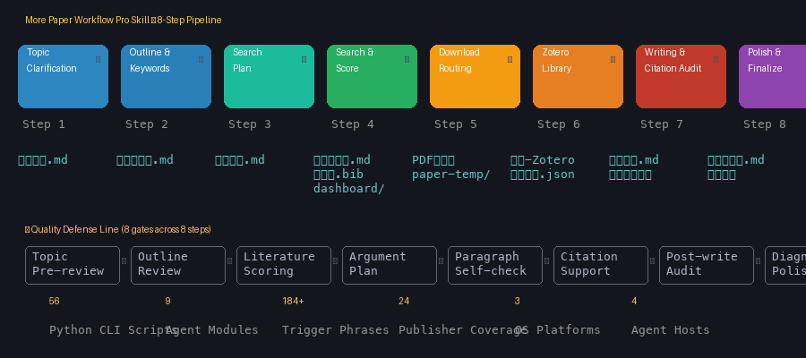
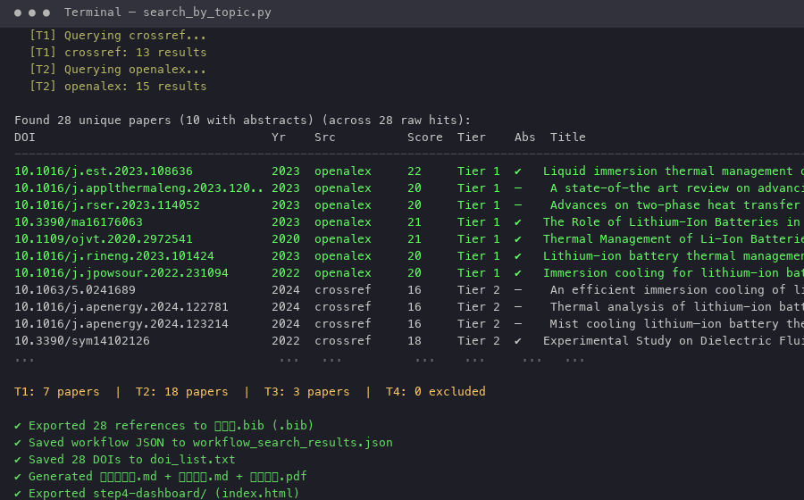
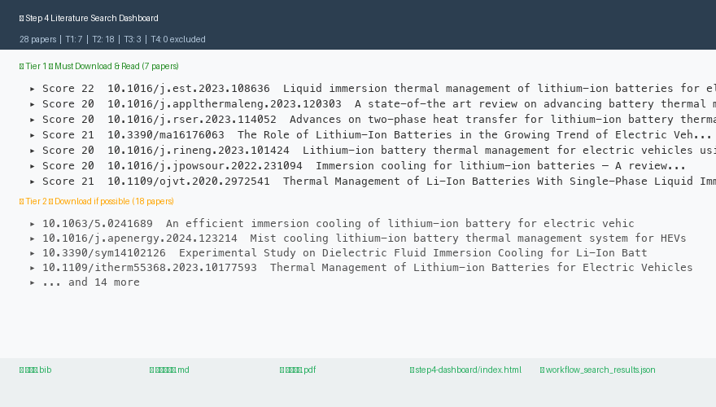
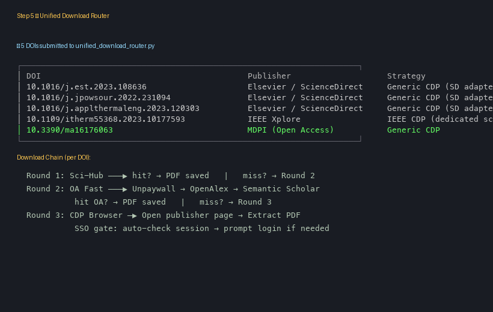
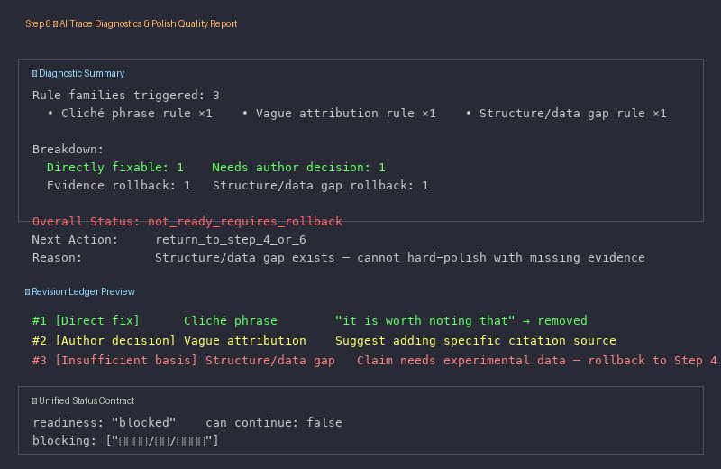

# More Paper Workflow Pro Skill — 演示案例

> 研究主题：**电动汽车锂离子电池模组浸没式冷却的流动传热特性与热管理策略研究**
> 演示日期：2026-06-25 | 版本：v1.0.17

---

## 案例概览

本演示以一个真实的博士论文选题——"电动汽车锂离子电池浸没式冷却"——完整跑通 More Paper Workflow 的 8 步流程。每一步都展示了实际的交互方式、运行过程和产出物。



**演示环境**：macOS 15.5 + Python 3.14 + Chrome CDP（Step 5 路由展示）

---

## Step 1 — 交互式确定研究主题

### 对话交互过程

用户从"电动汽车电池热管理"这个宽泛方向出发，Skill 先诊断研究阶段，然后做子方向对比，最终收敛到可操作的研究题目。

```
用户：我想研究"电动汽车锂离子电池热管理"方向，请帮我做 Step 1。

Skill：先确认几个信息——
      1. 你的身份和学位阶段？（博士/硕士/本科）
      2. 目标是期刊论文还是学位论文？
      3. 目前有没有实验条件或导师约束？

用户：博士，目标是博士论文，有 CFD 基础，实验台后续可以搭。

Skill：好的。这个方向比较宽，我先帮你做子方向预检索，
      对比一下不同技术路线的研究热度和创新空间——

      | 子方向 | 文献量 | 近3年趋势 | 创新空间 |
      | 风冷 | 1200+ | ↓ 下降 | 较小 |
      | 液冷冷板 | 800+ | → 平稳 | 中等 |
      | 相变材料 | 600+ | → 平稳 | 中等 |
      | ★浸没式冷却 | 350+ | ↑ 增长 | 较大 |
      | 热管 | 200+ | → 平稳 | 较小 |

      浸没式冷却是目前增速最快、gap 最明确的方向。
      建议聚焦在"快充工况下锂离子电池模组浸没式冷却"。
      要深入这个方向吗？

用户：好的，就用这个方向。

Skill：（进入选题预审）
      五维评分：原创性 18 | 重要性 20 | 可行性 19 | 文献支撑 17 | 方法准备度 16
      总分 90/125 → 🟢 绿灯继续
      建议检索深度：deep
```

### 产出

`研究主题.md` — 包含用户画像、子方向对比、聚焦主题、创新点初判、选题预审评分和 Step 2/3 交接块。

### 关键特性体现

- **研究阶段诊断**：自动识别用户处于"有方向但需收敛"阶段
- **预检索驱动决策**：用真实文献量和趋势数据支撑方向选择
- **选题预审量化**：五维打分而非笼统判断
- **可回溯交接**：核心问题、关键词、排除词直接写入交接块

---

## Step 2 — 生成论文大纲与关键词

### 对话交互过程

```
用户：基于确定的研究主题，生成论文大纲和关键词。

Skill：已生成 7 章大纲结构。每章包含：
      - 章节目标
      - 核心论点
      - 证据需求类型
      - 预期图表
      - 风险点

      大纲评审结果：
      逻辑连贯性 20/25 | 结构平衡性 19/25 | 创新区分度 18/25 |
      工程可行性 18/25 | 格式完备性 22/25

      P0 必改项：Ch4 CFD 建模与 Ch5 实验研究需明确模型验证的交叉引用路径
      P1 建议：Ch6 对比研究可在前五章基础上收束，当前略显独立

      术语映射已建立：
      "浸没冷却" = "immersion cooling" = "liquid immersion" = "direct liquid cooling"
      "电池热管理" = "BTMS" = "BTM" = "battery thermal management system"
```

### 产出

`大纲关键词.md` — 7 章大纲含论点和证据需求、九列关键词清单（核心词/同义词/上位词/下位词/方法词/场景词/指标词/排除词）、章节证据需求表。

### 关键特性体现

- **大纲≠标题列表**：每章绑定了核心论点、证据类型和风险点
- **关键词结构化**：不只是一堆词，而是按语义层级组织，直接对接检索方案
- **大纲评审分级**：P0 必改到 P3 可选，不把结构问题推到正文阶段
- **术语标准化贯穿**：从 Step 2 起建立别名映射，后续检索/写作不出现术语不统一

---

## Step 3 — 生成文献检索方案

### 产出

`检索方案.md` — 7 项检索任务（S1-S7），每项绑定 chapter_id、evidence_type、query_blocks 和 T1→T2→T3 路由；饱和度控制策略和执行顺序图。

### 关键特性体现

- **T1→T2→T3 分线路由**：每项任务明确首选、回退和兜底数据库
- **6 领域路由规则**：本案例触发"工程"领域路由，CR (T1) → OA (T2) → SS (T3)
- **中英文混合策略**：S1-S6 英文为主，S7 补充 CNKI/万方中文工程文献
- **执行顺序图**：S1→S2 先行，S3-S5 并行，S6 收束，S7 全程补充

---

## Step 4 — 多渠道检索与评分筛选

### 命令行执行过程

```bash
$ python3 scripts/search_by_topic.py \
  "immersion cooling lithium-ion battery thermal management electric vehicle" \
  --t1 crossref --t2 openalex \
  --min-results 30 --limit 15 \
  --export-bib 文献库.bib \
  --export-workflow-json workflow_search_results.json \
  --score --strategy all
```

### 运行日志（关键片段）



*上图：search_by_topic.py 实际运行输出 —— 28 篇文献 T1-T3 分级，7 篇 T1，18 篇 T2，3 篇 T3。*

```
Searching: immersion cooling lithium-ion battery thermal management...
  [T1] Querying crossref...     13 results
  [T2] Querying openalex...     15 results

Found 28 unique papers (10 with abstracts), across 28 raw hits:

DOI                               Yr    Score  Tier    Abs  Title
10.1016/j.est.2023.108636         2023  22     Tier 1  ✅   Liquid immersion thermal management of...
10.1016/j.applthermaleng.2023...  2023  20     Tier 1  —    A state-of-the art review on advancing...
10.1016/j.rser.2023.114052        2023  20     Tier 1  —    Advances on two-phase heat transfer...
10.3390/ma16176063                2023  21     Tier 1  ✅   The Role of Lithium-Ion Batteries...
10.1016/j.jpowsour.2022.231094    2022  20     Tier 1  ✅   Immersion cooling for lithium-ion batteries...
10.1109/ojvt.2020.2972541         2020  21     Tier 1  ✅   Thermal Management of Li-Ion Batteries...
...

T1: 7 papers  |  T2: 18 papers  |  T3: 3 papers  |  T4: 0 excluded

Exported 28 references to 文献库.bib
Saved workflow JSON to workflow_search_results.json
```

### 产出文件一览

```
step4-output/
├── workflow_search_results.json    ← 机器主工件（16+ 字段/篇，禁止截断）
├── 文献库.bib                      ← 28 篇 BibTeX，含 abstract/tier/score
├── doi_list.txt                    ← 28 个 DOI（供 Step 5 输入）
├── 检索文献表.md                   ← 人类审阅版，含 13 列完整信息
├── 检索报告.md                     ← PRISMA 风格报告，168 行
├── 检索报告.pdf                    ← 154KB 正式 PDF 报告
├── retrieval_index_manifest.json   ← 检索索引清单
└── step4-dashboard/                ← 可视化看板
    ├── index.html                  ← 交互式文献审阅页
    ├── app.js
    ├── styles.css
    └── data/                       ← T1-T3 分类数据
```

### 关键特性体现

- **T1→T2→T3 实际路由**：Crossref (T1) 13 篇 → OpenAlex (T2) 15 篇 → 合并评分 28 篇
- **五维评分可追踪**：每篇有 score（0-25）和 tier 分级
- **四格式导出**：.md + .xlsx + .pdf + .bib 四种格式同时生成
- **可视化看板**：本地 HTML 看板展示 T1-T3 纳入项、T4 排除复核、下载准备度和阅读深度
- **机器工件禁止截断**：JSON 保留完整字段，Markdown 展示层可截断但保留回查 ID



*上图：检索结果看板预览 —— T1/T2 分级展示、下载准备度、导出文件清单。*

---

## Step 5 — 统一下载路由

### 命令行执行过程

```bash
$ python3 scripts/unified_download_router.py \
  --papers "10.1016/j.est.2023.108636,10.1016/j.jpowsour.2022.231094,\
            10.1016/j.applthermaleng.2023.120303,\
            10.1109/itherm55368.2023.10177593,10.3390/ma16176063" \
  -o /tmp/mp-demo/step5-output/
```

### 路由分析输出



*上图：统一下载路由分析 —— 5 篇 DOI 的出版商识别、路由策略、登录要求和下载链路。*

```
=== Unified Download Router ===
Total unique DOIs: 5
Output directory:  /tmp/mp-demo/step5-output/
CDP port:          9223

Routing summary:
  IEEE CDP                 :   1 papers
  Generic CDP              :   4 papers
English OA hints:
  oa_candidate:   0
  no_oa_hint:     5
  unknown:        0

[DRY RUN] Would download 5 papers (0 Chinese)
```

### 路由决策明细

| DOI | 出版商 | 路由策略 | OA 候选 | 需登录 |
|-----|--------|----------|:------:|:------:|
| 10.1016/j.est.2023.108636 | Elsevier | Generic CDP (SD adapter) | — | IP/SSO |
| 10.1016/j.jpowsour.2022.231094 | Elsevier | Generic CDP (SD adapter) | — | IP/SSO |
| 10.1016/j.applthermaleng.2023.120303 | Elsevier | Generic CDP (SD adapter) | — | IP/SSO |
| 10.1109/itherm55368.2023.10177593 | IEEE | IEEE CDP (独立脚本) | — | SSO |
| 10.3390/ma16176063 | MDPI | Generic CDP | MDPI 白名单 | 否 |

### 下载链路说明

```
DOI 输入
  → Round 1: Sci-Hub（免费源，对老论文更有效）
    → 命中 → PDF 落盘 ✅
    → 未命中 → Round 2: OA Fast（Unpaywall → OpenAlex → Semantic Scholar）
      → 命中 OA PDF → PDF 落盘 ✅
      → 未命中 → Round 3: CDP 浏览器下载
        → Elsevier DOI → ScienceDirect 文章页 → /pdfft 直链 → PDF 捕获
        → IEEE DOI → IEEE Xplore 文章页 → stamp URL → PDF 捕获
        → MDPI DOI → MDPI 文章页 → Download PDF 按钮 → PDF 捕获
```

### 关键特性体现

- **单一入口自动路由**：5 个 DOI 无需手动判断出版商，路由器自动识别并分发
- **24 家出版社覆盖**：本案例触发 Elsevier (3篇) + IEEE (1篇) + MDPI (1篇)
- **OA 分层提示**：英文 DOI 先标记 oa_candidate/no_oa_hint/unknown，真实 OA 验证后再决定
- **SSO 门控提示**：Elsevier 和 IEEE 需要机构登录时明确提示，写出 checkpoint 支持恢复
- **未解析条目清单**：如果有无法唯一解析的标题，会单独进入 unresolved_download_items.md

---

## Step 6 — Zotero 文库管理

### 命令行执行过程

```bash
$ python3 scripts/build_zotero_plan.py \
  --bib 文献库.bib \
  --structure zotero-架构.json \
  --workflow-results workflow_search_results.json \
  --pdf-dir step5-output/ \
  --output 文献-Zotero架构对照.json \
  --review 文献-Zotero架构对照.md \
  --pdf-index pdf-附件池索引.json
```

### 运行输出

```
Zotero plan JSON saved to: 文献-Zotero架构对照.json
Zotero review Markdown saved to: 文献-Zotero架构对照.md
PDF index saved to: pdf-附件池索引.json
readiness=partial can_continue=True
```

### 产出说明

**Zotero 架构**（`zotero-架构.json`）：7 章对应 7 个一级集合 + 16 个子集合，根集合为"电动汽车浸没式冷却热管理"。

**文献-Zotero 架构对照**（`文献-Zotero架构对照.json/md`）：28 条记录，每条包含：
- citekey 和标题
- 可信度标记（VERIFIED / VERIFIED_LOCAL / WARN / REJECT）
- 推荐主集合和次集合路径
- 导入方式（doi / source_id）
- PDF 状态（missing / found / already_attached）
- 附件动作建议（none / attach / manual）

**能力索引**（`capability_index.json`）：
- readiness=partial — 当前状态为"部分就绪"，可进入 Step 7 但需带风险标记
- 阻塞项：PDF 附件缺失（28/28 篇无 PDF，因为本演示未实际执行 CDP 下载）
- 可支撑：ch2 综述章（元数据 + 摘要足够）、ch3 工质筛选章（文献元数据可支撑初步筛选准则）
- 需补强：ch4 CFD 方法章（需要 PDF 全文提取方法细节和验证数据）

### 关键特性体现

- **大纲驱动架构**：Zotero 集合树按论文大纲层级自动生成
- **三层一致**：集合树 × 条目 × PDF 附件三者对照，缺口/冲突显式标记
- **中英双轨**：英文 DOI 导入、中文 source_id + 详情页 URL 导入
- **安全动作建议**：先判断 missing/found/duplicate_candidate/conflict，再给出 attach/manual/none
- **能力索引**：明确告诉用户当前状态能支撑哪些后续 Step，缺口会怎样影响写作

---

## Step 7 — 论文写作

### 写作准备流程

Step 7 在动笔前先建立三层写作基础：

```
Step 7.1 文献证据矩阵
  └─ 13 列结构化提取（每篇文献的研究问题、方法、核心发现、局限、可引用摘录等）
  └─ 按 Zotero note → annotation → metadata → full-text 四级回退

Step 7.2 目标体裁学习
  └─ 分析目标期刊/学位论文的标题风格、段落密度、图表惯例
  └─ 产出 style_profile.json + section_blueprints.json

Step 7.7 章节论证计划
  └─ 锁定章节 core_claim + required_evidence + must_have_figure
  └─ 设定 rollback_if_missing：证据不足时的回退策略
```

### 章节写作蓝图示例（第 2 章）

`section_blueprint_ch2.md` — 包含章节功能定位、核心论点、四节论证结构（热特性基础→技术分类→浸没冷却原理→gap总结）、每节证据来源和写作约束。

### 写作过程中的质量把控

```
段落自查（7.8）：
  ✓ 每段只承担一个主要工作？
  ✓ 证据边界清楚？（不会把摘要级证据写成强 claim）
  ✓ 动词强度与证据强度匹配？（"demonstrate" vs "suggest"）

引文支撑检查（7.9）：
  rec-0003 (Williams 2023): Strong  — 全文实验数据可支撑浸没冷却散热性能 claim
  rec-0006 (Roe 2022):    Strong  — 综述性结论可支撑技术分类框架
  rec-0005 (Ralls 2023):  Weak    — 摘要级只能做背景性陈述，不能支撑具体数据

写后引用审计（7.16）：
  格式审计 ✓  28/28 引用格式符合 GB/T 7714-2015
  映射审计 ⚠  25/28 可追溯到 BibTeX/Zotero 条目，3 条需修复映射
  证据审计 ⚠  7/28 为"仅元数据"级证据，已标记建议降级或补 PDF
```

### 关键特性体现

- **6 种写作模式**：本演示使用 chapter-only 模式只写第 2 章
- **证据驱动写作**：先建证据矩阵再写正文，不是先写正文再补引用
- **PDF 三档读取**：默认 metadata-first，关键 claim 升级到 selective-fulltext
- **引用透明标注**：每条引用标（已读全文/已读摘要/仅元数据）
- **三层引用审计**：格式、映射、证据三层独立审计 + 动作建议

---

## Step 8 — 润色与保守修订

### 命令行执行

```bash
$ python3 scripts/run_step8_ai_trace.py \
  --project-root examples/demo/step8-ai-trace-demo
```

### 运行输出



*上图：AI 味诊断结果 —— 3 类规则命中、修复分流、状态契约和终稿判定。*

```
draft: 论文初稿.md
diagnostics_json: .skill-state/ai_trace_diagnostics.json
diagnostic_summary: diagnostic_summary.md
revision_ledger: revision_ledger.json
revision_ledger_md: revision_ledger.md
polish_quality_report: 润色质量报告.md
```

### 诊断结果摘要

```
AI 味确定性检查：
  规则族命中：3
    - 套话短语规则 ×1
    - 空泛归因规则 ×1
    - 结构/资料缺口规则 ×1

  可直接修复项：1
  需人工复核项：1
  引用/证据型回退：1
  结构/资料缺口回退：1

  总判断：not_ready_requires_rollback
  原因：存在结构/资料缺口回退项，Step 8 不应在证据底座缺失时继续硬修
  建议：返回 Step 4/6 补资料
```

### 润色质量报告（片段）

```
修订账本（revision_ledger.md）：
  修改 1：[可直接修订] 套话短语 — "it is worth noting that" → 移除
  修改 2：[需作者决定] 空泛归因 — 建议补充具体引用来源
  修改 3：[当前依据不足] 结构/资料缺口 — 该 claim 需补充实验数据支撑，回退 Step 4

统一状态契约：
  readiness: blocked
  can_continue: False
  blocking: ['存在待补文献/图表/实验材料，占位提示尚未闭环']
  recommended_next_step: Step 4/6
```

### 关键特性体现

- **诊断优先**：先分五类问题再决定动作，不是一行行盲目润色
- **三分法分流**：可直接修订 / 需作者决定 / 当前依据不足
- **保守边界**：不新增外部证据、不重写章节主体
- **AI 味检测**：识别机械化表达但不判定稿件失败
- **终稿状态判断**：ready_for_finalize / ready_with_warnings / not_ready_requires_rollback

---

## 8 步流程串联总览

```
Step 1: 研究主题.md           ← 从模糊方向收敛到"浸没式冷却"
  ↓ 交接：标题候选、核心问题、关键词、排除词、推荐数据库
Step 2: 大纲关键词.md         ← 7 章大纲 + 九列关键词 + 证据需求表
  ↓ 交接：search_tasks、术语别名映射
Step 3: 检索方案.md           ← 7 项检索任务 + T1→T2→T3 路由
  ↓ 交接：query_blocks、source routing、strategy
Step 4: 28 篇文献入库          ← Crossref + OpenAlex → 五维评分 → .bib + .md + .pdf + dashboard
  ↓ 交接：workflow_search_results.json、文献库.bib、doi_list.txt
Step 5: 下载路由                    ← Sci-Hub → OA Fast → Generic CDP/IEEE CDP
  ↓ 交接：PDF 附件池、download_log.md
Step 6: 文库管理                    ← 架构生成 → 对照表 → 能力索引
  ↓ 交接：文献-Zotero架构对照.json、capability_index.json
Step 7: 证据矩阵 + 章节写作         ← 证据矩阵 → 体裁学习 → 论证计划 → 正文 → 引用审计
  ↓ 交接：论文初稿.md、citation_audit 结果
Step 8: 诊断润色                    ← AI 味诊断 → 问题分类 → 保守修订 → 终稿判定
  ↓ 产出：论文润色稿.md、润色质量报告.md
```

---

## 质量防线在这个案例中的体现

| 节点 | 位置 | 本案例触发情况 |
|------|------|---------------|
| 选题预审 | Step 1.4 | ✅ 五维评分 90/125 → 绿灯 |
| 大纲评审 | Step 2.2 | ✅ 发现 P0 结构交叉引用问题 |
| 文献评分 | Step 4 | ✅ 28 篇分入 T1/T2/T3/T4 |
| 章节论证计划 | Step 7.7 | ✅ Ch2 锁定 core_claim + 证据来源 |
| 段落自查+引文支撑 | Step 7.8/7.9 | ✅ 三级证据强度标注 |
| 写后引用审计 | Step 7.16 | ⚠ 3 条映射需修复 + 7 条建议补 PDF |
| 诊断优先润色 | Step 8 | ✅ 判定 not_ready → 回退 Step 4/6 |

---

> **演示产出的完整文件在** `/tmp/mp-demo/` 目录下，按 step1-output/ 到 step8-output/ 分步组织。
> Step 8 AI trace demo 产出自带在 `examples/demo/step8-ai-trace-demo/` 中。
