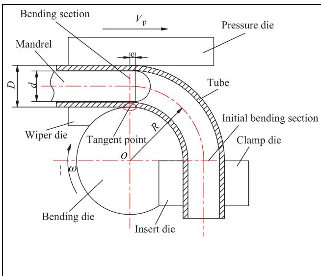
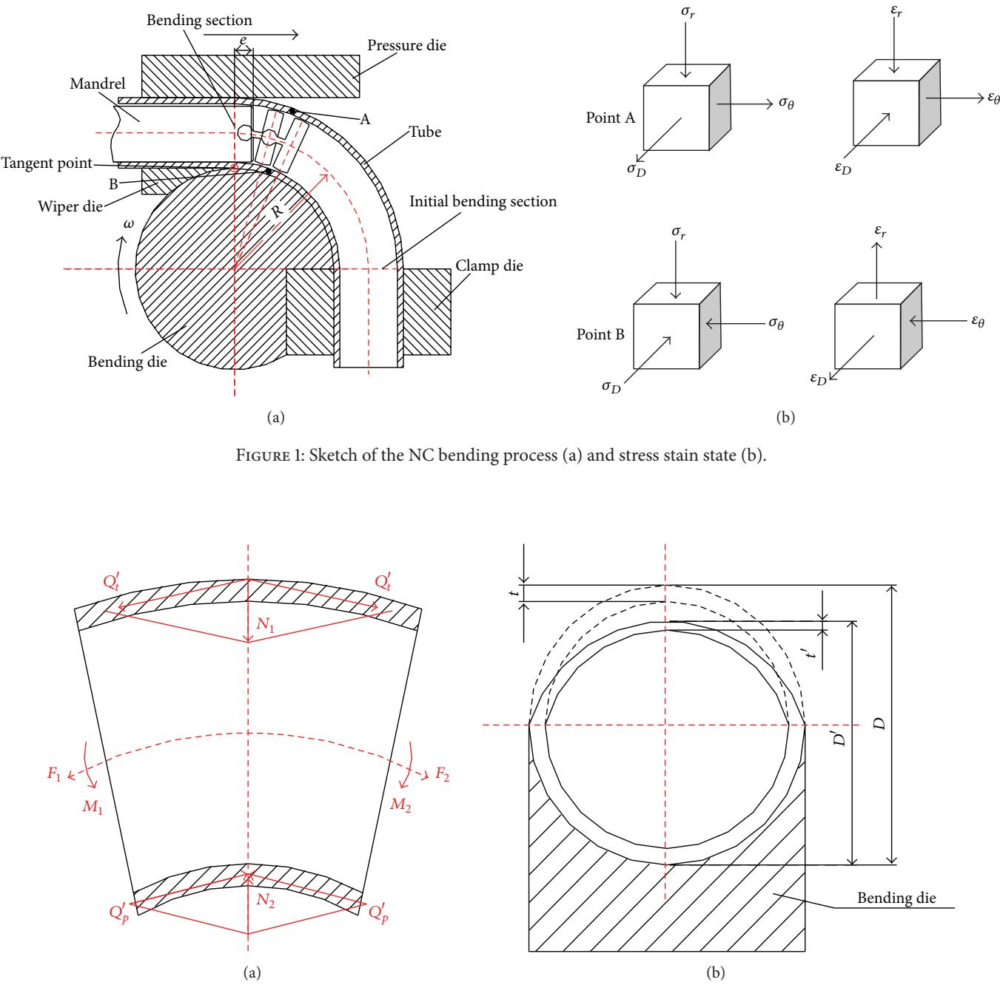
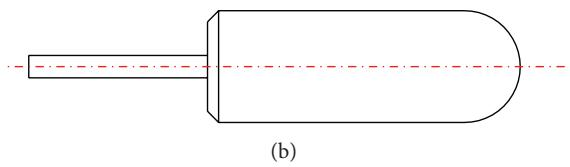
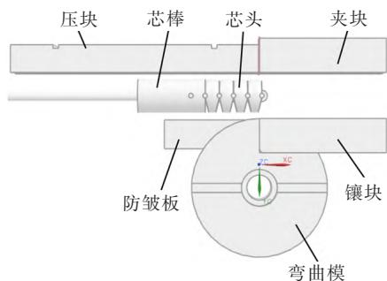
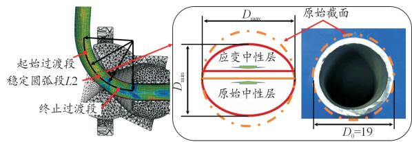

# 航空金属导管弯曲成形受力与变形特征及缺陷耦合机制研究

## 摘要

航空金属导管承担液压、燃油和环控系统中的介质输运与结构连接功能，其弯曲成形质量直接关系到承压安全、装配精度和服役可靠性。围绕航空导管弯曲过程中的壁厚减薄、截面畸变、内侧起皱和回弹等缺陷，综述数控绕弯、薄壁管绕弯和三维自由弯曲中的受力状态与变形特征。结果表明，导管弯曲不是单一弯矩作用下的几何成形，而是外弧侧切向拉伸、内弧侧压缩、径向约束、接触间隙和摩擦共同作用的多因素耦合过程。壁厚减薄沿弯曲方向呈现起始增长、稳定平台和末端下降的阶段性分布；相对弯曲半径是高强不锈钢管减薄的重要敏感变量；芯棒支撑可以降低截面畸变，但也可能因接触摩擦和材料流动受阻而增加外侧减薄；不同弯曲工艺中的摩擦作用路径存在差异，绕弯接触副规律不能直接套用于三维自由弯曲。本文提出“受力状态-材料流动-缺陷响应”的分析框架，为航空金属导管小半径精密弯曲和内部加压辅助弯曲研究提供证据边界清晰的文献基础。

**关键词：** 航空金属导管；弯曲成形；壁厚减薄；截面畸变；芯棒；摩擦；接触边界

## 1 引言

航空金属导管通常具有小直径、薄壁、高强度和空间走向复杂等特点。弯曲成形不仅需要获得规定的弯曲半径和装配走向，还必须控制外侧壁厚减薄、内侧起皱、截面椭圆化和回弹等缺陷。对于高压管路，局部壁厚不足会降低承压裕度；截面畸变会影响流通能力、接头装配和密封稳定性；起皱和局部失稳则可能成为疲劳裂纹或泄漏风险源。因此，航空导管弯曲质量评价不能只看成形角度是否达到要求，而应同时考察壁厚分布、截面形状、起皱风险和回弹控制。

现有研究主要从理论分析、有限元模拟和实验验证三个层面揭示管材弯曲成形规律。Fang 等针对 0Cr21Ni6Mn9N 高强不锈钢管建立了考虑弹性模量变化的数控弯曲模型，指出壁厚减薄是决定成形质量和成形极限的关键指标，相对弯曲半径对减薄最敏感[1]（已读全文）。Fang 等对 2169 小直径不锈钢管的研究表明，芯棒能够显著降低截面畸变，但芯棒直径和伸出量增大也会增加壁厚减薄[2]（已读全文）。易杰和董菲菲从接触边界角度说明，间隙和摩擦会改变外侧减薄、截面畸变和起皱风险[3]（已读全文）。于波等则指出，在三维自由弯曲少约束状态下，弯曲模与管材之间的摩擦会影响 U-R 关系、壁厚分布和截面畸变[4]（已读全文）。

上述研究说明，航空金属导管弯曲成形的关键不在于孤立优化某一工艺参数，而在于理解受力状态、材料流动和多缺陷响应之间的耦合关系。本文基于指定 Zotero 子集合进行证据归纳，不引入新的实验或仿真数据；涉及数值和工艺窗口的判断均限定在原文献材料、尺寸和弯曲工艺范围内。

## 2 证据来源与方法边界

本文采用 Step 7 的 `zotero_mineru` 和 `mechanism_analysis` 写作入口。强结论主要来自 4 篇已读全文文献：文献[1]支撑高强不锈钢管壁厚减薄、相对弯曲半径和变弹性模量影响；文献[2]支撑基本受力状态、截面畸变和芯棒支撑折中；文献[3]支撑接触间隙、摩擦与缺陷响应；文献[4]支撑自由弯曲中摩擦与 U-R 关系、壁厚分布和截面畸变的耦合。文献[5-8]只作为摘要级背景，不用于支撑具体参数窗口；元数据级条目仅作为研究线索，不进入强结论。

图表来自核心全文文献对应的 MinerU ZIP 图文资产，并已在 `figure_index.json` 中绑定到正文 claim。需要强调的是，这些图片用于写作论证和本地预览；若后续正式投稿，应按目标期刊要求确认转载许可，或依据原理重新绘制示意图。

本文采用“证据层级-机制链条-工艺边界”三层组织方式。证据层级用于区分全文支撑、摘要级背景和元数据线索，避免把摘要中的一般性表述升级为参数结论；机制链条用于把受力状态、材料流动和缺陷响应串联起来，而不是简单罗列影响因素；工艺边界用于限定数控绕弯、传统绕弯和三维自由弯曲之间的可比范围。由于当前证据集中缺少内部加压辅助弯曲的全文实验或仿真数据，本文只把内部压力作为后续研究变量讨论，不把芯棒支撑或自由弯曲结果直接等同于内压作用。

## 3 弯曲成形中的基本受力状态

导管弯曲时，外弧侧材料主要承受切向拉伸，内弧侧材料主要承受压缩，截面径向则受到弯曲模槽、压力模、防皱板和芯棒的非均匀约束。数控绕弯过程通常由弯曲模、夹模、压力模和管材共同形成局部塑性变形区。图1给出了数控绕弯过程的基本几何和接触关系，可作为理解后续减薄、畸变和起皱耦合的工艺背景。

Fang 等对 2169 小直径不锈钢管数控弯曲过程的分析表明，外侧拉伸会导致壁厚减薄甚至开裂，内侧压缩会导致增厚和起皱倾向，径向压缩和模具约束共同引起截面畸变[2]（已读全文）。因此，壁厚减薄、内侧起皱和截面畸变不是彼此独立的缺陷，而是同一三维受力状态在不同空间区域中的表现。

从力学传导看，弯曲模和夹模首先建立弯矩和外弧侧拉伸应变，压力模通过轴向推送或局部接触改变材料补给，防皱板限制内弧侧压缩区的面外失稳，芯棒则在管内壁提供径向支撑。四类作用并不只改变单一缺陷：压力模补料可以降低外弧侧拉伸需求，但也会改变中性层附近的应变分布；防皱板抑制起皱的同时会引入额外接触摩擦；芯棒提高截面保持能力，但会通过内壁摩擦改变材料向弯曲区流入的阻力。换言之，数控绕弯中的“受力状态”不是静态载荷组合，而是随着管材绕模旋转不断迁移的接触-塑性耦合场。

数控绕弯中，压力模的材料补给有助于降低外侧拉伸减薄，防皱板和芯棒则主要抑制起皱和过度截面变形[2]（已读全文）。但这些约束并非越强越好。芯棒和管内壁之间的接触会产生摩擦阻力，改变材料向弯曲变形区流动的条件；约束不足会放大畸变和起皱，约束过强又可能增加减薄、表面划伤和模具磨损。

三维自由弯曲的受力状态与数控绕弯不同。于波等建立考虑摩擦效应的自由弯曲力学模型，指出推进力、弯曲模成形力、摩擦力和导向支撑力共同决定管材弯矩；在少约束状态下，摩擦会直接参与塑性变形区的应力应变分布和曲率形成[4]（已读全文）。因此，同样是摩擦变量，在不同弯曲工艺中可能具有不同作用路径，不能把绕弯接触副规律直接套用于自由弯曲。

这一差异对航空复杂空间导管尤为重要。若导管路径由多段空间曲线组成，工艺补偿不仅要控制单个弯曲截面的缺陷，还要控制弯曲半径、回弹和相邻弯曲段之间的累积误差。数控绕弯更依赖模具约束和芯棒支撑稳定截面，自由弯曲则更依赖进给、模具偏距和摩擦共同决定曲率。二者都涉及“摩擦”，但一个主要表现为材料流动阻力和缺陷竞争，另一个还直接参与曲率形成。因此，后续建立航空导管弯曲模型时，应先区分工艺约束类型，再讨论摩擦系数或润滑策略。

## 4 壁厚减薄与截面畸变的耦合变形

壁厚减薄是航空导管弯曲成形中最直接影响承压能力的缺陷。Fang 等将减薄度定义为初始壁厚与弯后壁厚差值相对于初始壁厚的百分比，并指出高压航空管路中减薄指标应受到严格控制[1]（已读全文）。对于 0Cr21Ni6Mn9N 高强不锈钢管，壁厚减薄沿弯曲方向呈现典型阶段性：从弯曲段到初始弯曲段，减薄先快速增加，随后进入稳定平台区，最后快速下降；当弯曲角超过一定范围后，平台高度变化不明显，而平台长度随弯曲角增加而扩展[1]（已读全文）。

截面畸变与壁厚减薄通常同时发生。图2所示的截面畸变和壁厚减薄示意表明，导管外弧侧和内弧侧的应变状态差异会投射到截面形状和壁厚分布上。因而，成形质量评价不宜只采用单个测点壁厚或名义弯曲角，而应沿弯曲方向建立壁厚分布曲线，并结合截面畸变率识别最大减薄位置、平台区长度和过渡区变化。

壁厚减薄的阶段性分布可以理解为三个连续区间。起始区内，管材刚进入有效弯曲和模具接触状态，切向拉伸、模具约束和材料补给尚未达到稳定平衡，减薄随弯曲过程快速增加；稳定区内，外弧侧拉伸应变、内侧压缩堆积、接触摩擦和加工硬化趋于相对稳定，减薄形成平台；末端区内，几何过渡和卸载效应增强，局部接触状态和应变路径发生变化，减薄快速下降[1]（已读全文）。该解释说明，最大减薄位置不是由名义弯曲角单独决定，而是由变形区建立、稳定和退出的全过程决定。

相对弯曲半径是影响减薄的重要几何变量。Fang 等研究表明，相对弯曲半径减小时，弯曲变形程度增大，壁厚减薄风险上升；在其 0Cr21Ni6Mn9N 高强管研究条件下，相对弯曲半径是壁厚减薄最敏感的参数，而弯曲角敏感性最低[1]（已读全文）。弯曲速度、工艺参数和推弯参数也被摘要级文献作为成形质量影响因素讨论[5-8]（已读摘要），但这些证据在本文中只用于提示变量维度，不用于给出定量工艺窗口。

高强材料的弹性模量变化也会影响减薄预测。Fang 等将弹性模量随塑性应变变化引入有限元模型后发现，变弹性模量会提高壁厚减薄预测值，使模拟结果更接近实验，但不会明显改变减薄沿程变化趋势[1]（已读全文）。这提示，若后续对航空高强导管进行有限元建模，常弹性模量模型可能低估外侧减薄风险。

从工程评价角度看，壁厚减薄和截面畸变还存在竞争关系。若通过增强芯棒支撑、减小间隙或提高局部约束来改善圆度，外侧材料流动可能受到抑制，导致减薄风险上升；若放松约束以降低外侧拉伸阻力，截面椭圆化和内侧起皱风险又可能增加。因此，航空导管成形质量不宜采用单一指标最优，而应建立“最大减薄率-截面畸变率-起皱裕度-回弹补偿量”的联合判据。

## 5 芯棒支撑与缺陷控制折中

截面畸变通常表现为圆截面向椭圆截面或局部压扁形态转变。其形成原因在于弯曲过程中外侧和内侧切向应力合力指向截面中心，同时管材在模槽约束较弱方向上仍具有变形空间。Fang 等关于 2169 小直径不锈钢管的研究显示，无芯棒时截面畸变显著增大；采用圆柱芯棒或球头芯棒后，截面畸变明显降低，其中球头芯棒由于支撑曲面范围更大，对截面质量改善更明显[2]（已读全文）。

图3展示了圆柱芯棒和球头芯棒两类硬芯棒形态。该图本身不证明某一芯棒参数最优，但可以说明芯棒接触形态会改变内壁支撑范围。芯棒直径增大或伸出量增加会增强内壁支撑，降低截面畸变；但芯棒与管内壁接触面积和摩擦阻力增加后，材料向弯曲变形区流动受阻，外侧切向应变和壁厚减薄随之增大[2]（已读全文）。

因此，芯棒参数设计本质上是降低截面畸变与避免过度减薄之间的折中，而不是简单追求更强支撑。航空导管既要求截面保持足够圆度以保证流动和装配，又要求外侧壁厚不能低于承压安全边界。若只追求截面畸变最小，可能导致芯棒伸出量过大、摩擦阻力增加和外侧过度减薄；若只追求减薄最小，又可能因内支撑不足导致截面畸变和起皱。因此，后续工艺设计应采用壁厚减薄率、截面畸变率、起皱风险和回弹角的联合评价。

芯棒作用可进一步拆解为三条路径。第一是几何支撑路径：芯棒占据内腔空间，限制截面向内塌陷，从而降低椭圆化和局部压扁。第二是摩擦阻力路径：芯棒与内壁接触面积越大，管材沿切向流入弯曲区的阻力越高，外弧侧需要承担更大的拉伸变形。第三是压缩稳定路径：适当芯棒伸出量能够抑制内侧压缩失稳，但过小或过大的局部间隙都可能使压缩区失去稳定支撑。上述三条路径方向并不一致，解释了为什么芯棒类型、直径和伸出量不能以单一“越大越好”规则确定。

这也提示内部加压辅助弯曲不能简单视为“流体芯棒”。内压可能提供较均匀的内支撑，并降低刚性芯棒与内壁之间的干摩擦，但它同时引入压力加载路径、密封边界和管端约束问题。若内压过低，截面保持作用不足；若内压过高，可能改变外弧侧应力状态甚至诱发胀形或局部屈服。由于当前证据集中缺少内压弯曲全文数据，本文只将其列为后续机制验证方向。

## 6 接触边界条件对材料流动和缺陷响应的影响

接触边界条件包括管材与弯曲模、防皱板、芯棒和压力模之间的间隙与摩擦。图4给出了绕弯工模具三维模型，可用于定位不同接触副。易杰和董菲菲以大口径薄壁钢管绕弯为对象，研究表明管材/弯曲模、管材/防皱板和管材/芯棒之间间隙增大时，外侧壁厚减薄率逐渐下降，而截面畸变率逐渐增加；芯棒间隙对起皱影响显著，间隙过小或过大都可能导致弯曲段起皱[3]（已读全文）。

间隙具有双重作用：增大间隙可减弱局部摩擦和外侧拉伸减薄，但也会削弱模具与芯棒对截面和内侧稳定性的支撑。摩擦的影响同样取决于接触副。易杰和董菲菲指出，防皱板与管材之间摩擦系数增大时，截面畸变逐渐增大，但对外侧减薄和内侧起皱影响不显著；芯棒与管材之间摩擦系数增大时，外侧壁厚减薄率和失稳起皱都逐渐增大[3]（已读全文）。因此，不能笼统地说摩擦增大有利或有害，必须明确摩擦发生在哪一接触副，以及它是促进材料补给、阻碍材料流动，还是改变压缩区稳定性。

在三维自由弯曲中，摩擦还会参与曲率形成。于波等发现，在相同弯曲模偏距条件下，摩擦系数增大时切向应力幅值升高，弯曲力矩增大，所形成弯曲半径减小；内凹侧壁厚增厚更明显，外凸侧壁厚由减薄向增厚转变，截面畸变率也随摩擦变化而改变[4]（已读全文）。图5中的 U-R 曲线和截面畸变率对比，进一步说明自由弯曲中的摩擦不只是缺陷控制变量，也是曲率半径和轨迹补偿变量。

由此可将摩擦划分为“阻流型摩擦”和“成形型摩擦”。在绕弯芯棒-管内壁接触副中，摩擦主要表现为阻碍材料向变形区补给，容易放大外侧减薄和压缩区失稳；在防皱板-管材接触副中，摩擦更多改变内侧局部约束和截面畸变；在自由弯曲弯曲模-管材接触副中，摩擦还会改变成形力矩和 U-R 关系。不同摩擦路径对应不同控制策略：绕弯芯棒侧通常需要润滑和合理间隙，自由弯曲则需要把摩擦纳入曲率补偿模型，而不是只把它当作应消除的扰动。

## 7 受力状态-材料流动-缺陷响应框架

基于上述证据，航空金属导管弯曲成形可概括为“受力状态-材料流动-缺陷响应”的耦合链条。首先，弯曲模、压力模、防皱板、芯棒、导向机构和轴向进给共同建立外侧拉伸、内侧压缩和径向约束状态。其次，材料在切向拉压和接触摩擦作用下向变形区流动，流动是否充分决定外侧壁厚减薄、内侧材料堆积和截面形状保持能力。最后，缺陷以外侧减薄、内侧起皱、截面畸变和回弹等形式显现[1-4]（已读全文）。

这一框架强调三个边界。第一，缺陷控制应从材料流动角度理解。外侧减薄并不只是弯曲半径小造成的几何结果，也受到压力模补料、芯棒摩擦和接触间隙影响。第二，工艺参数之间存在耦合而非孤立作用。芯棒直径增大降低截面畸变，但同时增加接触阻力和外侧减薄；间隙增大降低减薄，却可能提高截面畸变和起皱风险。第三，不同弯曲工艺之间不能直接套用参数规律。数控绕弯中的芯棒摩擦通常需要降低，而自由弯曲中的弯曲模摩擦还会参与曲率半径形成[2-4]（已读全文）。

该框架还可以转化为可执行的建模顺序。第一步确定工艺约束类型，即绕弯、推弯、自由弯曲或内部加压辅助弯曲；第二步识别主要接触副和载荷源，包括弯曲模、压力模、防皱板、芯棒、轴向进给和内压；第三步建立缺陷指标与状态量之间的关系，例如最大减薄率对应外弧侧拉伸应变和材料补给，截面畸变率对应径向支撑和截面压扁，起皱对应内弧侧压缩应变、间隙和防皱约束，回弹对应卸载弹性恢复和材料弹性模量变化。只有完成这一路径，后续参数优化才不会退化为经验试错。

对于后续内部加压辅助弯曲研究，该框架可进一步扩展。内部压力可能通过提供均匀内支撑、改变中性层位置和抑制截面畸变来改善成形质量，但其是否降低减薄、是否抑制内侧起皱，以及是否引入密封和加载控制问题，需要以具体材料、尺寸、压力路径和弯曲工艺为边界进行实验或仿真验证。当前集合中的芯棒支撑和接触边界研究只能提供类比框架，不能直接替代内部加压工况证据。

面向航空导管工程应用，建议后续研究把内部压力路径、相对弯曲半径、材料强化行为、芯棒/内压支撑方式和摩擦边界作为耦合变量，而不是分别进行单因素讨论。尤其是在小半径弯曲中，减薄、畸变和起皱的改善方向并不总是一致；若缺少联合指标，单纯降低某一缺陷可能会放大另一缺陷。因此，内部加压辅助弯曲的验证重点应放在“是否改变材料流动路径”和“是否扩大多缺陷共同可接受窗口”上，而不只是比较单个最大减薄率。

## 8 结论

1. 航空金属导管弯曲成形中的外侧减薄、内侧起皱和截面畸变来源于外弧侧切向拉伸、内弧侧压缩、径向约束和接触摩擦的共同作用。该过程是多模具约束、多接触边界和材料塑性流动耦合的成形过程。

2. 高强不锈钢管数控弯曲中，壁厚减薄沿弯曲方向具有起始增长、稳定平台和末端下降的阶段性分布。相对弯曲半径是影响减薄的重要变量，变弹性模量模型可能提高减薄预测精度。

3. 芯棒可以显著降低截面畸变，但芯棒直径和伸出量增大也会通过增加接触和摩擦阻力加剧外侧壁厚减薄。航空导管弯曲工艺应采用减薄、截面畸变、起皱和回弹的多指标综合评价。

4. 接触间隙和摩擦对材料流动具有双重影响。绕弯中，间隙和润滑条件需要在减薄、畸变和起皱之间折中；自由弯曲中，摩擦还会改变 U-R 关系和曲率补偿规律。

5. 后续若开展航空导管内部加压弯曲研究，应在“受力状态-材料流动-缺陷响应”框架基础上补充内部压力路径、材料牌号、弯曲半径和实验/仿真数据，避免用芯棒绕弯文献直接替代内部加压机理证据。

## 参考文献草表

[1] Fang J, Ouyang F, Lu S, et al. Wall thinning behaviors of high strength 0Cr21Ni6Mn9N tube in numerical control bending considering variation of elastic modulus. （已读全文）

[2] Fang J, Lu S, Wang K, et al. Effect of Mandrel on Cross-Section Quality in Numerical Control Bending Process of Stainless Steel 2169 Small Diameter Tube. （已读全文）

[3] 易杰, 董菲菲. 接触边界条件对管材绕弯成形质量的影响. （已读全文）

[4] 于波, 舒送, 程宗辉, 等. 摩擦效应对三维自由弯曲过程中管材变形行为的影响规律研究. （已读全文）

[5] Fang J, Ouyang F, Lu S, et al. Effect of process parameters on wall thinning of high strength 21-6-9 stainless steel tube in numerical control bending. （已读摘要）

[6] 唐文献, 张阳, 张建. 薄壁管材推弯工艺参数灵敏度分析. （已读摘要）

[7] 郝用兴, 张少华, 刘亚辉. 基于数值模拟的管材三维自由弯曲成形规律研究. （已读摘要）

[8] Fang J, Lu S Q, Wang K L, et al. Effect of Bending Speed on Forming Quality of 0Cr21Ni6Mn9N Stainless Steel Tube NC Bending. （已读摘要）
